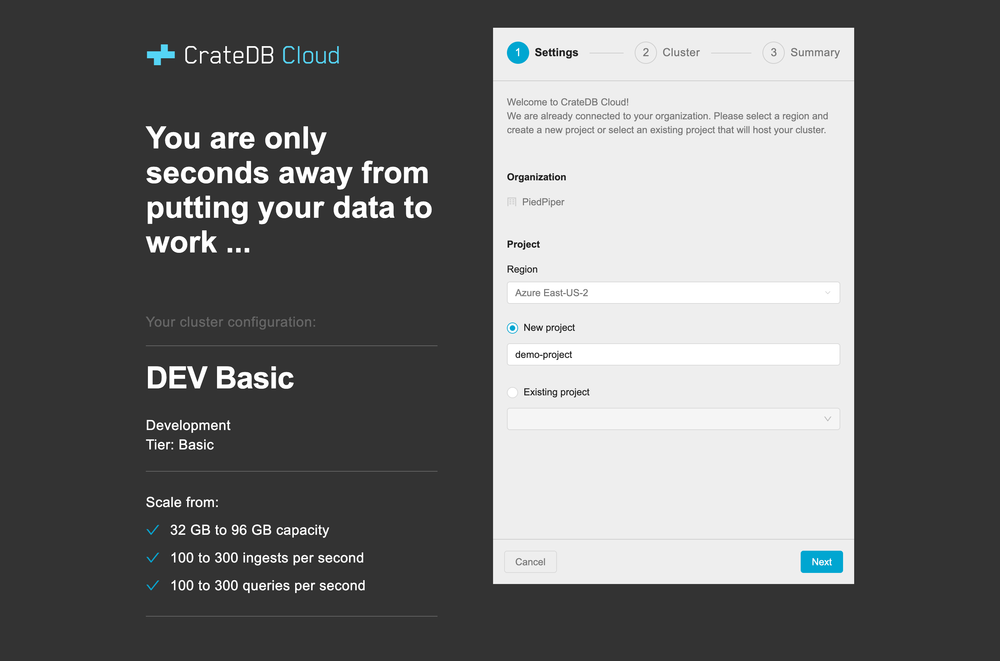
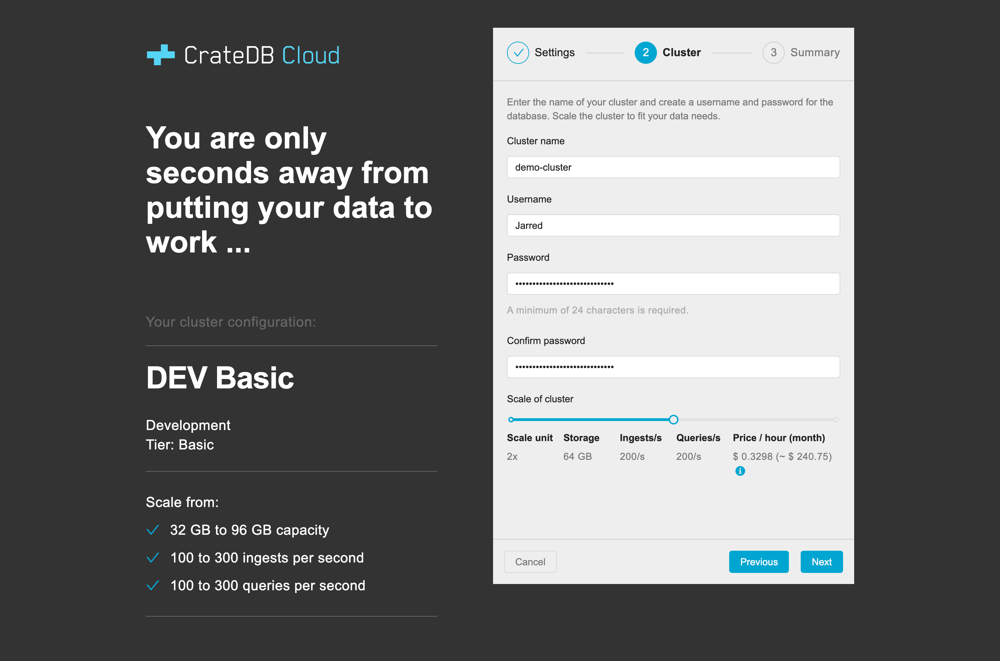
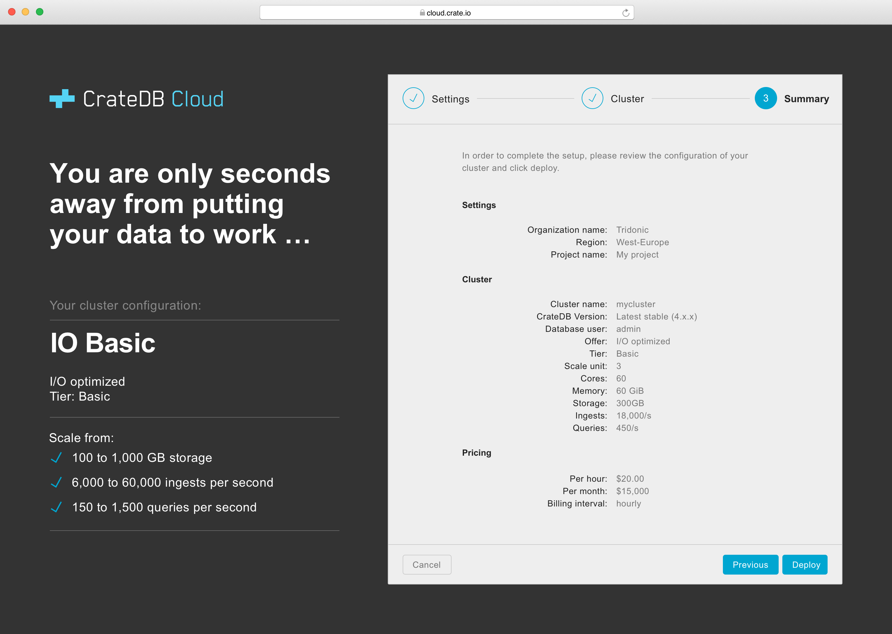

.. _configure-azure-to-cluster:

=================================
Configure and deploy your cluster
=================================

After having subscribed to the offer, you can now start the process to deploy
the cluster.

.. rubric:: Table of contents

.. contents::
   :local:

.. _configure-azure-to-cluster_config:

Configuration
=============

First it must be configured. On the *Home > Software as a Service (SaaS)* page,
go to *Overview*. Now click on *Configure Account* at the top left of the
Overview page.

.. image:: ../_assets/img/configure-account.png

You'll now be redirected to the CrateDB Cloud Console.

Once in the Console, authenticate with the Azure account you used to create the
offer in the previous step. Select *Sign in with Azure AD* and continue.

Now complete the three-step wizard to deploy the cluster.

.. _configure-azure-to-cluster_wizard:

Wizard
======

Wizard step 1
-------------

The cluster must be part of an organization and a project, so these must be
defined for it first. Create an organization. (If you have previously created
an organization it will be pre-selected.) Next, select the region. Finally,
choose either an already existing project or create a new one.

Wizard step 2
-------------

The second step concerns the cluster itself. Give the cluster a name. Then
create a database user and set a password at least 24 characters in length.

At this stage you can also configure the size of your cluster. Depending on the
plan you chose previously, the storage size as well as the ingest and query
capacities can be adjusted with the slider. Note that the hourly usage price
will change accordingly.

Wizard step 3
-------------

Step 3 provides a summary of what you are going to deploy. To run the cluster
and start the billing, click *Deploy*.

You'll now be redirected to the Console. The new cluster should be visible
inside the project where you created it in the left hand menu. Please keep in
mind that the deployment can take some time depending on the size of the
cluster. Usually it takes about 10 to 20 minutes.

.. _configure-azure-to-cluster_connect:

Connecting to the cluster
=========================

To test if your cluster is available, go to *Cluster Overview* in the Console
and click on the cluster URL. Once the cluster is up and running you should be
presented with a login form. Enter the database user and password defined in
step 2 of the wizard. After authentication the CrateDB Admin UI opens and you
can start using your cluster. For more information visit `our Help page`_.

.. _our Help page: https://help.crate.io/en/articles/1771425-accessing-cratedb-s-admin-ui