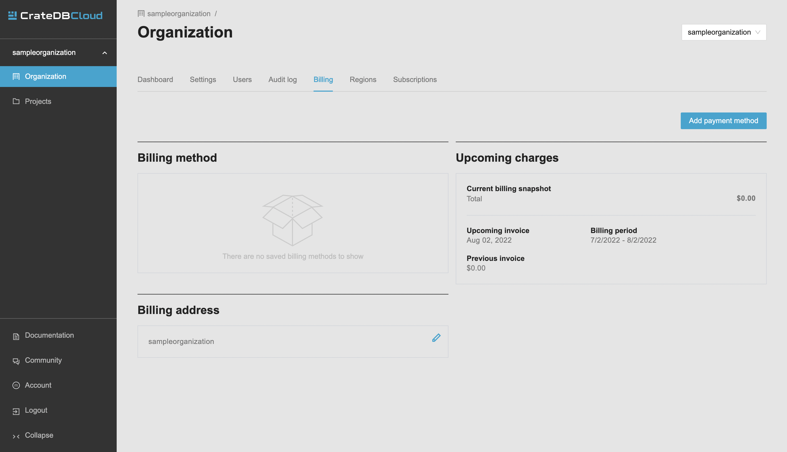

.. _cluster-deployment-croud:

===========================
Deploy a cluster with Croud
===========================

In this tutorial, we will provide a step-by-step guide to deploying a cluster
from scratch using our CLI application Croud. Our recommended procedure assumes
you have completed the :ref:`signup process <sign-up>`. The simplest way to
then deploy a cluster is to subscribe to CrateDB Cloud using your
credit card. Here we will explain how to do so, from the initial subscribing to
the deployment itself. Our payment processing and billing are powered by Stripe.

This tutorial also assumes that you have our CLI tool Croud installed in your
system. In case not, follow the Croud `Getting started`_ section.

.. rubric:: Table of contents

.. contents::
   :local:

Log in
======

When working with Croud, the first step is always logging into your account.

Croud, being a CLI application, is operated using commands. Commands should be
supplemented following this format:

.. code-block:: console

    sh$ croud [COMMAND] [OPTIONS]

To log in execute this command:

.. code-block:: console

    sh$ croud login

This will open a browser window where you will be prompted for your
credentials. You can also log in using `azuread`, `github`, or `google` using
the `--idp` argument. See full `Authentication documentation`_ for details.

.. image:: ../_assets/img/croud-login.png
   :alt: Croud login

After successfully logging in, you will see this prompt in your browser:

.. code-block:: console

    You have successfully logged into CrateDB Cloud!
    This window can be closed.

Create a project
================

The next step is to create a project in your organization. It is assumed that
you created your first organization when signing up.

To create a new project execute this command:

.. code-block:: console

    sh$ croud projects create --name sampleproject

This will create a new project named `sampleproject`. Check out full
`documentation of projects in Croud`_.

Create a subscription
=====================

To deploy a cluster, you need to create a subscription first. New subscription
can only be created in the CrateDB Cloud UI. 

To create a subscription, go to the Organization page and click on the Billing
tab.

Here, click the *Add payment method* button and input your credit card
information.

Deploy a cluster
================

When deploying a cluster, these are the required arguments:

``--product-name``
    The product name to use.

``--tier``
    The product tier to use.

``-p, --project-id``
    The project ID to use.

``--cluster-name``
    The CrateDB cluster name to use.

``--version``
    The CrateDB version to use.

``--username``
    The CrateDB username to use.

``--password``
    The CrateDB password to use.

Example
-------

.. code-block:: console

   sh$ croud clusters deploy --product-name cr1 --tier default --cluster-name my-first-crate-cluster --project-id 952cd102-91c1-4837-962a-12ecb71a6ba8 --version 4.8.1 --username admin --password "as6da9ddasfaad7i902jcv780dmcba" --subscription-id 782dfc00-7b25-4f48-8381-b1b096dd1619

   +--------------------------------------+------------------------+----------+--------------+--------------------------------------+-------------+--------------------------------------------------+
   | id                                   | name                   | numNodes | crateVersion | projectId                            | username    | fqdn                                             |
   |--------------------------------------+------------------------+----------+--------------+--------------------------------------+-------------+--------------------------------------------------|
   | 8d6a7c3c-61d5-11e9-a639-34e12d2331a1 | my-first-crate-cluster |        1 | 4.8.1        | 952cd102-91c1-4837-962a-12ecb71a6ba8 | admin       | my-first-crate-cluster.eastus.azure.cratedb.net. |
   +--------------------------------------+------------------------+----------+--------------+--------------------------------------+-------------+--------------------------------------------------+
   ==> Info: Cluster creation initiated. It may take a few minutes to complete.
   ==> Info: Status: REGISTERED (Your creation request was received and is pending processing.)
   ==> Info: Status: IN_PROGRESS (Cluster creation started. Waiting for the node(s) to be created and creating other required resources.)
   ==> Success: Operation completed.
   +--------------------------------------+------------------------+----------+--------------+--------------------------------------+-------------+--------------------------------------------------+
   | id                                   | name                   | numNodes | crateVersion | projectId                            | username    | fqdn                                             |
   |--------------------------------------+------------------------+----------+--------------+--------------------------------------+-------------+--------------------------------------------------|
   | 8d6a7c3c-61d5-11e9-a639-34e12d2331a1 | my-first-crate-cluster |        1 | 4.8.1        | 952cd102-91c1-4837-962a-12ecb71a6ba8 | admin       | my-first-crate-cluster.eastus.azure.cratedb.net. |
   +--------------------------------------+------------------------+----------+--------------+--------------------------------------+-------------+--------------------------------------------------+

.. tip::
    The minimum length of a password is 24 characters.

.. note::
    Complete documentation on clusters in Croud, including all the deployment
    arguments, can be found `here`_.

Scale a cluster
===============

After deploying, the next thing that you might want to do is scale your
cluster. This allows you to either add more CPUs or more storage to your
cluster.

Scaling
-------

Required arguments:

``--cluster-id``
    The CrateDB cluster ID to use.

``--unit``
    The product scale unit to use.

Example:

.. code-block:: console

   sh$ croud clusters scale \
       --project-id 952cd102-91c1-4837-962a-12ecb71a6ba8 \
       --cluster-id 8d6a7c3c-61d5-11e9-a639-34e12d2331a1 \
       --unit 1
   +--------------------------------------+------------------------+----------+
   | id                                   | name                   | numNodes |
   |--------------------------------------+------------------------+----------|
   | 8d6a7c3c-61d5-11e9-a639-34e12d2331a1 | my-first-crate-cluster |        2 |
   +--------------------------------------+------------------------+----------+
   ==> Info: Cluster scaling initiated. It may take a few minutes to complete the changes.
   ==> Info: Status: SENT (Your scaling request was sent to the region.)
   ==> Info: Status: IN_PROGRESS (Scaling up from 2 to 3 nodes. Waiting for new node(s) to be present.)
   ==> Success: Operation completed.
   +--------------------------------------+------------------------+----------+
   | id                                   | name                   | numNodes |
   |--------------------------------------+------------------------+----------|
   | 8d6a7c3c-61d5-11e9-a639-34e12d2331a1 | my-first-crate-cluster |        3 |
   +--------------------------------------+------------------------+----------+

Storage expansion
-----------------

Required arguments:

``--cluster-id``
    The CrateDB cluster ID to use.

``--disk-size-gb``
    New size of attached disks (in GiB).

Example:

.. code-block:: console

   sh$ croud clusters expand-storage \
       --cluster-id 8d6a7c3c-61d5-11e9-a639-34e12d2331a1 \
       --disk-size-gb 512
   +--------------------------------------+------------------------+------------------------------------+
   | id                                   | name                   | hardware_specs                     |
   |--------------------------------------+------------------------+------------------------------------|
   | 8d6a7c3c-61d5-11e9-a639-34e12d2331a1 | my-first-crate-cluster | Disk size: 256.0 GiB               |
   +--------------------------------------+------------------------+------------------------------------+
   ==> Info: Cluster storage expansion initiated. It may take a few minutes to complete the changes.
   ==> Info: Status: REGISTERED (Your storage expansion request was received and is pending processing.)
   ==> Info: Status: SENT (Your storage expansion request was sent to the region.)
   ==> Info: Status: IN_PROGRESS (Suspending cluster and waiting for Persistent Volume Claim(s) to be resized.)
   ==> Info: Status: IN_PROGRESS (Starting cluster. Scaling back up to 3 nodes. Waiting for node(s) to be present.)
   ==> Success: Operation completed.
   +--------------------------------------+------------------------+------------------------------------+
   | id                                   | name                   | hardware_specs                     |
   |--------------------------------------+------------------------+------------------------------------|
   | 8d6a7c3c-61d5-11e9-a639-34e12d2331a1 | my-first-crate-cluster | Disk size: 512.0 GiB               |
   +--------------------------------------+------------------------+------------------------------------+

.. note::
    For all arguments available when scaling, see the `cluster scale`_ and 
    `cluster storage expansion`_ documentation.

.. _Getting started: https://crate.io/docs/cloud/cli/en/latest/getting-started.html

.. _Authentication documentation: https://crate.io/docs/cloud/cli/en/latest/commands/authentication.html

.. _documentation of projects in Croud: https://crate.io/docs/cloud/cli/en/latest/commands/projects.html

.. _here: https://crate.io/docs/cloud/cli/en/latest/commands/clusters.html

.. _cluster scale: https://crate.io/docs/cloud/cli/en/latest/commands/clusters.html#clusters-scale

.. _cluster storage expansion: https://crate.io/docs/cloud/cli/en/latest/commands/clusters.html#clusters-expand-storage