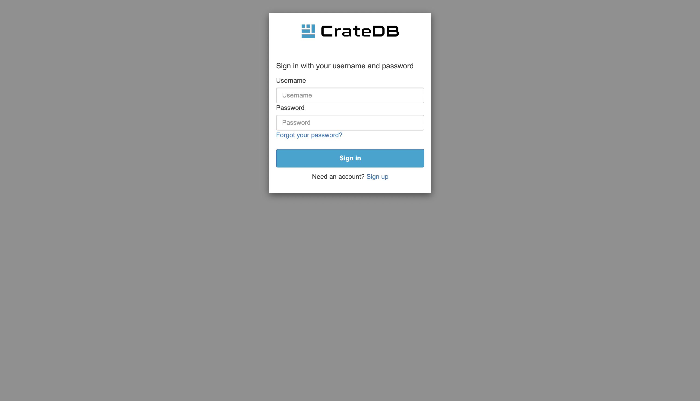

.. _cluster-deployment-croud:

===========================
Deploy a cluster with Croud
===========================

In this tutorial, we will provide a step-by-step guide to deploying a cluster
from scratch using our CLI application - `Croud`_. Our recommended procedure
assumes you have completed the :ref:`signup process <sign-up>`. The simplest
way to then deploy a cluster is to subscribe to CrateDB Cloud using your
credit card. For the purposes of this tutorial, it is assumed that you have
already created subscription in the UI. Currently, it is not possible to 
create new subscription using Croud. Our payment processing and billing are
powered by Stripe. It is also possible to subscribe using Azure and AWS.

This tutorial also assumes that you have Croud installed in your
system. If not, follow the Croud `Getting started`_ section.

.. rubric:: Table of contents

.. contents::
   :local:

.. warning::
    Because of the current implementation of subscriptions, it is NOT
    recommended to deploy your first cluster with Croud. You need to have an
    existing subscription to deploy a cluster using Croud. To create a
    subscription, `use UI`_.

Log in
======

When working with Croud, the first step is always logging into your account.

Croud, being a CLI application, is operated using commands. Commands should be
issued using the following format:

.. code-block:: console

    sh$ croud [COMMAND] [OPTIONS]

To log in execute this command:

.. code-block:: console

    sh$ croud login

This will open a browser window where you will be prompted for your
credentials. You can also log in using `azuread`, `github`, or `google` using
the `--idp` argument. See full `Authentication documentation`_ for details.

After successfully logging in, you will see this prompt in your browser:

.. code-block:: console

    You have successfully logged into CrateDB Cloud!
    This window can be closed.

Create organization
===================

The first step of deployment is creating an organization which will contain
your cluster. If you've registered recently, or didn't delete the organization
that was created automatically, you can skip this step:

.. code-block:: console

    sh$ croud organizations create --name samplecroudorganization

This will create an organization called "samplecroudorganization".

Create a project
================

The next step is to create a project in your organization.
To create a new project execute this command:

.. code-block:: console

    sh$ croud projects create --name sampleproject

This will create a new project named `sampleproject`.

Deploy a cluster
================

When deploying a cluster, these are the required arguments:

``--product-name``
    The product name to use.

``--tier``
    The product tier to use.

``-p, --project-id``
    The project ID to use.

``--cluster-name``
    The CrateDB cluster name to use.

``--version``
    The CrateDB version to use.

``--username``
    The CrateDB username to use.

``--password``
    The CrateDB password to use.

``--subscription-id``
    The CrateDB subscription to use.

Example
-------

.. code-block:: console

   sh$ croud clusters deploy --product-name cr1 --tier default --cluster-name my-crate-cluster --project-id 952cd102-91c1-4837-962a-12ecb71a6ba8 --version 4.8.1 --username admin --password "as6da9ddasfaad7i902jcv780dmcba" --subscription-id 782dfc00-7b25-4f48-8381-b1b096dd1619

   +--------------------------------------+------------------------+----------+--------------+--------------------------------------+-------------+--------------------------------------------------+
   | id                                   | name                   | numNodes | crateVersion | projectId                            | username    | fqdn                                             |
   |--------------------------------------+------------------------+----------+--------------+--------------------------------------+-------------+--------------------------------------------------|
   | 8d6a7c3c-61d5-11e9-a639-34e12d2331a1 | my-crate-cluster |        1 | 4.8.1        | 952cd102-91c1-4837-962a-12ecb71a6ba8 | admin       | my-crate-cluster.eastus.azure.cratedb.net. |
   +--------------------------------------+------------------------+----------+--------------+--------------------------------------+-------------+--------------------------------------------------+
   ==> Info: Cluster creation initiated. It may take a few minutes to complete.
   ==> Info: Status: REGISTERED (Your creation request was received and is pending processing.)
   ==> Info: Status: IN_PROGRESS (Cluster creation started. Waiting for the node(s) to be created and creating other required resources.)
   ==> Success: Operation completed.
   +--------------------------------------+------------------------+----------+--------------+--------------------------------------+-------------+--------------------------------------------------+
   | id                                   | name                   | numNodes | crateVersion | projectId                            | username    | fqdn                                             |
   |--------------------------------------+------------------------+----------+--------------+--------------------------------------+-------------+--------------------------------------------------|
   | 8d6a7c3c-61d5-11e9-a639-34e12d2331a1 | my-crate-cluster |        1 | 4.8.1        | 952cd102-91c1-4837-962a-12ecb71a6ba8 | admin       | my-crate-cluster.eastus.azure.cratedb.net. |
   +--------------------------------------+------------------------+----------+--------------+--------------------------------------+-------------+--------------------------------------------------+

.. tip:: **Parameters tips:**

    The minimum length of a password is 24 characters.
    
    | To see all the available products issue: ``croud products list``.
    | To find out your `project-id` issue: ``croud projects list``.
    | To find out your `subscription-id` issue: ``croud subscriptions list``.

.. note::
    Complete documentation on clusters in Croud, including all the deployment
    arguments, can be found `here`_.

Deploying a cluster with a specific version
-------------------------------------------

You may want to deploy a cluster with a version other than the latest. You can
do this using the ``--version`` parameter. Historical `Stable`_ and `Testing`_ or
Nightly builds are all public and available to any user. To use the
Nightly/Testing channels, you must use the ``--channel`` parameter.

.. code-block:: console

   sh$ croud clusters deploy --product-name cr1 --tier default --cluster-name my-crate-cluster --project-id 3ac44505-1d6e-419c-ad23-5d0d572915ba --version 5.2.0 --username admin --password "as6da9ddasfaad7i902jcv780dmcba" --subscription-id 3a35974f-5319-47fb-9a1f-ab85dca75c86 --channel testing

This command deploys a `5.2.0` version cluster, which is in the testing
channel at the time of writing. 

Alternatively, you can deploy a cluster with older version, like this:

.. code-block:: console

   sh$ croud clusters deploy --product-name cr1 --tier default --cluster-name my-crate-cluster --project-id f76d96aa-f1a7-46aa-a89b-8cdd2b3cef15 --version 4.8.0 --username admin --password "as6da9ddasfaad7i902jcv780dmcba" --subscription-id 3a35974f-5319-47fb-9a1f-ab85dca75c86

Scale a cluster
===============

After deploying, the next thing that you might want to do is scale your
cluster. This allows you to either add more nodes or more storage to your
cluster.

Scaling
-------

Required arguments:

``--cluster-id``
    The CrateDB cluster ID to use.

``--unit``
    The product scale unit to use. This parameter SETS the amount of nodes.
    I.e. 

    | ``--unit 0`` means **1 node**
    | ``--unit 1`` means **2 nodes**
    | ``--unit 2`` means **3 nodes** etc. 
    | This allows you to scale the performance of your cluster up or down.

Example:

.. code-block:: console

   sh$ croud clusters scale \
       --project-id 952cd102-91c1-4837-962a-12ecb71a6ba8 \
       --cluster-id 8d6a7c3c-61d5-11e9-a639-34e12d2331a1 \
       --unit 1
   +--------------------------------------+------------------------+----------+
   | id                                   | name                   | numNodes |
   |--------------------------------------+------------------------+----------|
   | 8d6a7c3c-61d5-11e9-a639-34e12d2331a1 | my-crate-cluster |        1 |
   +--------------------------------------+------------------------+----------+
   ==> Info: Cluster scaling initiated. It may take a few minutes to complete the changes.
   ==> Info: Status: SENT (Your scaling request was sent to the region.)
   ==> Info: Status: IN_PROGRESS (Scaling up from 1 to 2 nodes. Waiting for new
   node(s) to be present.)
   ==> Success: Operation completed.
   +--------------------------------------+------------------------+----------+
   | id                                   | name                   | numNodes |
   |--------------------------------------+------------------------+----------|
   | 8d6a7c3c-61d5-11e9-a639-34e12d2331a1 | my-crate-cluster |        2 |
   +--------------------------------------+------------------------+----------+

Storage expansion
-----------------

Required arguments:

``--cluster-id``
    The CrateDB cluster ID to use.

``--disk-size-gb``
    New size of attached disks (in GiB). This parameter sets the storage to 
    the size specified in parameter. **It is not possible to reduce storage.**

Example:

.. code-block:: console

   sh$ croud clusters expand-storage \
       --cluster-id 8d6a7c3c-61d5-11e9-a639-34e12d2331a1 \
       --disk-size-gb 512
   +--------------------------------------+------------------------+------------------------------------+
   | id                                   | name                   | hardware_specs                     |
   |--------------------------------------+------------------------+------------------------------------|
   | 8d6a7c3c-61d5-11e9-a639-34e12d2331a1 | my-crate-cluster | Disk size: 256.0 GiB               |
   +--------------------------------------+------------------------+------------------------------------+
   ==> Info: Cluster storage expansion initiated. It may take a few minutes to complete the changes.
   ==> Info: Status: REGISTERED (Your storage expansion request was received and is pending processing.)
   ==> Info: Status: SENT (Your storage expansion request was sent to the region.)
   ==> Info: Status: IN_PROGRESS (Suspending cluster and waiting for Persistent Volume Claim(s) to be resized.)
   ==> Info: Status: IN_PROGRESS (Starting cluster. Scaling back up to 3 nodes. Waiting for node(s) to be present.)
   ==> Success: Operation completed.
   +--------------------------------------+------------------------+------------------------------------+
   | id                                   | name                   | hardware_specs                     |
   |--------------------------------------+------------------------+------------------------------------|
   | 8d6a7c3c-61d5-11e9-a639-34e12d2331a1 | my-crate-cluster | Disk size: 512.0 GiB               |
   +--------------------------------------+------------------------+------------------------------------+

.. warning::
    When increasing storage size of a cluster, it is temporarily stopped, 
    while the operation finishes.

.. note::
    For all available arguments for the scaling command, see the 
    `cluster scale`_ and `cluster storage expansion`_ documentation.

.. _Getting started: https://crate.io/docs/cloud/cli/en/latest/getting-started.html

.. _Authentication documentation: https://crate.io/docs/cloud/cli/en/latest/commands/authentication.html

.. _documentation of projects in Croud: https://crate.io/docs/cloud/cli/en/latest/commands/projects.html

.. _here: https://crate.io/docs/cloud/cli/en/latest/commands/clusters.html

.. _cluster scale: https://crate.io/docs/cloud/cli/en/latest/commands/clusters.html#clusters-scale

.. _cluster storage expansion: https://crate.io/docs/cloud/cli/en/latest/commands/clusters.html#clusters-expand-storage

.. _Croud: https://pypi.org/project/croud/

.. _Stable: https://hub.docker.com/_/crate/tags

.. _use UI: https://console.cratedb.cloud

.. _Testing: https://hub.docker.com/r/crate/crate/tags

