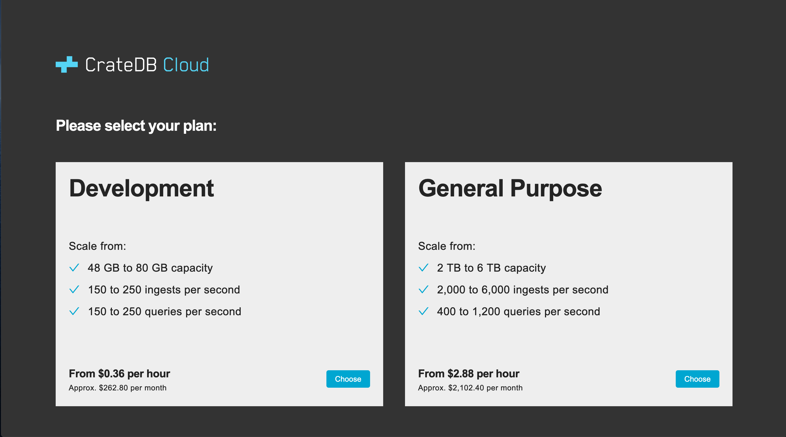
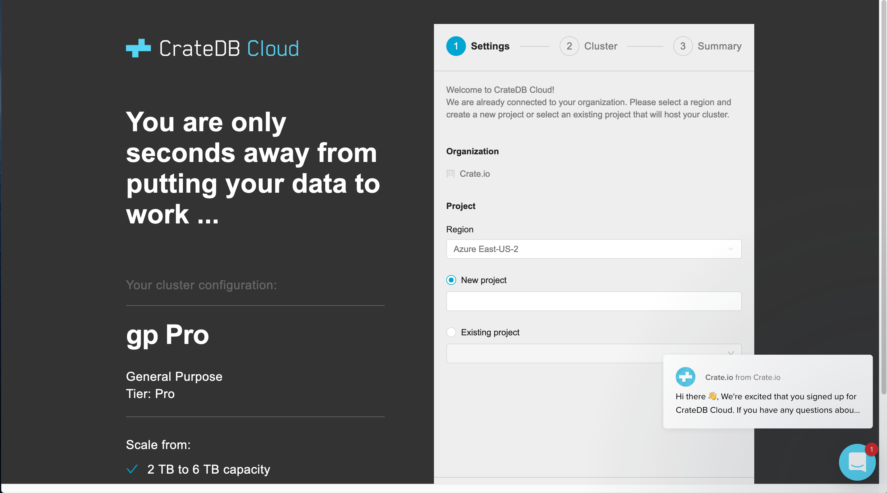
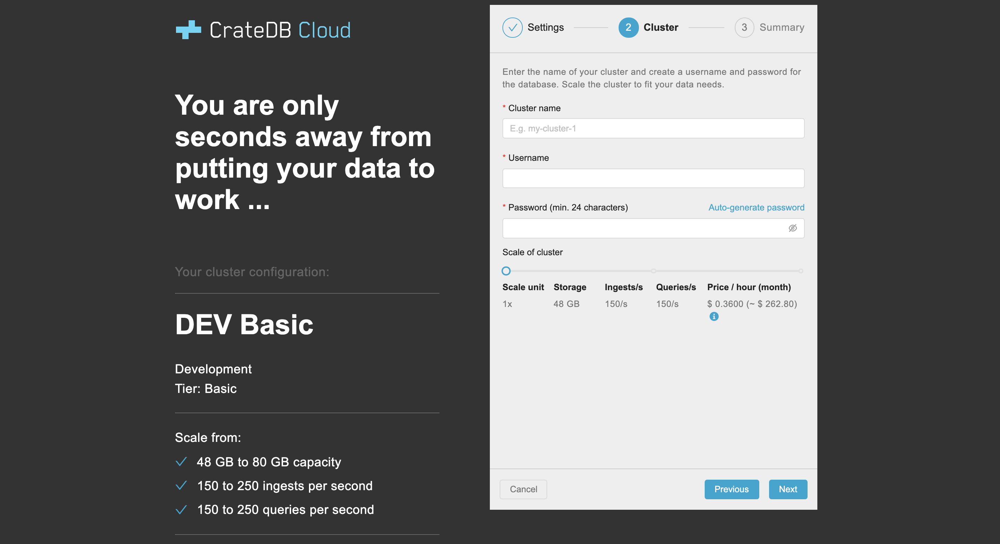
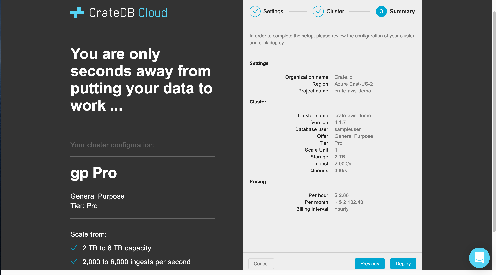

.. _configure-aws-to-cluster:

=================================
Configure and deploy your cluster
=================================

After having subscribed to the AWS Marketplace offer, you can now start to
deploy your first cluster by going through the CrateDB Cloud Console
configuration wizard. Here you will find a step-by-step description of the
process.

.. rubric:: Table of contents

.. contents::
   :local:

.. _configure-aws-to-cluster-plans:

Choose a plan
=============

You choose a subscription plan at this stage of configuration. CrateDB Cloud
currently offers two different subscription plans: *Development* and *General
Purpose*. The Development plan is intended for trying out the service. The
General Purpose plan is designed to meet production-ready use cases. In the
future, the number and nature of the subscription plans may change. To learn
more about our subscription plans, including the seamless scaling options, see
the `reference`_ on the subject.

Choose the plan of your liking by clicking the relevant *Choose* button and
proceed.

.. _configure-aws-to-cluster-wizard:

Wizard
======

You will now enter the CrateDB Cloud Console configuration wizard, where the
final steps for cluster configuration and deployment await.

Wizard step 1
-------------

After having chosen the desired subscription plan, you are referred to the
first stage of the wizard that will configure and deploy your cluster. In this
step, you must first define an organization, if you have not already done so.
(If you have, it will be pre-selected for you.) You must also select a region
for your project (within which the cluster will be deployed), and either name
a new project or choose an existing one if you have one.

You may also notice a popup in the right bottom corner. This is to welcome you
after your signup for CrateDB Cloud. In it, you will find a link to our help
document on cluster deployment, which provides a quick summary of the same
process described in this tutorial. If you want, you can also respond. This
gets you in contact with the Crate.io team.

Fill out the required lines and click *Next* to continue.

Wizard step 2
-------------

In the second step of the CrateDB Cloud Console configuration wizard, you can
define your cluster name as well as the username and password used to directly
access the cluster via its URL. The password must be at least 24 characters
long.

You can also already set the scale unit of the cluster to the level you want
here. As you move the slider horizontally, the different capacities
corresponding to each scale unit within the subscription plan will be
displayed. Currently, within each subscription plan clusters can be scaled
between scale units 1-3. The default scale unit is 1. Note that scaling the
cluster changes its price.

Do not worry, however: clusters can be scaled up or down as needed, for example
if your use case changes, at any point later on. To understand more about
subscription plans and scale units, refer to our `reference`_ on the subject.

When you have filled out the required lines and chosen a scale unit, click
*Next* to proceed.

Wizard step 3
-------------

The final step of the configuration wizard provides you with a summary of your
previous choices and the overall result. First, it shows the settings for your
organization and project, with the names you have defined. Next, it shows
the cluster information, including the version of CrateDB the cluster will be
running and once again the scale unit capacities the cluster will have.
Finally, the pricing information shows you the relevant costs of running the
cluster. Note that Crate.io always bills for usage on an hourly basis, and only
actual usage is ever billed.

Take a moment to review. If you are satisfied, click *Deploy*, and the cluster
will be deployed. Eventually, you will be forwarded to the `CrateDB Cloud
Console`_.

Deploy and connect
==================

The new cluster should be visible inside the project where you created it in
the left hand menu. Please keep in mind that the deployment can take some time
depending on the size of the cluster.

To test if your cluster is available, go to *Cluster Overview* in the Console
and click on the cluster URL. Once the cluster is up and running you should be
presented with a login form. Enter the database user and password defined in
step 2 of the wizard. After authentication the CrateDB Admin UI opens and you
can start using your cluster. For more information, visit `our Help page`_.

.. _CrateDB Cloud  Console: https://crate.io/docs/cloud/reference/en/latest/overview.html
.. _our Help page: https://help.crate.io/en/articles/1771425-accessing-cratedb-s-admin-ui
.. _reference: https://crate.io/docs/cloud/reference/en/latest/subscription-plans.html
