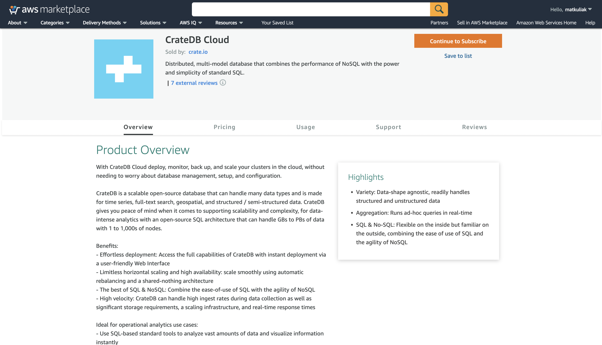
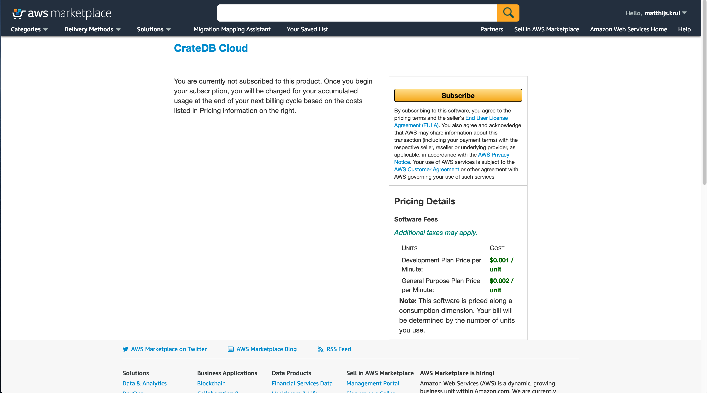
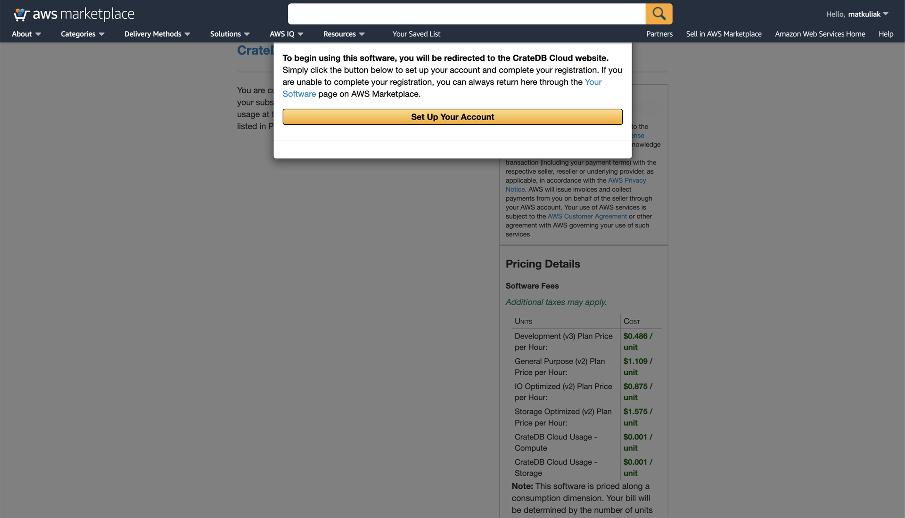

.. _signup-aws-to-cluster:

==================================================
Subscribe to CrateDB Cloud via the AWS Marketplace
==================================================

Another way to deploy a cluster on CrateDB Cloud is to sign up via AWS
Marketplace. You will need an AWS Marketplace account to proceed, which for the
purposes of this tutorial we will assume you have. (If not, you can sign up
easily `here`_.) By using CrateDB Cloud's service on AWS Marketplace, your
hourly usage is billed directly by Amazon, not by Crate.io.

.. rubric:: Table of contents

.. contents::
   :local:

.. _signup-aws-to-cluster-offer:

Using the CrateDB Cloud offer on AWS Marketplace
================================================

To subscribe to CrateDB Cloud's offering on AWS Marketplace, find the CrateDB
Cloud offer page. You can either search "CrateDB Cloud" in the search bar at
the top of the AWS Marketplace front page, or follow `this link`_ to the offer.
The top of the offer page should look as follows:

The offer page provides all the information about the CrateDB Cloud offer on
AWS you might need: a product overview, brief descriptions of the subscription
plans, the license agreement, and so forth. If you are happy with the offer,
you can subscribe via the *Continue to subscribe* button at the top right of
the offer page.

When you do, you will be referred to a page with pricing details and a request
for confirmation, like so:

After reviewing the details, click *Subscribe*.

A notice will pop up, confirming your subscription and referring you to the
configuration on the CrateDB Cloud end.

Click on the *Set Up Your Account* button to proceed.

.. _signup-aws-to-cluster-next:

Next steps
==========

Proceeding with the AWS Marketplace subscription will take you to the CrateDB
Cloud Console wizard. The next steps are to choose a subscription plan, to
configure the cluster, and to finish the CrateDB Cloud Console wizard, all of
which is described in the :ref:`next part <configure-aws-to-cluster>` of this
tutorial. This will allow deployment of your cluster.

.. _here: https://portal.aws.amazon.com/billing/signup
.. _this link: https://aws.amazon.com/marketplace/pp/B089M4B1ND
