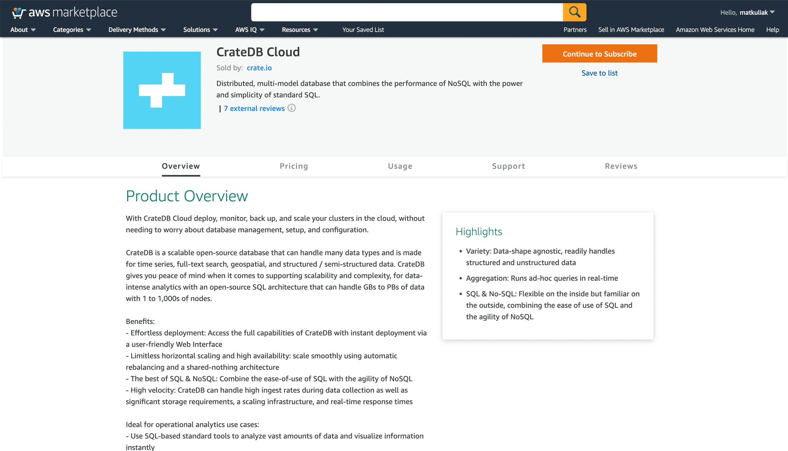
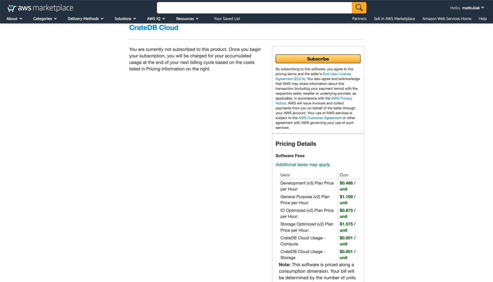
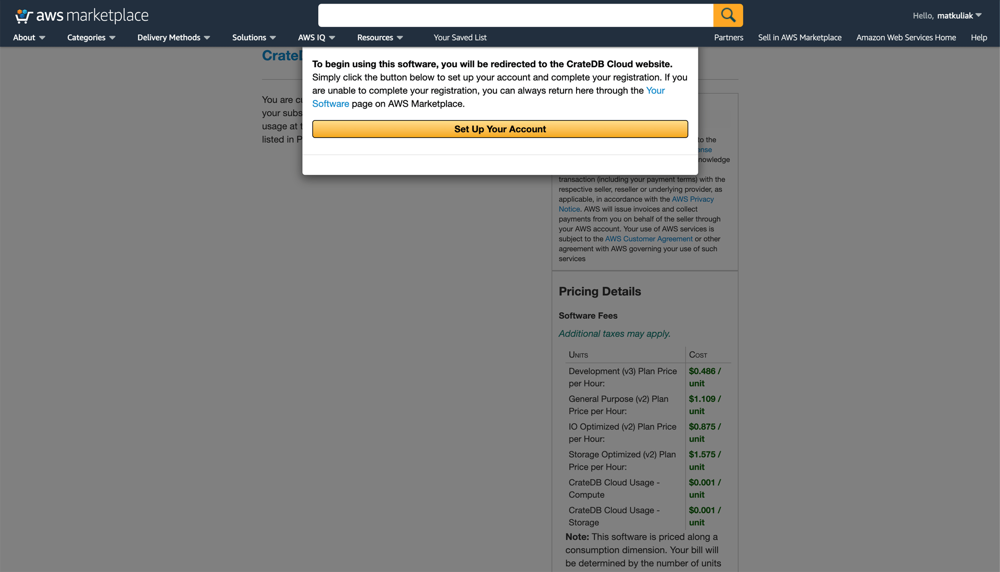
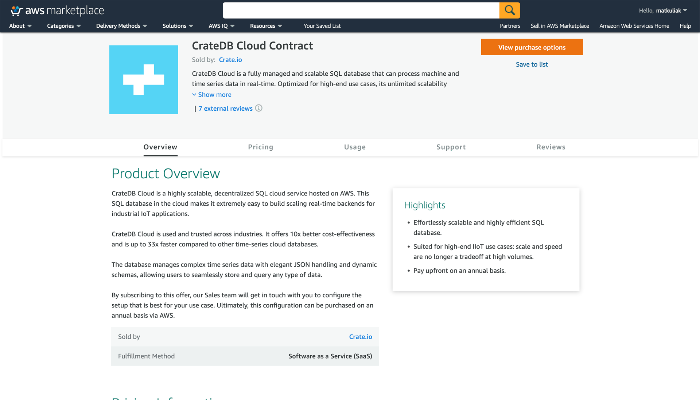

.. _signup-aws-to-cluster:

==================================================
Subscribe to CrateDB Cloud via the AWS Marketplace
==================================================

Another way to deploy a cluster on CrateDB Cloud is to sign up via AWS
Marketplace. You will need an AWS Marketplace account to proceed, which for the
purposes of this tutorial we will assume you have. (If not, you can sign up
easily on the `Marketplace page`_.) By using CrateDB Cloud's service on AWS
Marketplace, your hourly usage is billed directly by Amazon, not by Crate.io.

As a SaaS service, the subscription payment is arranged through AWS. The
cluster will be hosted in the region you select as part of the configuration
process. If you are looking for a self-hosted CrateDB Cloud service, check out
the :ref:`CrateDB Edge tutorial <edge>`. To pay directly for a hosted cluster
by credit card, see our tutorial for :ref:`direct cluster deployment
<cluster-deployment-stripe>`.

.. rubric:: Table of contents

.. contents::
   :local:

.. _signup-aws-to-cluster-offer:

Using the CrateDB Cloud offer on AWS Marketplace
================================================

To subscribe to CrateDB Cloud's offering on AWS Marketplace, find the CrateDB
Cloud offer page. You can either search "CrateDB Cloud" in the search bar at
the top of the AWS Marketplace front page, or go directly to `the AWS offer`_.
The top of the offer page should look as follows:

The offer page provides all the information about the CrateDB Cloud offer on
AWS you might need: a product overview, brief descriptions of the subscription
plans, the license agreement, and so forth. If you are happy with the offer,
you can subscribe via the *Continue to subscribe* button at the top right of
the offer page.

When you do, you will be referred to a page with pricing details and a request
for confirmation, like so:

After reviewing the details, click *Subscribe*.

A notice will pop up, confirming your subscription and referring you to the
configuration on the CrateDB Cloud end.

Click on the *Set Up Your Account* button to proceed.

.. _signup-aws-contract:

Using the CrateDB Cloud Contract on AWS Marketplace
===================================================

Alternatively, you can avail yourself of the possibility of an annual contract
for our cloud service through the CrateDB Cloud Contract. On AWS Marketplace,
the contract is a separate product for subscription purposes. You can access it
by going to the `CrateDB Cloud Contract landing page`_.

Simply subscribe to it as you would to the CrateDB Cloud subscription. A screen
will appear where you can confirm your subscription plan and review the prices
once more. After confirmation, our Sales team will get in touch with you to
configure your plan according to your specific needs. If you plan to purchase
large volumes, please contact `Sales`_ first to negotiate a private offer.

.. _signup-aws-to-cluster-next:

Next steps
==========

Proceeding with the AWS Marketplace subscription will take you to the CrateDB
Cloud Console. The next steps are to deploy a cluster, select the subscription
plan, and to finish the CrateDB Cloud Console wizard, all of which is described
in the :ref:`next part <configure-aws-to-cluster>` of this tutorial. This will
allow the full functioning of your cluster.

.. _CrateDB Cloud Contract landing page: https://aws.amazon.com/marketplace/pp/B08KHK34RK
.. _Marketplace page: https://portal.aws.amazon.com/billing/signup
.. _Sales: sales@crate.io
.. _the AWS offer: https://aws.amazon.com/marketplace/pp/B089M4B1ND