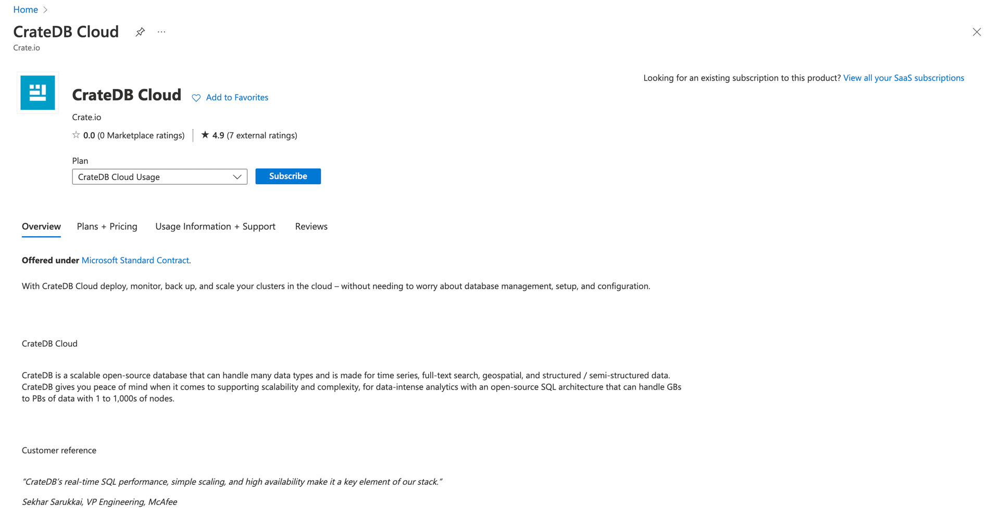
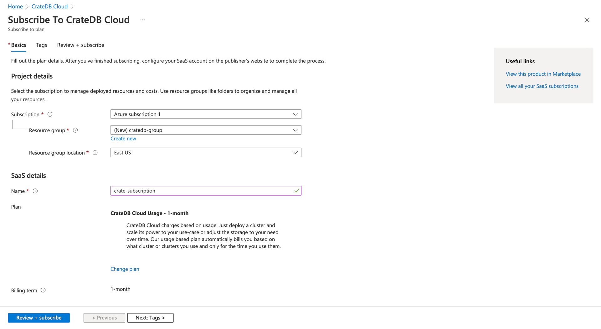
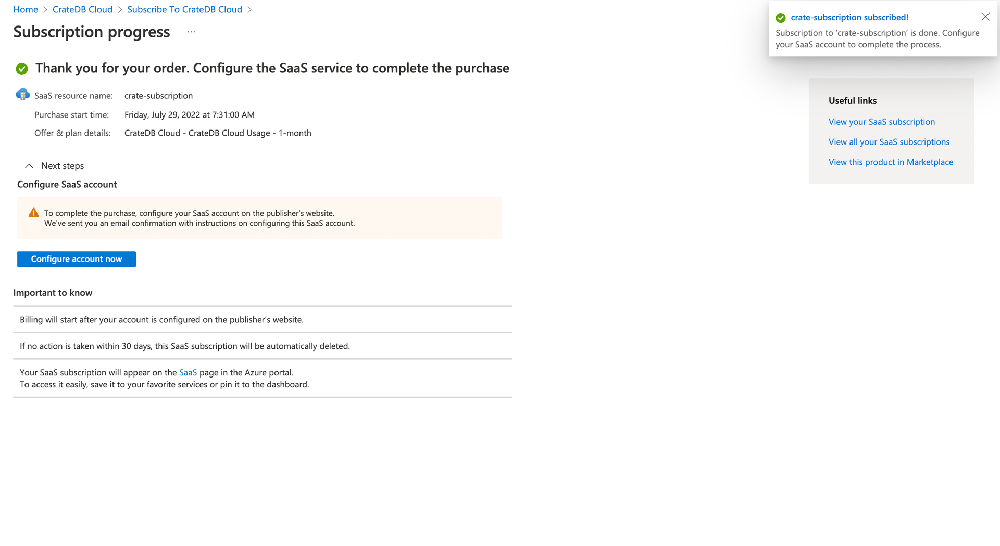

.. _signup-azure-to-cluster:

====================================================
Subscribe to CrateDB Cloud via the Azure Marketplace
====================================================

Another way to deploy a CrateDB cluster on CrateDB Cloud is via the Microsoft
Azure Marketplace. You will need a Microsoft Azure account and an Azure 
subscription with a credit card linked to it. By using CrateDB Cloud's service
on Azure Marketplace, your hourly usage is billed directly by Microsoft, not by
Crate.io.

As a SaaS service, the subscription payment is arranged through Azure. The
cluster will be hosted in the region you select as part of the configuration
process. If you are looking for a self-hosted CrateDB Cloud service, check out
the :ref:`CrateDB Edge tutorial <edge>`. To pay directly for a hosted cluster
by credit card, see our tutorial for :ref:`direct cluster deployment
<cluster-deployment-stripe>`.

.. rubric:: Table of contents

.. contents::
   :local:

.. _signup-azure-to-cluster-offer:

Using the CrateDB Cloud offer on Azure Marketplace
==================================================

To subscribe to CrateDB Cloud's offering on Azure Marketplace, find the CrateDB
Cloud offer page. You can either search "CrateDB Cloud" in the search bar at
the top of the Azure Marketplace front page or go directly to 
`Azure marketplace`_.  The top of the offer page should look as follows:

To create the subscription, click the *Get it now* button. A confirmation modal
should pop up. Once you click confirm, you will be redirected to a new page,
where you need to confirm once again.

Clicking the *Subscribe* button will start the process of creating a new
subscription. Here you can create a new resource group, specify the resource
group's location and name this new subscription. You can also apply tags to
your subscription.

.. NOTE::

   A resource group is a set of resources with the same life cycle,
   permissions, and policies. For more information on these, refer to the 
   `Azure documentation on resource groups`_. Also, more information about tags
   can be found in the `Azure documentation on tags`_.

Once everything is set, click *Review + Subscribe* in the bottom left corner
and accept the terms of use by clicking *Subscribe* again.

After confirming, a screen similar to this should appear in a few moments:

This means the process is done and the subscription was successfully created.
From here, you can follow the :ref:`usual deployment procedure
<cluster-deployment-stripe>` and use your new Azure subscription for the
billing in the CrateDB Cloud console.

.. _Azure documentation on resource groups: https://docs.microsoft.com/en-us/azure/azure-resource-manager/management/manage-resource-groups-portal
.. _Azure documentation on tags: https://docs.microsoft.com/en-us/azure/azure-resource-manager/management/tag-resources
.. _Azure Marketplace: https://azuremarketplace.microsoft.com/en-us/marketplace/apps/crate.cratedbcloud?tab=Overview