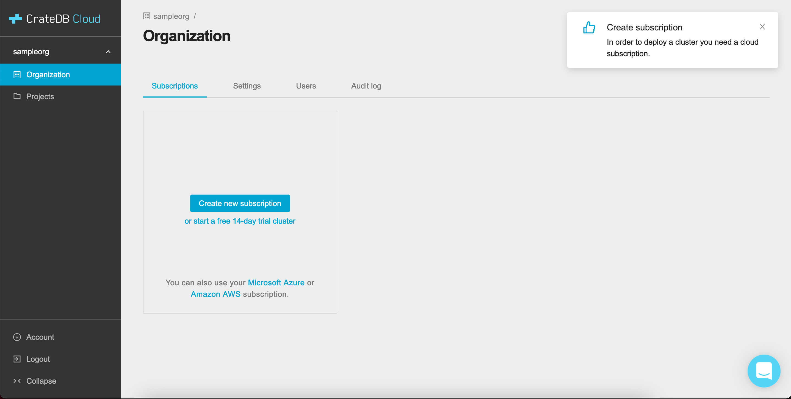
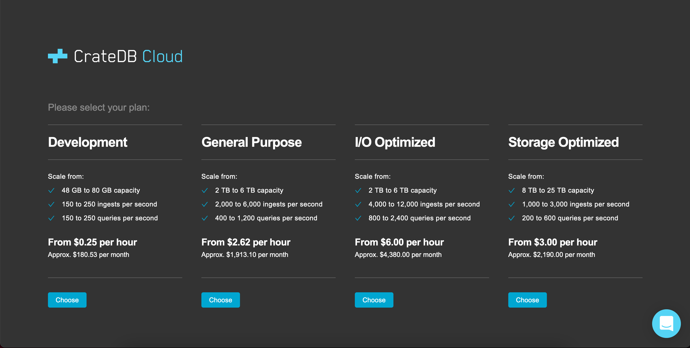

.. _cluster-deployment-stripe:

=========================
Deploy a cluster directly
=========================

In this tutorial, we will provide a step by step guide to deploying a cluster
from scratch. Our recommended procedure assumes you have completed the
:ref:`signup process <sign-up>` and have created an organization (either
through AzureAD setup or through the Amazon Cognito signup process). The
simplest way to then deploy a cluster quickly is to subscribe to CrateDB Cloud
using your credit card. Here we will explain how to do so, from the initial
subscribing to the deployment itself. Our payment processing and billing are
powered by `Stripe`_.

.. rubric:: Table of contents

.. contents::
   :local:

.. _signup-stripe:

Subscribe to CrateDB Cloud
==========================

When you have completed the initial signup process, you will see the CrateDB
Cloud Console organization overview. This normally lists all your subscriptions
and the clusters that can be deployed in them. In this case, however, you
probably do not yet have any. You will therefore only see a set of subscription
options, as well as a popup warning that you need a subscription to deploy
services on CrateDB Cloud:

As you can see, there are two options: either subscribing directly or using
one of our supported cloud partners. To subscribe directly using your credit
card, simply click the blue button marked *Create new subscription*.

.. _signup-stripe-plans:

Choose a plan
=============

You will now see an overview of the different subscription plans CrateDB Cloud
offers. For details on what each plan entails, see our `reference on
subscription plans`_.
Choose a plan to your liking by clicking *Choose*.

.. _signup-stripe-configure:

Configure your cluster
======================

Now comes the stage to finalize the subscription and configure your soon-to-be-
deployed cluster. The next part will take you through the CrateDB Cloud
cluster configuration wizard. In four quick steps, you will have everything
set up.

Wizard step 1
-------------

In the first step of the wizard, you are prompted for an organization, a
project name, and a project region. Fortunately, the organization you have
created earlier is already pre-selected for you. The region is also set by
default, but can be changed using the region dropdown menu. All that is needed
is to name the project within which your cluster will be deployed.

.. image:: ../_assets/img/stripe-wizard-step1.png
   :alt: CrateDB Cloud configuration wizard step 1

Click *Next* to proceed.

Wizard step 2
-------------

In the next step, we come to the cluster itself. Here the wizard will ask you
to name the cluster, as well as the username and the password that will
subsequently be used to access the cluster via the unique cluster URL. The
password must be at least 24 characters long; any characters are accepted,
including special characters. If you want, click the *Auto-generate password*
button to automatically generate a secure 24 character password (if it shows
a password already, clicking again will generate a new one).

.. image:: ../_assets/img/stripe-wizard-step2.png
   :alt: CrateDB Cloud configuration wizard step 2

Finally, you can also set the scale unit of the cluster to the desired level
here. As you move the slider horizontally, you will move up (or down) the scale
levels within the subscription plan you previously selected. As you will see,
the hardware capacities of the cluster will change correspondingly. Currently,
within each subscription plan clusters can be scaled between scale units 1-3.
The default scale unit is 1. Note that scaling the cluster changes its price.

Do not worry, however: clusters can be scaled up or down as needed - for
example if your use case changes - at any point later on. To understand more
about subscription plans, scaling, and scale units, refer to our `reference on
subscription plans`_ and our `scaling guide`_.

When the names and password are generated, click *Next* to continue.

Wizard step 3
-------------

This step is even easier than the others: it merely summarizes the results
of your choices. First, it shows the settings for your organization and
project, with the names you have defined. Next, it shows the cluster
information, including the version of CrateDB the cluster will be running and
once again the scale unit capacities the cluster will have. Finally, the
pricing information shows you the relevant costs of running the cluster. Note
that Crate.io always bills for usage on an hourly basis, and only actual usage
is ever billed.

.. image:: ../_assets/img/stripe-wizard-step3.png
   :alt: CrateDB Cloud configuration wizard step 3

As always, simply click *Next* to proceed.

Wizard step 4
-------------

One final step remains, however. At this stage, the wizard will prompt you for
your credit card information to bill for the cluster. Fill out the number,
expiry date, and CVC (the three numbers on the back of the card) for the credit
card you intend to use to pay for the CrateDB Cloud cluster. Additionally,
provide your billing address. Please do not forget to tick the box to authorize
Crate.io to take payments from your card.

.. image:: ../_assets/img/stripe-wizard-step4.png
   :alt: CrateDB Cloud configuration wizard step 4

When you are done, click *Next* once more.

Finish
======

You will now be returned to the CrateDB Cloud Console, but this time to the
cluster overview page. A popup menu will remind you of the username and
password you selected for connecting to the cluster. Make sure you copy this
information to a safe place (e.g., a password manager), as it will not be
retrievable past this point.

As the spinning wheel icon in the left-hand menu indicates, the cluster is now
being set up according to your specifications. Simply wait for it to finish;
no further action is needed. Thank you for choosing CrateDB Cloud!

.. _reference on subscription plans: https://crate.io/docs/cloud/reference/en/latest/subscription-plans.html
.. _scaling guide: https://crate.io/docs/cloud/howtos/en/latest/scale-cluster.html
.. _Stripe: https://stripe.com