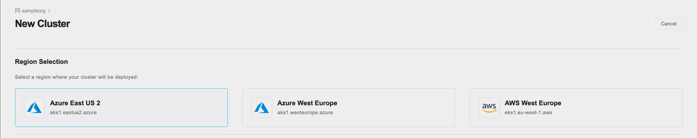
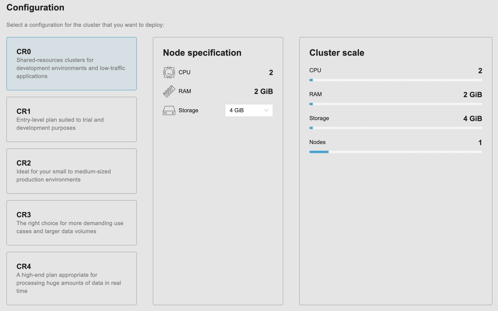
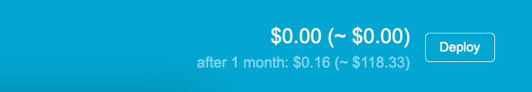
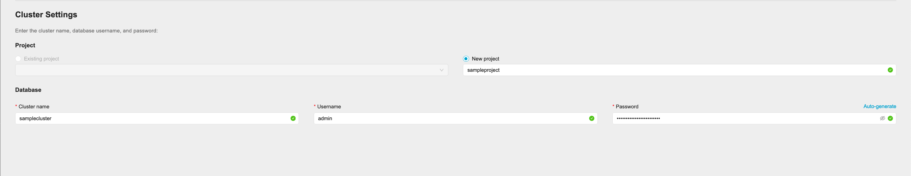
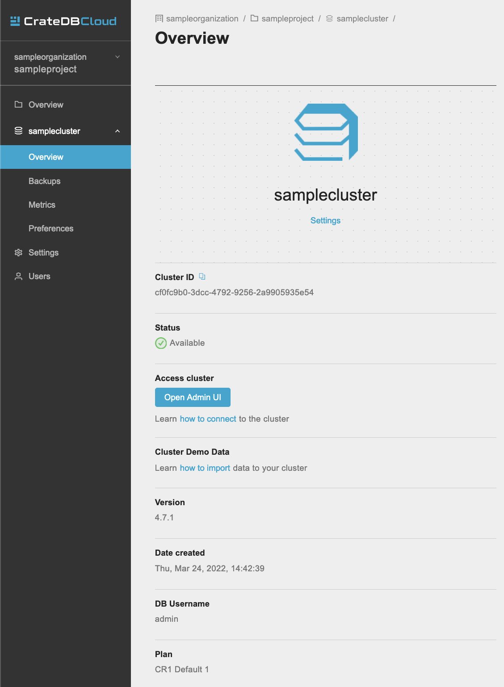

.. _cluster-deployment-stripe:

=========================
Deploy a cluster directly
=========================

In this tutorial, we will provide a step by step guide to deploying a cluster
from scratch. Our recommended procedure assumes you have completed the
:ref:`signup process <sign-up>` and have created an organization (either
through AzureAD setup or through the Amazon Cognito signup process). The
simplest way to then deploy a cluster quickly is to subscribe to CrateDB Cloud
using your credit card. Here we will explain how to do so, from the initial
subscribing to the deployment itself. Our payment processing and billing are
powered by `Stripe`_.

.. rubric:: Table of contents

.. contents::
   :local:

Deploy cluster
==============

When you have finished the signup process mentioned above, you will arrive at
the CrateDB Cloud Console. The screen will show the Organization overview:

.. image:: ../_assets/img/stripe-console.png
   :alt: CrateDB Cloud Console Organization overview

From here, click the blue *Deploy new cluster* button. This will take you to
the cluster deployment screen. This screen consists of three steps: region
selection, cluster configuration, and account settings.

Select region
-------------

First, select a `region`_. Your cluster will be deployed in this region.

.. NOTE::
    Your choice of region may affect the price of the cluster. Refer to the
    price total indicated at the bottom right of the screen.

Configure cluster
-----------------

Next, go through the cluster configuration process. On the left-hand side, you
can choose a `subscription plan`_. As you select each subscription plan, you
will see that the values for CPU, RAM, and (minimum) storage per node change
accordingly in the middle panel that shows the node specification.

Each subscription plan comes with a preconfigured compute value per node. The
compute capacity of your cluster can be scaled horizontally by adding nodes. To
do this, use the slider under the 'Cluster scale' panel. This overview shows
the current CPU and RAM values of your cluster, which is simply the compute
values of the plan you have chosen multiplied by the number of nodes.

CrateDB Cloud separates storage configuration from compute configuration. You
can separately configure the desired storage for your cluster by using the
dropdown menu under 'Storage' in the 'Node specification' panel. The range of
eligible storage sizes varies by subscription plan. The storage you have chosen
for your cluster is also reflected in the cluster overview in the right-hand
panel.

.. NOTE::
    The storage capacity of a cluster cannot currently be changed in the
    CrateDB Cloud Console once it has been deployed.

Shared-resources clusters (CR0)
~~~~~~~~~~~~~~~~~~~~~~~~~~~~~~~

The Shared-resource clusters are a special category of clusters that allow
better utilisation of resources. These cluster essentially share resources with
each other. Because of this they offer more cost-effective solution for 
smaller teams and experimental deployments of low-traffic applications. They
are limited to one node with 2 CPUs, 2 GiB of memory and 4 GiB of storage.

---

To sum up: the configuration of the cluster depends on the hardware values per
node, the storage selected, and the number of nodes in the cluster. The
hardware values per node are determined by the choice of subscription plan. The
storage capacity is set in the dropdown menu. The number of nodes in the
cluster can be configured by using the slider on the right.

Each of these choices will affect the price of the cluster. It is also possible
that a subscription plan or a number of nodes is eligible for a promotion,
making it either discounted or free. You can always find the total price per
hour and per month in the blue bar at the bottom of the screen.

.. TIP::
    To identify a promotional offer where a discount is available, look for the
    % icon under the cluster scale panel. For more information about
    promotions, see :ref:`our documentation on promoted clusters <promo>`.

    .. image:: ../_assets/img/stripe-icon.png
       :alt: Promotional icon
       :scale: 50%

Set up your account
-------------------

At the bottom of the deployment screen you can configure your account settings.
Since you have already created an organization, it does not need to be set
here. However, you can now define a project that the cluster can be deployed
in, as well as the cluster name. You also determine the database username and
password that you can use to access the cluster `Admin UI`_ later on.

Note that the cluster name has certain validation requirements: it may contain
only numbers, letters, and the dash symbol -. It must begin with a letter and
end with a letter or a number, and must be at least three characters long.

Click *Next* at the bottom right to proceed.

Provide billing information
===========================

Finally, you will be taken to a new screen where you can fill out your billing
information. Our payment processing is supported by `Stripe`_. At the bottom
right you can find the cards accepted by Crate.io. When you have filled out the
necessary information, click *Deploy* below it to deploy your cluster. Do not
forget to accept financial authorization by ticking the box at the bottom.

.. image:: ../_assets/img/stripe-billing.png
   :alt: Billing information screen

The payment and billing information you have submitted will be saved in the
Billing tab of the Organization overview screen in the CrateDB Cloud Console
(i.e., the fifth tab from the left on the same screen you arrived at).

You can at any time check your current accumulated bill at the bottom left of
the CrateDB Cloud Console screen:

.. image:: ../_assets/img/cloud-billing-meter.png
   :alt: Cloud Console billing meter

Finish
======

You will now be returned to the CrateDB Cloud Console, but this time to the
Cluster overview page. A popup menu will remind you of the username and
password you selected for connecting to the cluster. Make sure you copy this
information to a safe place (e.g., a password manager), as it will not be
retrievable past this point.

As the spinning wheel icon in the left-hand menu indicates, the cluster is now
being set up according to your specifications. Simply wait for it to finish;
no further action is needed.

When the cluster is up and running, you can connect to it with the CrateDB
AdminUI, where you can input queries and view additional metrics. To do so, go
to the cluster overview page of the cluster you just created and click on *Open
Admin UI*. You can log in with the database username and password you defined
in the account settings stage.

Thank you for choosing CrateDB Cloud!

.. _Admin UI: https://crate.io/docs/crate/admin-ui/en/latest/console.html
.. _reference on subscription plans: https://crate.io/docs/cloud/reference/en/latest/subscription-plans.html
.. _region: https://crate.io/docs/cloud/reference/en/latest/glossary.html#region
.. _scaling guide: https://crate.io/docs/cloud/howtos/en/latest/scale-cluster.html
.. _Stripe: https://stripe.com
.. _subscription plan: https://crate.io/docs/cloud/reference/en/latest/subscription-plans.html