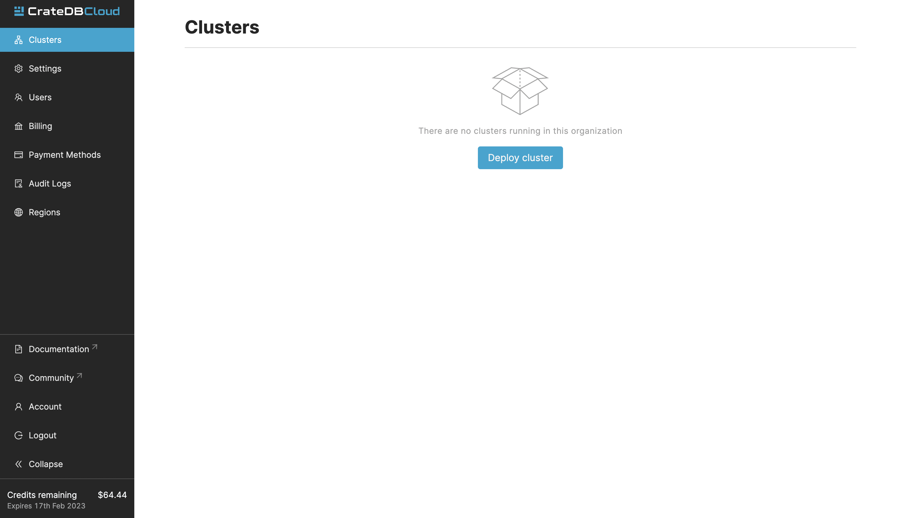
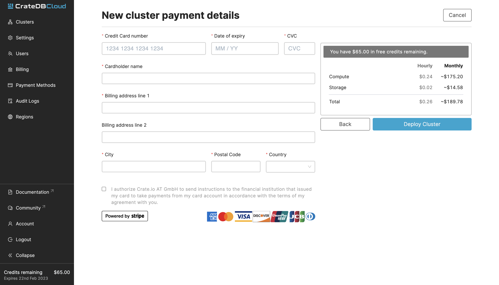

.. _cluster-deployment-stripe:

=========================
Deploy a cluster directly
=========================

In this tutorial, we will provide a step by step guide to deploying a cluster
from scratch. Our recommended procedure assumes you have completed the
:ref:`signup process <sign-up>` and have created an organization (either
through AzureAD setup or through the Amazon Cognito signup process). The
simplest way to then deploy a cluster quickly is to subscribe to CrateDB Cloud
using your credit card. Here we will explain how to do so, from the initial
subscribing to the deployment itself. Our payment processing and billing are
powered by `Stripe`_.

.. rubric:: Table of contents

.. contents::
   :local:

Deploy cluster
==============

When you have finished the signup process mentioned above, you will arrive at
the CrateDB Cloud Console. The screen will show the Organization overview:

From here, click the blue *Deploy new cluster* button. This will take you to
the cluster deployment screen. This screen consists of three steps: region
selection, cluster configuration, and account settings.

Select region
-------------

First, select a `region`_. Your cluster will be deployed in this region.

.. image:: ../_assets/img/stripe-regions.png
   :alt: Region selection

.. NOTE::
    Currently, your choice of region does not affect the price of the cluster.
    This may change in future versions of CrateDB Cloud.

Configure cluster
-----------------

Next, go through the cluster configuration process. On the left-hand side, you
can choose a subscription plan. As you select each subscription plan, you will
see that the values for CPU, RAM, and storage per node change accordingly in
the middle panel that shows the node specification.

For most subscription plans, the node specification also allows a further
choice of tier: Basic, Pro, or Premium. Each higher tier doubles the values per
node of the previous tier.

Finally, on the right the cluster scale overview shows the total values for the
cluster. This is simply the number of nodes multiplied by the values of the
subscription plan and tier. The cluster scale panel also allows you to increase
the number of nodes you want in your cluster.

.. image:: ../_assets/img/stripe-config.png
   :alt: Cluster configuration panels

To sum up: the configuration of the cluster depends on the hardware values per
node and the number of nodes in the cluster. The hardware values per node are
determined by the choice of subscription plan and the choice of tier within the
subscription plan. The number of nodes in the cluster is set in the cluster
scale panel.

Each of these choices will affect the price of the cluster, and it is possible
for a subscription plan, a tier, or a number of nodes to be subject to a free
or discounting promotion. You can always find the total price per hour and per
month in the blue bar at the bottom of the screen.

.. image:: ../_assets/img/stripe-price.png
   :alt: Total price information bar

.. HINT::
    To identify a promotional offer where a discount is available, look for the
    % icon under the cluster scale panel. For more information about
    promotions, see :ref:`our documentation on promoted clusters <promo>`.

.. image:: ../_assets/img/stripe-icon.png
   :alt: Promotional icon

Set up your account
-------------------

At the bottom of the deployment screen you can configure your account settings.
Since you have already created an organization, it does not need to be set
here. However, you can now define a project that the cluster can be deployed
in, as well as the cluster name. You also determine the database username and
password that you can use to access the cluster `Admin UI`_ later on.

.. image:: ../_assets/img/stripe-settings.png
   :alt: Account settings menu

Note that the cluster name has certain validation requirements: it may contain
only numbers, letters, and the dash symbol -. It must begin with a letter and
end with a letter or a number, and must be at least three characters long.

Click *Next* at the bottom right to proceed.

Provide billing information
===========================

Finally, you will be taken to a new screen where you can fill out your billing
information. Our payment processing is supported by `Stripe`_. At the bottom
right you can find the cards accepted by Crate.io. When you have filled out the
necessary information, click *Deploy* below it to deploy your cluster. Do not
forget to accept financial authorization by ticking the box at the bottom.

The payment and billing information you have submitted will be saved in the
Billing tab of the Organization overview screen in the CrateDB Cloud Console
(i.e., the fifth tab from the left on the same screen you arrived at).

Finish
======

You will now be returned to the CrateDB Cloud Console, but this time to the
Cluster overview page. A popup menu will remind you of the username and
password you selected for connecting to the cluster. Make sure you copy this
information to a safe place (e.g., a password manager), as it will not be
retrievable past this point.

As the spinning wheel icon in the left-hand menu indicates, the cluster is now
being set up according to your specifications. Simply wait for it to finish;
no further action is needed. Thank you for choosing CrateDB Cloud!

.. _Admin UI: https://crate.io/docs/crate/admin-ui/en/latest/console.html
.. _reference on subscription plans: https://crate.io/docs/cloud/reference/en/latest/subscription-plans.html
.. _region: https://crate.io/docs/cloud/reference/en/latest/glossary.html#region
.. _scaling guide: https://crate.io/docs/cloud/howtos/en/latest/scale-cluster.html
.. _Stripe: https://stripe.com