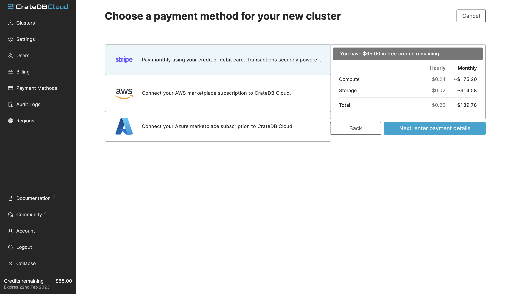
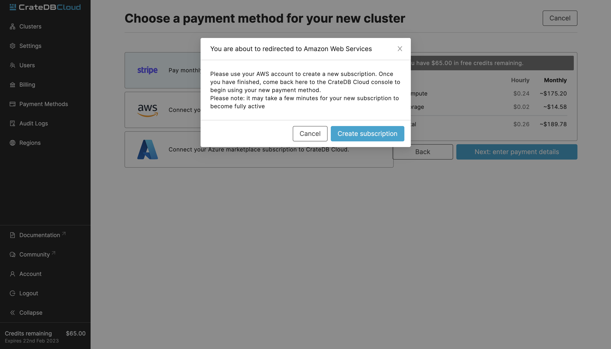

.. _cluster-deployment-stripe:

=========================
Deploy a cluster directly
=========================

In this tutorial, we will provide a step-by-step guide to deploying a cluster
from scratch. It is assumed you have completed the
:ref:`signup process <sign-up>`. If you're a first-time user, a new 
organization will have been created for you as a part of the signup process.
If not, you will need to create one manually to proceed. The simplest way to
then deploy a cluster quickly is to subscribe to CrateDB Cloud using your
credit card. Our payment processing and billing are powered 
by `Stripe`_. It is also possible to use your AWS or Azure subscription as a
payment. To follow these steps, go to the `Cloud Console`_.

.. rubric:: Table of contents

.. contents::
   :local:

Deploy cluster
==============

When you have finished the signup process, you will arrive at the CrateDB
Cloud Console. The screen will show the Clusters overview:

.. image:: ../_assets/img/stripe-console.png
   :alt: CrateDB Cloud Console Clusters overview

From here, click the blue *Deploy cluster* button to get to the cluster
deployment screen. Here you can configure the name, region, compute, storage,
and the number of deployed nodes.

Region
------

First, after naming your cluster, select a `region`_ where your cluster should
be deployed. Currently, we offer AWS and Azure regions. If you'd like to 
request a new region, there is a form present. Simply click the "Request a new
region" link, and the form will appear:

If you are deploying an :ref:`Edge <edge>` cluster, you can choose your
custom region by clicking the "Add a custom edge region" link.

Compute
-------

In the Compute section, you should choose a `subscription plan`_ that suits
your needs and use case. Plans consist of a per-node CPU and RAM allocation.

Shared-resources clusters (CR0)
~~~~~~~~~~~~~~~~~~~~~~~~~~~~~~~

The Shared-resource clusters are a special category of clusters that allow
better utilization of resources. These clusters share compute and storage
resources with other clusters in this category. Because of this, they offer
more cost-effective solution for smaller teams and experimental deployments of
low-traffic applications. They are limited to one node with 2 CPUs, 2 GiB of
memory, and 4 GiB of storage.

Storage
-------

You can choose, with the exception of CR0, how much storage space you need for
your cluster.

.. NOTE::
    The storage capacity of a cluster cannot currently be lowered in the
    CrateDB Cloud Console once it has been deployed.

Number of nodes
---------------

The number of nodes represents the horizontal scaling of your CrateDB Cloud
cluster.

---

To sum up: the configuration of the cluster consists of the hardware per-node
values (CPU, RAM, storage), and the number of nodes in the cluster.
The hardware values are determined by choice of subscription plan. Each of
these choices will affect the price of the cluster. You can always find the
total price per hour and month on the right side of the deployment screen.

Provide billing information
===========================

Next comes a payment method screen. Our credit card payment processing is
powered by `Stripe`_. If you have an existing AWS or Azure subscription, you
can also pay using that. You can choose the payment method right after you 
configure your cluster and click **Next**.

Credit card
-----------

You can find the cards accepted by Crate.io at the bottom right part of the 
screen. When you have filled out the necessary information, click *Deploy
Cluster* below it to deploy your cluster. Do not forget to accept the financial
authorization by ticking the box at the bottom.

.. image:: ../_assets/img/stripe-billing.png
   :alt: Billing information screen

AWS/Azure
---------

The other payment option is to use an AWS or Azure marketplace subscription.
Simply choose the one you'd like to use, and you will see a prompt that
will forward you to the respective marketplace page where you can confirm the
subscription.

---

The payment and billing information you have submitted will be saved in the
Billing and Payment method pages, visible in the menu on the left side of the
console.

Your current accumulated bill is shown in the billing meter in the bottom left
of the CrateDB Cloud Console screen.

Finish
======

Your cluster should now be ready to use!

.. _Admin UI: https://crate.io/docs/crate/admin-ui/en/latest/console.html
.. _Cloud Console: https://console.cratedb.cloud/?utm_campaign=2022-Q3-WS-Developer-Motion&utm_source=docs
.. _region: https://crate.io/docs/cloud/reference/en/latest/glossary.html#region
.. _Stripe: https://stripe.com
.. _subscription plan: https://crate.io/docs/cloud/reference/en/latest/subscription-plans.html