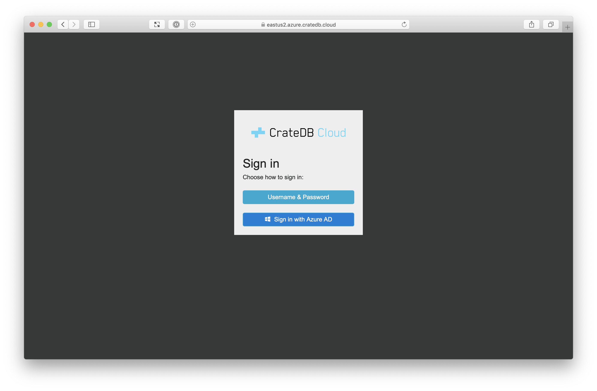
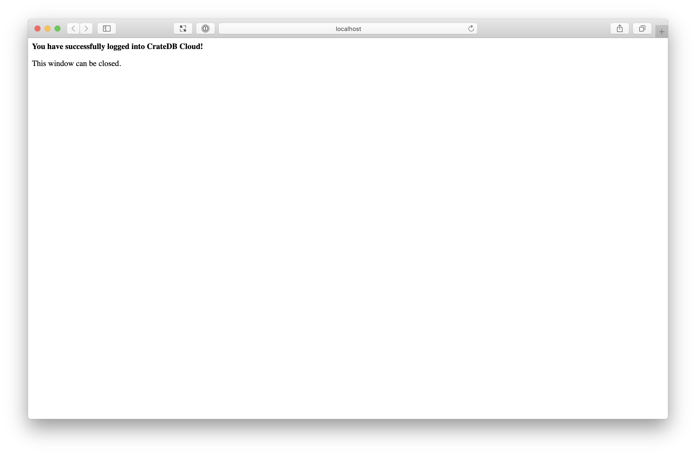

.. _configure:

=========
Configure
=========

Now that you have :ref:`a CrateDB Cloud account <sign-up>`, it's time to
install and configure `Croud`_, a *command-line interface* (CLI) tool for
interacting with the service.

.. rubric:: Table of contents

.. contents::
   :local:

.. _configure-install:

Install Croud
=============

Croud is distributed as a Python package.

Before continuing, you must have `Python 3.6 or higher`_ installed on your
system.

Install Croud from `PyPI`_, like so:

.. code-block:: console

    sh$ python3 -m pip install --user -U croud

Test the installation with a quick version check:

.. code-block:: console

    sh$ croud -v

    croud 0.18.0

.. TIP::

    Update Croud to the latest version on a regular basis for all the latest
    features.

    To update Croud, run:

    .. code-block:: console

        sh$ python3 -m pip install -U croud

.. _configure-sign-in:

Log in to CrateDB Cloud
=======================

Log in to CrateDB Cloud, like so:

.. code-block:: console

    sh$ croud login

This command should open the sign-in screen:

Sign in.

You should see this screen:

Close the window and return to the command-line.

Check it worked, like so:

.. code-block:: console

  sh$ croud me

  +--------------------+--------------+
  | email              | username     |
  |--------------------+--------------|
  | youruser@email.com | yourusername |
  +--------------------+--------------+

.. _configure-next:

Next steps
==========

Now you've logged in with Croud, you can issue commands on the command-line to
:ref:`create and deploy your first CrateDB cluster <deploy>`.

.. _Croud: https://crate.io/docs/cloud/cli/en/latest/
.. _PyPI: https://pypi.org/project/croud/
.. _Python 3.6 or higher: https://www.python.org/downloads/
