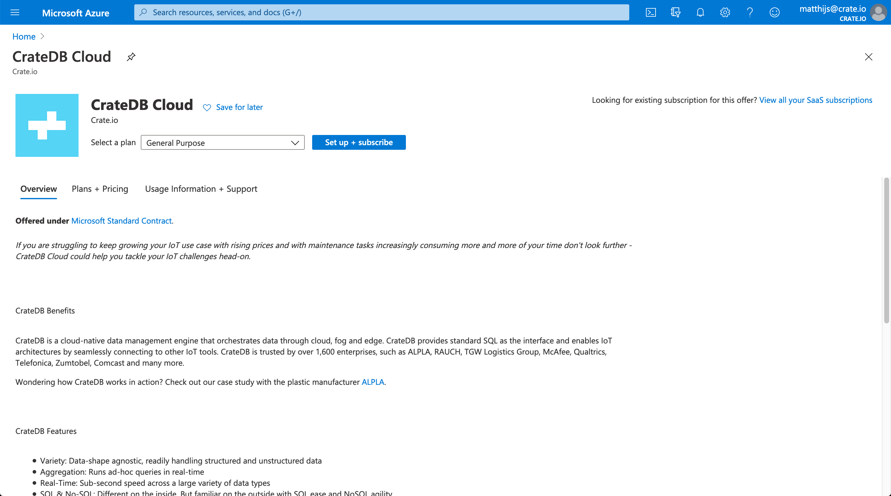

.. _signup-azure-to-cluster:

====================================================
Subscribe to CrateDB Cloud via the Azure Marketplace
====================================================

One way to deploy a CrateDB cluster on CrateDB Cloud is via the Microsoft Azure
Marketplace. You will need a Microsoft Azure account and an Azure subscription
with a credit card linked to it. By using CrateDB Cloud's service on Azure
Marketplace, your hourly usage is billed directly by Microsoft, not by
Crate.io.

.. rubric:: Table of contents

.. contents::
   :local:

.. _signup-azure-to-cluster-offer:

Using the CrateDB Cloud offer on Azure Marketplace
==================================================

Visit the CrateDB Cloud offer on Azure Marketplace via |this link|. Under the
*Plans + Pricing* tab you will find useful information on available cluster
configurations. The Development plan is suitable as a demo of CrateDB Cloud.
For production ready use cases, there is a General Purpose plan.

Once you know which plan suits your needs, click the blue *Get It Now* button
to the left to take up the CrateDB Cloud offer. After giving consent to
Microsoft sharing basic account information, you will be redirected to the
Azure Portal. The Azure Portal provides a dropdown menu where you can select
the plan you have chosen previously.

Simply select your preferred plan and confirm by clicking *Create*. Note that
you can still review the plans and pricing again at this stage before creating
one.

The next page allows you to configure the subscription you have just chosen.
First, name your subscription. Then choose a subscription type that should be
billed for the total usage. All resources in a single Azure subscription are
billed together.

.. image:: ../_assets/img/subscribe-offer.png

Once everything is set, click *Subscribe* in the bottom left corner.

Your offer with the desired subscription is now being created. This might
take a few seconds. You'll see the progress in the Azure Portal's
*Notifications* menu. Once the offer has been created you can access it either
by clicking on the notification when it appears or by going to *Home >*
*Software as a Service (SaaS)*.

Select the service you just created. You will see an orange warning sign in the
overview. This is because you first have to configure and deploy your cluster
on CrateDB Cloud. Until this is done, the cluster will not be active and
nothing will be billed.

.. _signup-azure-to-cluster-next:

Next steps
==========

The next steps are to configure your cluster in the CrateDB Cloud Console
wizard and, finally, to deploy your cluster. This will be explained in the
:ref:`next section of the tutorial <configure-azure-to-cluster>`.

.. |this link| raw:: html

    <a href="https://azuremarketplace.microsoft.com/en-us/marketplace/apps/crate.cratedbcloud?tab=Overview" target="_blank">this link</a>