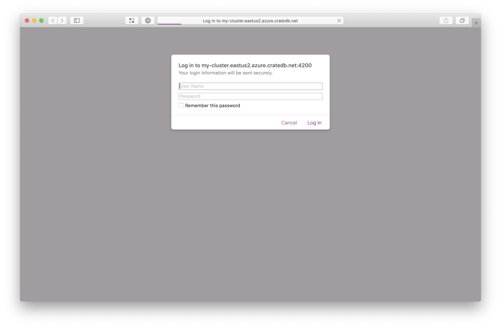
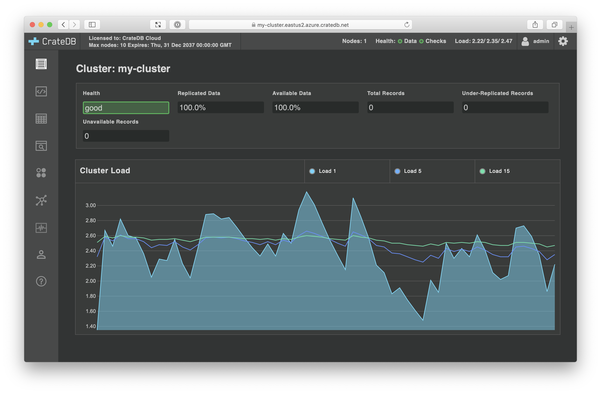
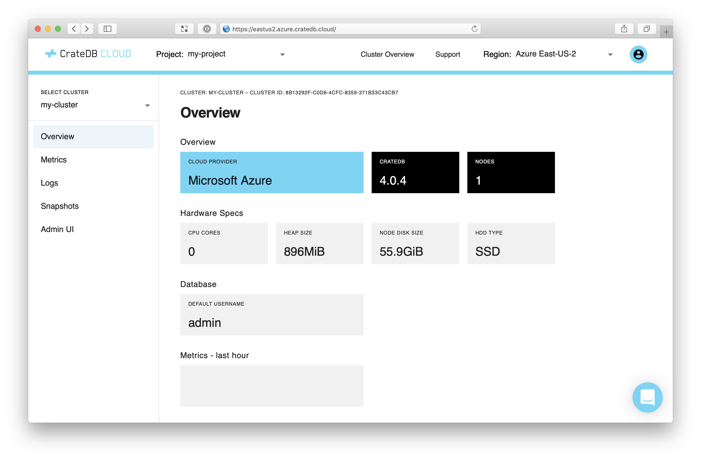

.. _deploy:

======
Deploy
======

After :ref:`logging in to your CrateDB Cloud account <configure>` with the
Croud CLI tool, you can interact with CrateDB Cloud directly from the
command-line.

Using Croud, you can deploy your first cluster.

.. rubric:: Table of contents

.. contents::
   :local:

.. _deploy-create-org:

Create an organization
======================

Before you continue, you must create an *organization*.

Organizations allow you to manage other CrateDB Cloud users, projects, and
project resources. When you create an organization, the administrator `role`_
is automatically assigned to you.

Create an organization, like so:

.. code-block:: console

    sh$ croud organizations create --name ORG_NAME

Here, replace ``ORG_NAME`` with the name of your organization.

.. SEEALSO::

    The Croud `organizations`_ command

Verify this worked by listing the organizations you belong to:

.. code-block:: console

    sh$ croud organizations list

    +--------------------------------------+-----------------+-------------+
    | id                                   | name            |   plan_type |
    |--------------------------------------+-----------------+-------------|
    | 59c7961b-33a2-4478-9e98-2a6b3f54f60e | my-organization |           3 |
    +--------------------------------------+-----------------+-------------+

Here, the output shows the created organization ID (which you will need later)
and support plan type, in addition to the name you chose.

.. NOTE::

    `Contact us`_ for more information about support plans.

.. _deploy-set-region:

Set a default region
====================

Next, set a default *region*.

`Regions`_ correspond to distinct geographic deployment areas.

Available regions:

+-------------------+-----------------------+
| Region            | Command-line option   |
+===================+=======================+
| Azure East-US     | ``eastus2.azure``     |
+-------------------+-----------------------+
| Azure West-Europe | ``westeurope.azure``  |
+-------------------+-----------------------+
| Bregenz           | ``bregenz.a1``        |
+-------------------+-----------------------+

Select Azure East-US, like so:

.. code-block:: console

    sh$ croud config set --region eastus2.azure

    ==> Info: Region switched to eastus2.azure

.. SEEALSO::

    The Croud `config`_ command

After you have set a default region, all subsequent Croud commands will use
that region until you set a new default region.

.. _deploy-list-products:

.. NOTE::

    Some CrateDB Cloud products are only available in specific regions.

    You can list the available products for a region, like so:

    .. code-block:: console

       sh$ croud products list --region eastus2.azure

    .. SEEALSO::

        The Croud `products`_ command

.. _deploy-create-proj:

Create a project
================

Next, you must create a *project*.

Projects allow you to group related resources together. All resources (including
clusters) must belong to a project, and all projects must belong to an
organization.

Create a project, like so:

.. code-block:: console

    sh$ croud projects create \
            --org-id ORG_ID \
            --name PROJECT_NAME

    +--------------------------------------+
    | id                                   |
    |--------------------------------------|
    | 57f78115-b44f-4be0-85f3-9d76734755de |
    +--------------------------------------+
    ==> Success: Project created.

Specifically:

- Replace ``ORG_ID`` with your organization ID (obtained in :ref:`a prior
  step <deploy-create-org>`).

- Replace ``PROJECT_NAME`` with the name of your project.

The output of this command provides the created project ID (which you will need
later).

.. SEEALSO::

    The Croud `projects`_ command

.. _deploy-launch-cluster:

Launch a cluster
================

You can now deploy your first CrateDB cluster:

.. code-block:: console

    sh$ croud clusters deploy \
            --product-name cratedb.az-gp1  \
            --tier xxs \
            --cluster-name CLUSTER_NAME \
            --project-id PROJECT_ID \
            --version VERSION \
            --username USERNAME \
            --password PASSWORD \

    +---------------------------------------+--------------------------------------+------------+---------------------------------------------------+
    | fqdn                                  | id                                   | name       | url                                               |
    |---------------------------------------+--------------------------------------+------------+---------------------------------------------------|
    | my-cluster.eastus2.azure.cratedb.net. | 8b13292f-c0d6-4cfc-8359-371b33c43cb7 | my-cluster | https://my-cluster.eastus2.azure.cratedb.net:4200 |
    +---------------------------------------+--------------------------------------+------------+---------------------------------------------------+
    ==> Success: Cluster deployed. It may take a few minutes to complete the changes.

Specifically:

- The ``cratedb.az-gp1`` (general purposes) product and ``xxs`` (extra
  extra small) tier has been chosen from the :ref:`list of available products
  <deploy-list-products>` for the default region.

- Replace ``CLUSTER_NAME`` with the name of your cluster. This name is used for
  `DNS`_, so must be DNS syntax compatible.

- Replace ``PROJECT`` with your project ID (obtained in :ref:`a prior
  step <deploy-create-proj>`).

- Replace ``VERSION`` with the current stable version of CrateDB, which can be
  found on the `downloads page`_.

- Replace ``USERNAME`` and ``PASSWORD`` to set up your `database user`_. (The
  ``crate`` superuser is reserved for internal use and cannot be used.)

.. CAUTION::

    Choose a strong password. Your cluster is publicly accessible on the
    internet.

The output of this command provides the created `FQDN`_, cluster ID, cluster
name, and a URL for accessing the `CrateDB Admin UI`_.

.. SEEALSO::

    The Croud `clusters`_ command

Next, visit the Admin UI using the URL provided.

You should see:

.. NOTE::

    You will not be able to access the Admin UI until the cluster has fully
    started.

Enter your CrateDB database user credentials (chosen during cluster creation)
and select *Log in*.

You will be logged in and redirected to the Admin UI:

Now your cluster has started, revisit your Cloud Console `dashboard`_. You
should see an overview screen with summary information, like this:

Congratulations! You have completed this tutorial.

.. _deploy-next:

Next steps
==========

If you're new to CrateDB, check out `Getting Started With CrateDB`_ which shows
you how to import test data and how to query.

.. SEEALSO::

    Full documentation for `Croud`_ and the `Cloud Console`_

.. _Cloud Console: https://crate.io/docs/cloud/console/en/latest/
.. _clusters: https://crate.io/docs/cloud/cli/en/latest/commands/clusters.html
.. _config: https://crate.io/docs/cloud/cli/en/latest/commands/config.html
.. _contact us: https://crate.io/contact/
.. _CrateDB Admin UI: https://crate.io/docs/clients/admin-ui/
.. _Croud: https://crate.io/docs/cloud/cli/en/latest/
.. _dashboard: https://eastus2.azure.cratedb.cloud/
.. _database user: https://crate.io/docs/crate/reference/en/latest/admin/user-management.html
.. _DNS: https://en.wikipedia.org/wiki/Domain_Name_System
.. _downloads page: https://crate.io/download/
.. _FQDN: https://en.wikipedia.org/wiki/Fully_qualified_domain_name
.. _Getting Started With CrateDB: https://crate.io/docs/crate/getting-started/en/latest/first-use/import.html
.. _organizations: https://crate.io/docs/cloud/cli/en/latest/commands/organizations.html
.. _products: https://crate.io/docs/cloud/cli/en/latest/commands/products.html
.. _projects: https://crate.io/docs/cloud/cli/en/latest/commands/projects.html
.. _regions: https://azure.microsoft.com/en-us/global-infrastructure/regions/
.. _role: https://crate.io/docs/cloud/cli/en/latest/user-roles.html#roles
