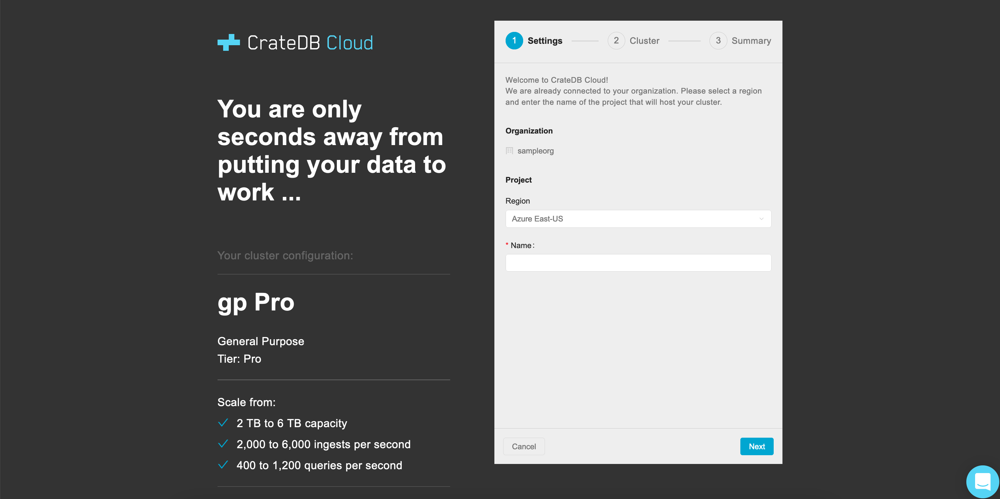
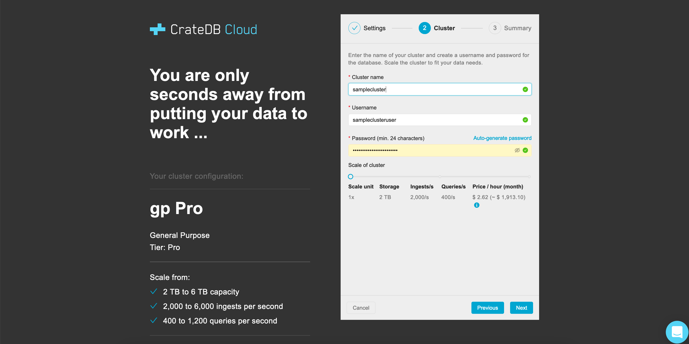
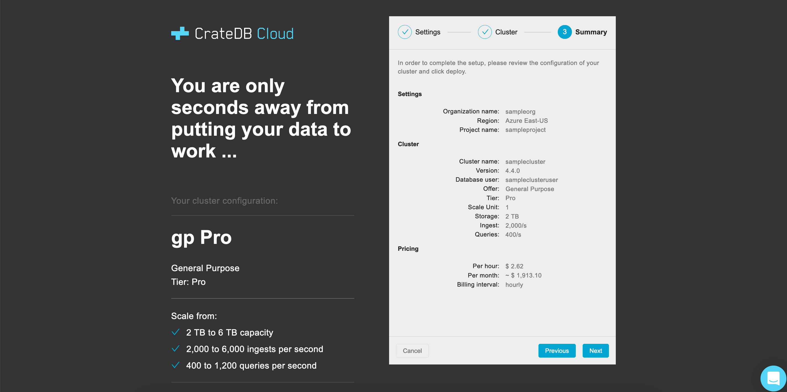
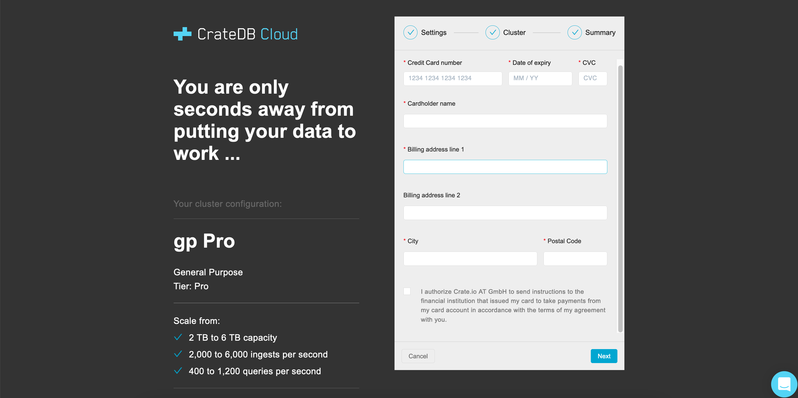

.. _edge:

============
CrateDB Edge
============

Crate.io is pleased to `announce CrateDB Edge`_, the hybrid cloud database
solution integrating CrateDB clusters and the CrateDB Cloud software stack with
on-premise or customer-controlled cloud infrastructure.

The process of getting CrateDB Edge running is far easier than it may seem,
thanks to the support for Edge deployment built into the CrateDB Cloud Console,
our own web UI. Even so, there are some steps involved, and some requirements
have to be met in order for it to work. This tutorial therefore serves as an
end-to-end walkthrough of the process and of these prerequisites.

.. rubric:: Table of contents

.. contents::
   :local:

.. _edge-disclaimer:

Disclaimer
==========

CrateDB Edge is currently in public beta. CrateDB Edge and related services are
provided on an "as is" basis and may change at any time. Crate.io provides no
guarantees or warrant regarding the usability or performance of CrateDB Edge.
The CrateDB Cloud Service Level Agreement (SLA) is expressly disclaimed for the
use of CrateDB Edge and related services. By using CrateDB Edge, you agree to
these terms and conditions.

Should you find any errors, bugs, or functionality problems while using the
CrateDB Edge public beta, please let us know via `our contact page`_ or our
`support email`_.

.. _edge-prereqs:

Prerequisites
=============

Certain hardware and software specifications must be met in order to make use
of CrateDB Edge. The most important of these is that you must provide a working
Kubernetes cluster, one that meets the following requirements:

.. rst-class:: open

* It must contain at least three nodes (for high availability).
  You can also run development workloads on a single-node cluster. Note,
  however, that you will only be able to provision single-node CrateDB
  "clusters";

* Sufficient CPU per node to run the CrateDB Cloud software stack and the OS
  (we recommend at least 4 CPU cores for reliable performance);

* A Kubernetes version > 1.15;

* A Kubernetes load balancer for accessing CrateDB Clusters;

* A storage class for persistent data.

Beyond this, using the CrateDB Cloud stack requires creating a CrateDB Cloud
account and an organization, which will become the owner of the Edge region in
which the cluster can be deployed. One must also access the CrateDB Cloud
Console in order to deploy the cluster itself, using the provided script. These
steps will be explained below.

.. NOTE::
    A special note about bare metal Kubernetes clusters: CrateDB Edge should
    work on any bare metal cluster, but the CrateDB instances running within
    require a load balancer for outside access. If you do not have a load
    balancer (for example `MetalLB`_), you can still access the CrateDB
    clusters within, but you will need to figure out the node ports to use.

.. _edge-signup:

Sign up
=======

To use the CrateDB Cloud software, you must first sign up. Follow the steps
outlined in :ref:`this tutorial <sign-up>` to do so.

.. _edge-create-org:

Create an organization
======================

When you first log in to the CrateDB Cloud Console after having created an
appropriate account, you will arrive at the organization overview page. Here
you will be prompted to create an organization.

.. image:: _assets/img/cloud-create-org.png
   :alt: CrateDB Console organization creation screen

Fill out the name of the organization and click the *Create organization*
button. After a short moment, the organization will be created and you can
proceed.

You will be taken to the Subscriptions tab of the overview page. You will be
prompted to create a new subscription. However, for the purposes of CrateDB
Edge deployment, you want to deploy directly into a given region, either one
hosted by a cloud provider or a custom region of your own. (Both routes will be
explained here.) To do so, go to the Regions tab in the same overview.

.. _edge-create-custom:

Create a custom region
======================

In the Regions tab, it is possible to create a custom region. You will want to
do this if you are hosting your cluster locally and are not relying on existing
cloud providers to host your database infrastructure.

The Regions tab shows an overview of regions hosted by cloud providers as well
as the option to create your own.

.. image:: _assets/img/cloud-regions.png
   :alt: CrateDB Console regions screen

To create a custom region, simply fill out a name for the region and click on
the *Create edge region* button.

Once you have done so, it will show your custom region.

.. image:: _assets/img/cloud-custom-region.png
   :alt: CrateDB Console custom region screen

A preconfigured script will appear in the custom region field that you have
just created. To proceed, open your local CLI and follow the steps in the next
section of the tutorial. (You may want to keep the CrateDB Cloud Console open
in your browser in the meantime.)

.. _edge-script:

Apply the script
----------------

You can use the copy function provided in the custom region field to copy the
script into your own CLI. Simply paste it there and execute the script. The
script will check whether your local setup conforms to the prerequisites listed
above. If one or more prerequisites fail, the script will notify you of this,
and you will have to install them to proceed. (We recommend `Helm`_ for
tracking and installing dependencies on Kubernetes.)

Manifest and verification
'''''''''''''''''''''''''

Once you satisfy the prerequisites, the script will ask for your confirmation
to install CrateDB Edge. Type Y or y to continue. The script will then
download the manifest files for the CrateDB Edge service and apply them.

In the final stage, the script will loop over the services and check their
availability. It continues doing this until all required services have become
available. Note that this may take some time, which depends among other things
on how fast a certificate can be issued.

Help and parameters
'''''''''''''''''''

Use the ``--help`` parameter to find an overview of the available parameters
for the script.

The parameters are defined as follows:

.. code-block:: console

    Usage:
    cratedb-cloud-edge.sh <token> [options]

    Here <token> represents the installation token provided on region creation,
    and the [options] are the optional parameters as shown below.

    Options:
      --base-url: The URL the manifest should be fetched from
      -d, --debug: Displays a lot of debug information
      --dry-run: Will not apply the downloaded manifest file. This can be used
      for checking the manifest file (edge-manifest.yaml) before applying it.
      -m, --max-execution-time (600): Maximum time in seconds the script should
      run
      --run-prerequisites: Will only run the prerequisites check
      --run-validation: Will only run the post-install validation

Once the services are up and running, the script will report: "Successfully
validated installation". At this point, you can return to the CrateDB Cloud
Console.

In the CrateDB Cloud Console, select an appropriate CrateDB Cloud
`subscription plan`_ to proceed. This will take you to the cluster
configuration wizard.

.. _edge-config:

Configure the cluster
---------------------

Now all that remains is to follow the steps in the configuration wizard to
finalize the setup of your custom CrateDB Edge cluster.

Wizard step 1
'''''''''''''

In the first step of the wizard, you are prompted for an organization, a
project name, and a project region. Fortunately, the organization and region
you have created earlier are already pre-selected for you. All that is needed
is to name the project within which your cluster will be deployed.

Click *Next* to proceed.

Wizard step 2
'''''''''''''

In the next step, we come to the cluster itself. Here the wizard will ask you
to name the cluster, as well as the username and the password that will
subsequently be used to access the cluster via the unique cluster URL. The
password must be at least 24 characters long; any characters are accepted,
including special characters. If you want, click the *Auto-generate password*
button to automatically generate a secure 24 character password (if it shows
a password already, clicking again will generate a new one).

Finally, you can also set the scale unit of the cluster to the desired level
here. As you move the slider horizontally, you will move up (or down) the scale
levels within the subscription plan you previously selected. As you will see,
the hardware capacities of the cluster will change correspondingly. Currently,
within each subscription plan clusters can be scaled between scale units 1-3.
The default scale unit is 1. Note that scaling the cluster changes its price.

When the names and password are generated, click *Next* to continue.

Wizard step 3
'''''''''''''

This step is even easier than the others: it merely summarizes the results
of your choices. First, it shows the settings for your organization and
project, with the names you have defined. Next, it shows the cluster
information, including the version of CrateDB the cluster will be running and
once again the scale unit capacities the cluster will have. Finally, the
pricing information shows you the relevant costs of running the cluster. Note
that Crate.io always bills for usage on an hourly basis, and only actual usage
is ever billed.

As always, click *Next* to proceed.

Wizard step 4
'''''''''''''

One final step remains, however. At this stage, the wizard will prompt you for
your credit card information to bill for the cluster. Fill out the number,
expiry date, and CVC (the three numbers on the back of the card) for the credit
card you intend to use to pay for the CrateDB Edge cluster. Additionally,
provide your billing address. Please do not forget to tick the box to authorize
Crate.io to take payments from your card.

When you are done, click *Deploy*. You will receive a final username and
password reminder. Subsequently, you will be taken to the Cluster overview
screen, where you will see the cluster deployment in process.

Once the cluster is fully deployed, it can be accessed through the `CrateDB
Admin UI`_ using the username and password you have defined and the URL of your
cluster.

.. NOTE::
    If your Kubernetes cluster does not provide a load balancer with an
    external IP address, you will not be able to access your cluster from the
    CrateDB Cloud Console.

.. _edge-cloud-region:

Use a cloud provider region
===========================

Besides creating your own custom region, it is also possible to use CrateDB
Edge in combination with an existing cloud provider. To deploy a cluster in
this way, follow the initial steps described above until you have :ref:`created
an organization <edge-create-org>`. Then, go to the Regions tab and instead of
creating a custom region, choose a cloud provider from the fields provided and
click *Deploy cluster*. You will be referred to the subscription plan screen.
Select your desired plan and proceed to the :ref:`configuration wizard
<edge-config>` as described above.

.. _edge-delete-region:

Delete a custom region
======================

In order to delete a custom region, click the trashcan icon at the bottom right
of the custom region panel. A confirmation screen will appear warning that
deletion of a custom region disables access to CrateDB Cloud for that region.

Deleting a custom region does not delete the resources inside that region. To
also delete the resources inside the region, run the script provided in the
deletion confirmation screen in your local CLI before confirming the deletion
in the console. This will uninstall CrateDB Edge from your local Kubernetes
cluster.

To finalize the deletion of the custom region, enter the name of your region
into the form.

.. image:: _assets/img/cloud-edge-delete.png
   :alt: CrateDB Edge deletion confirmation screen
   :scale: 50%

.. _edge-tools:

Install CrateDB Edge using an on-premise Kubernetes distribution
================================================================

In the tutorial walkthroughs below, you can read how to install CrateDB Edge
using two of the most common Kubernetes distributions: `Microk8s`_ and `K3s`_.
These are third-party tools and not officially supported by Crate.io, nor are
we responsible for their behavior. That said, we have tested the instructions
provided below for functionality. Users less familiar with customizing their
Kubernetes stack on their own may find either of these two guides a practical
solution for easier CrateDB Edge setup.

.. _edge-tools-microk8s:

Microk8s
--------

Below is a full walkthrough of how to get CrateDB Edge up and running on
Microk8s. The steps are merely examples of a process validated by us; other
methods may work also. We provide this information for ease of use and to
illustrate how to work with CrateDB Edge.

Set up Microk8s
'''''''''''''''

Follow the instructions from the `Microk8s docs`_. For the purposes of this
tutorial, we assume a `snap`_-based distribution, such as `Ubuntu`_. On this
occasion, you'll be setting up a three-node Kubernetes cluster. You can also
use a single node for testing purposes if you wish. Regardless, the
installation instructions must be run on every node you set up.

.. code-block:: console

    sudo snap install microk8s --classic --channel=1.21

    sudo usermod -a -G microk8s $USER
    sudo chown -f -R $USER ~/.kube

    microk8s status --wait-ready
    microk8s kubectl get nodes

    alias kubectl='microk8s kubectl'

    microk8s enable dns storage

Set up cluster
''''''''''''''

On one of the nodes, run the command to get joining instructions. This will
print the command that you need to run on the other two nodes to create a
Kubernetes cluster.

.. code-block:: console

    microk8s add-node

Join nodes to cluster
'''''''''''''''''''''

Now SSH into the two remaining nodes and run the command you received on the
first node.

.. code-block:: console

    root@ub11:~# microk8s join <IP of first node>:25000/<cluster id>
    Contacting cluster at <IP address>
    Waiting for this node to finish joining the cluster...

Use a storage solution
''''''''''''''''''''''

The Microk8s setup will require a storage solution. In this case, the tutorial
shows how to do so using `Longhorn`_, a distributed storage solution for
Kubernetes. You can follow the `Longhorn installation instructions`_ as
described below. (Other storage solutions for Kubernetes may work as well.)

First the installation:

.. code-block:: console

    kubectl apply -f https://raw.githubusercontent.com/longhorn/longhorn/v1.1.1/deploy/longhorn.yaml

Then you need to specify the root directory:

.. code-block:: console

    kubectl -n longhorn-system edit deployment longhorn-driver-deployer

    - name: KUBELET_ROOT_DIR
    value: /var/snap/microk8s/common/var/lib/kubelet

Set up Cloud region
'''''''''''''''''''

At this stage, you can create an Edge region via the CrateDB Cloud Console.
Follow the steps outlined above :ref:`from the CrateDB sign up onwards
<edge-signup>` to proceed.

Run the script
''''''''''''''

Run the script with the following command:

.. code-block:: console

    wget -qO- https://console.cratedb.cloud/edge/cratedb-cloud-edge.sh > edge-installer.sh
    chmod u+x edge-installer.sh
    ./edge-installer --dry-run  <token>

Note that ``dry-run`` provides, as the name suggests, a method to test the
installation by generating the manifests that are going to be applied without
applying them. This gives you an opportunity to verify them before the full
install.

The ``<token>`` in question is the token you receive from the CrateDB Console
Edge region field in the Regions tab of the Organization Overview. For more
information on this section of the CrateDB Console, refer to our :ref:`CrateDB
Cloud Console overview <cloud-reference:overview-org-regions>`.

With this, you should be ready to use CrateDB Edge via Microk8s.

.. _edge-tools-k3s:

K3S
---

Below is a full walkthrough of how to get CrateDB Edge up and running on K3S.
The steps are merely examples of a process validated by us; other methods may
work also. We provide this information for ease of use and to illustrate how to
work with CrateDB Edge.

Set up K3S
''''''''''

A simple way to bootstrap the K3S setup is with `k3sup`_. However, this
tutorial assumes you will use K3S native, which offers more granularity. Also,
this setup is suitable for a multi-node cluster.

First you have to set up the master node:

.. code-block:: console

    export INSTALL_K3S_VERSION="v1.19.10+k3s1"
    curl -sfL https://get.k3s.io | sh -s - --disable=traefik

    mkdir ~/.kube
    cp /etc/rancher/k3s/k3s.yaml ~/.kube/config
    export KUBECONFIG=~/.kube/config
    kubectl config set-context default
    kubectl get node -o wide

Next, get the token:

.. code-block:: console

    cat /var/lib/rancher/k3s/server/node-token

Note that the master node will operate both as a master and as a worker.

Join nodes to cluster
'''''''''''''''''''''

Next, you set up other worker nodes (as many as applicable to your use case):

.. code-block:: console

    export token=<token>
    export INSTALL_K3S_VERSION="v1.19.10+k3s1"
    curl -sfL https://get.k3s.io | K3S_URL="https://ub1:6443" K3S_TOKEN=$token sh -

Uninstall
'''''''''

If you need to uninstall, run:

.. code-block:: console

    /usr/local/bin/k3s-agent-uninstall.sh

Use a storage solution
''''''''''''''''''''''

The K3S setup for CrateDB Edge will require a storage solution. In this case,
the tutorial shows how to do so using `Longhorn`_, a distributed storage
solution for Kubernetes. You can follow the `Longhorn installation
instructions`_ as described below. (Other storage solutions for Kubernetes may
work as well.)

First the installation:

.. code-block:: console

    kubectl apply -f https://raw.githubusercontent.com/longhorn/longhorn/v1.1.1/deploy/longhorn.yaml

Then you need to specify the root directory. Note that unlike in the Microk8s
example above, you need to redirect the directory:

.. code-block:: console

    kubectl -n longhorn-system edit deployment longhorn-driver-deployer

        - name: KUBELET_ROOT_DIR
        value: /var/lib/rancher/k3s/agent/kubelet  ..... /var/lib/kubelet

Set up Cloud region
'''''''''''''''''''

At this stage, you can create an Edge region via the CrateDB Cloud Console.
Follow the steps outlined above :ref:`from the CrateDB sign up onwards
<edge-signup>` to proceed.

Run the script
''''''''''''''

Run the script with the following command:

.. code-block:: console

    wget -qO- https://console.cratedb.cloud/edge/cratedb-cloud-edge.sh > edge-installer.sh
    chmod u+x edge-installer.sh
    ./edge-installer --dry-run  <token>

Note that ``dry-run`` provides, as the name suggests, a method to test the
installation by generating the manifests that are going to be applied without
applying them. This gives you an opportunity to verify them before the full
install.

The ``<token>`` in question is the token you receive from the CrateDB Console
Edge region field in the Regions tab of the Organization Overview. For more
information on this section of the CrateDB Console, refer to our :ref:`CrateDB
Cloud Console overview <cloud-reference:overview-org-regions>`.

With this, you should be ready to use CrateDB Edge via K3S.

.. _announce CrateDB Edge: https://crate.io/a/announcing-cratedb-edge/
.. _our contact page: https://crate.io/contact/
.. _CrateDB Admin UI: https://crate.io/docs/crate/admin-ui/en/latest/
.. _Helm: https://helm.sh/docs/intro/quickstart/
.. _ingress-nginx: https://github.com/kubernetes/ingress-nginx
.. _installation instructions: https://kubernetes.github.io/ingress-nginx/deploy/
.. _K3s: https://k3s.io/
.. _k3sup: https://github.com/alexellis/k3sup
.. _Longhorn: https://longhorn.io/
.. _Longhorn installation instructions: https://longhorn.io/docs/1.1.1/deploy/install/install-with-kubectl/
.. _MetalLB: https://metallb.universe.tf/
.. _Microk8s: https://microk8s.io/
.. _Microk8s docs: https://microk8s.io/docs
.. _snap: https://snapcraft.io/
.. _subscription plan: https://crate.io/docs/cloud/reference/en/latest/subscription-plans.html
.. _support email: support@crate.io
.. _Ubuntu: https://ubuntu.com/