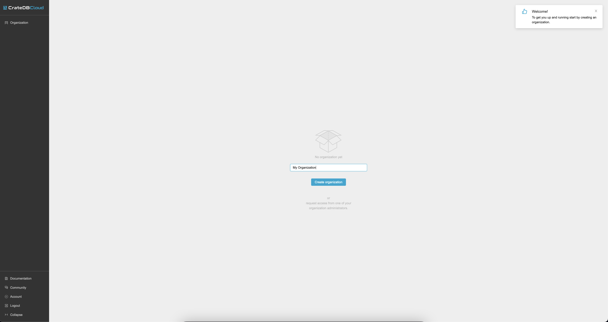
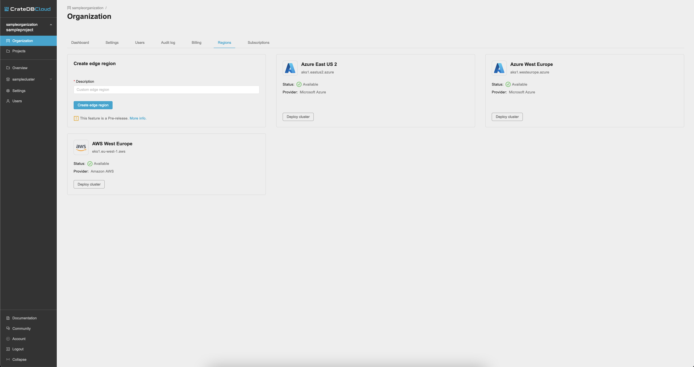
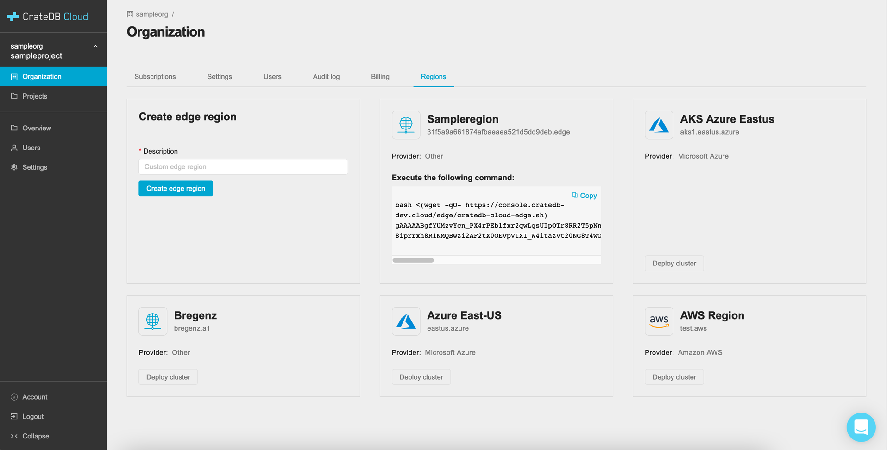
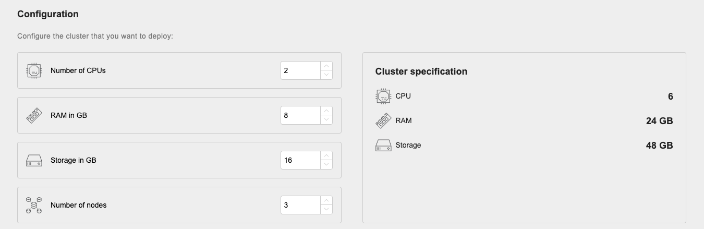
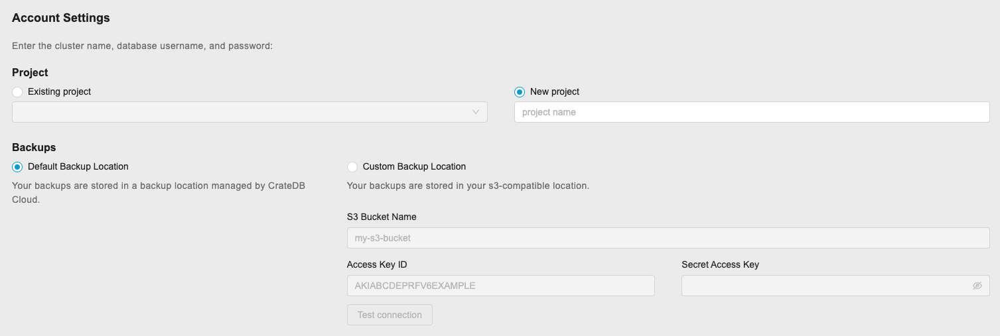
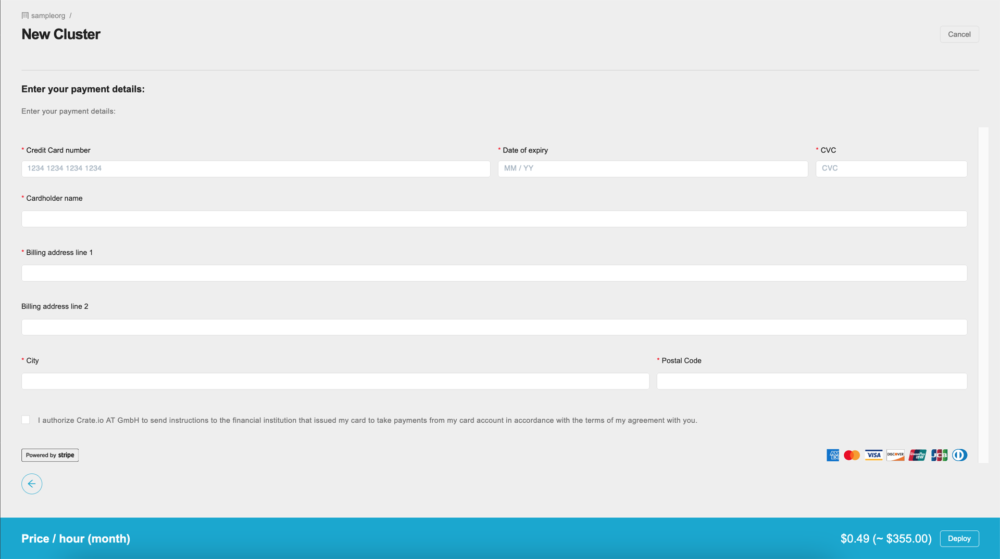
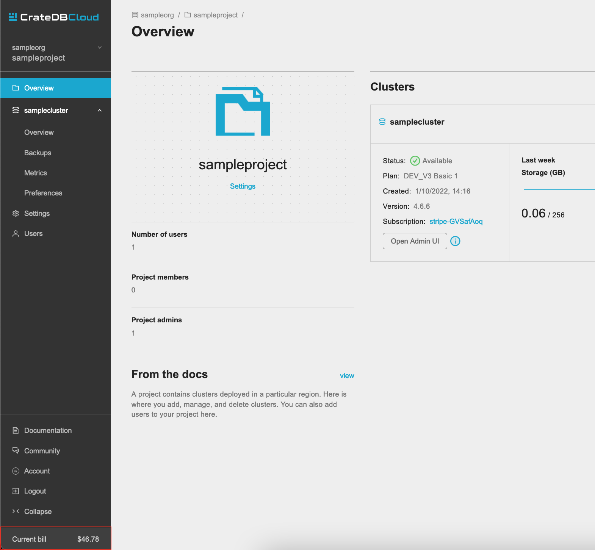
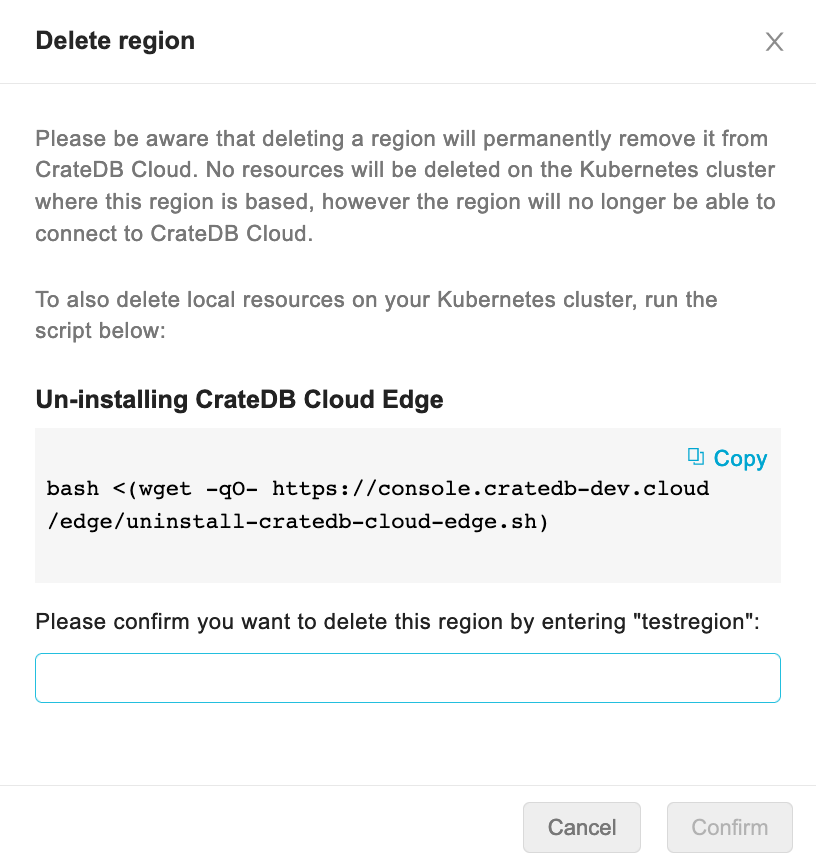

.. _edge:

============
CrateDB Edge
============

Crate.io is pleased to `announce CrateDB Edge`_, the hybrid cloud database
solution integrating CrateDB clusters and the CrateDB Cloud software stack with
on-premise or customer-controlled cloud infrastructure.

The CrateDB Edge concept is simple. You bring your own Kubernetes
infrastructure - whether in a production site, office, laboratory, or local
setup, or in your existing managed cloud infrastructure on AWS, Azure, or GCP.
Wherever it may be, we provide the full experience of CrateDB Cloud to that
Kubernetes environment. You keep your existing infrastructure setup and you get
all the benefits of CrateDB Cloud on top: from quick deployment to seamless
scaling and easy cluster management.

The process of getting CrateDB Edge running is far easier than it may seem,
thanks to the support for Edge deployment built into the CrateDB Cloud Console,
our own web UI. Even so, there are some steps involved, and some requirements
have to be met in order for it to work. This tutorial therefore serves as an
end-to-end walkthrough of the process and prerequisites.

In this tutorial, we first introduce the signup and configuration process for
a local Kubernetes installation. Next, we explain the process end-to-end for
using AKS and EKS services. Finally, we outline the installation method for
some lightweight Kubernetes distributions, like K3s and Microk8s.

.. rubric:: Table of contents

.. contents::
   :local:

.. _edge-disclaimer:

Disclaimer
==========

CrateDB Edge is currently in Pre-Release. CrateDB Edge and related services are
provided on an "as is" basis and may change at any time. Crate.io provides no
guarantees or warrant regarding the usability or performance of CrateDB Edge.
The CrateDB Cloud Service Level Agreement (SLA) is expressly disclaimed for the
use of CrateDB Edge and related services until further notice. By using CrateDB
Edge, you agree to these terms and conditions.

Should you find any errors, bugs, or functionality problems while using the
CrateDB Edge Pre-Release, please let us know via `our contact page`_ or our
`support email`_.

.. _edge-prereqs:

Prerequisites
=============

Certain hardware and software specifications must be met in order to make use
of CrateDB Edge. The most important of these is that you must provide a working
Kubernetes cluster, one that meets the following requirements:

.. rst-class:: open

* It must contain at least three nodes (for high availability).
  You can also run development workloads on a single-node cluster. Note,
  however, that you will only be able to provision single-node CrateDB
  "clusters";

* Sufficient CPU per node to run the CrateDB Cloud software stack and the OS
  (we recommend at least 4 CPU cores for reliable performance);

* A Kubernetes version > 1.15 and < 1.22 (support for Kubernetes versions 1.22+
  is coming in the near future);

* A Kubernetes load balancer for accessing CrateDB Clusters;

* A storage class for persistent data.

Beyond this, using the CrateDB Cloud stack requires creating a CrateDB Cloud
account and an organization, which will become the owner of the Edge region in
which the cluster can be deployed. One must also access the CrateDB Cloud
Console in order to deploy the cluster itself, using the provided script. These
steps will be explained below.

Some Kubernetes knowledge, especially regarding networking and storage, is
recommended when using CrateDB Edge, especially when using it as-is. If you're
uncertain, you may benefit from using CrateDB Edge in combination with
:ref:`cloud providers or third-party tools <edge-providers>` as described
further down in this tutorial.

.. NOTE::
    A special note about bare metal Kubernetes clusters: CrateDB Edge should
    work on any bare metal cluster, but the CrateDB instances running within
    require a load balancer for outside access. If you do not have a load
    balancer (for example `MetalLB`_), you can still access the CrateDB
    clusters within, but you will need to figure out the node ports to use.

.. _edge-signup:

Sign up
=======

To use the CrateDB Cloud software, you must first sign up. Follow the steps
outlined in :ref:`this tutorial <sign-up>` to do so.

.. _edge-create-org:

Create an organization
======================

When you first log in to the CrateDB Cloud Console after having created an
appropriate account, you will arrive at the Organization overview page. Here
you will be prompted to create an organization.

Fill out the name of the organization and click the *Create organization*
button. After a short moment, the organization will be created and you can
proceed.

You will be taken to the Subscriptions tab of the Organization overview page.
You will be prompted to create a new subscription. However, for the purposes of
CrateDB Edge deployment, you want to deploy directly into a given region,
either one hosted by a cloud provider or a custom region of your own. (Both
routes will be explained here.) To do so, go to the Regions tab in the same
overview.

.. _edge-create-custom:

Create a custom region
======================

In the Regions tab, it is possible to create a custom region. You will want to
do this if you are hosting your cluster locally and are not relying on existing
cloud providers to host your database infrastructure.

The Regions tab shows an overview of regions hosted by cloud providers as well
as the option to create your own.

To create a custom region, simply fill out a name for the region and click on
the *Create edge region* button.

Once you have done so, it will show your custom region.

A preconfigured script will appear in the custom region field that you have
just created. To proceed, open your local CLI and follow the steps in the next
section of the tutorial. (You may want to keep the CrateDB Cloud Console open
in your browser in the meantime.)

.. _edge-script:

Apply the script
----------------

You can use the copy function provided in the custom region field to copy the
script into your own CLI. Simply paste it there and execute the script. The
script will check whether your local setup conforms to the prerequisites listed
above. If one or more prerequisites fail, the script will notify you of this,
and you will have to install them to proceed. (We recommend `Helm`_ for
tracking and installing dependencies on Kubernetes.)

.. NOTE::
    You must have `wget`_ and `jq`_ installed for the script to function.

Manifest and verification
'''''''''''''''''''''''''

Once you satisfy the prerequisites, the script will ask for your confirmation
to install CrateDB Edge. Type Y or y to continue. The script will then
download the manifest files for the CrateDB Edge service and apply them.

In the final stage, the script will loop over the services and check their
availability. It continues doing this until all required services have become
available. Note that this may take some time, which depends among other things
on how fast a certificate can be issued.

Help and parameters
'''''''''''''''''''

Use the ``--help`` parameter to find an overview of the available parameters
for the script.

The parameters are defined as follows:

.. code-block:: console

    Usage:
    cratedb-cloud-edge.sh <token> [options]

    Here <token> represents the installation token provided on region creation,
    and the [options] are the optional parameters as shown below.

    Options:
      --base-url: The URL the manifest should be fetched from
      -d, --debug: Displays a lot of debug information
      --dry-run: Will not apply the downloaded manifest file. This can be used
      for checking the manifest file (edge-manifest.yaml) before applying it.
      -m, --max-execution-time (600): Maximum time in seconds the script should
      run
      --run-prerequisites: Will only run the prerequisites check
      --run-validation: Will only run the post-install validation

Once the services are up and running, the script will report: "Successfully
validated installation". At this point, you can return to the CrateDB Cloud
Console.

In the CrateDB Cloud Console you can now deploy a cluster from within your
custom Edge region. Go to the Regions tab of the Organization overview to find
your custom region and deploy your cluster from there. This will take you to
the cluster configuration screen.

.. _edge-config:

Configure the cluster
---------------------

Configuration
'''''''''''''

Next, go through the cluster configuration process. You will see your custom
Edge region is selected, so no region selection is necessary. You can move
directly to the cluster configuration. You can configure your desired hardware
values for CPU, RAM, and storage per node manually in the panel provided, as
well as the number of nodes you want in your cluster.

On the right the cluster scale overview shows the total hardware values for the
cluster. This is simply the number of nodes you have chosen, multiplied by the
values per node you have defined.

At the bottom of the deployment screen you can configure your account settings.
Since you have already created an organization, it does not need to be set
here. However, you can now define a project that the cluster can be deployed
in, as well as the cluster name. You also determine the database username and
password that you can use to access the cluster `Admin UI`_ later on.

Note that the cluster name has certain validation requirements: it may contain
only numbers, letters, and the dash symbol -. It must begin with a letter and
end with a letter or a number, and must be at least three characters long.

You can also here define the backup location of your CrateDB Edge cluster. You
have the option of either using the default backup location for CrateDB Cloud,
which is managed by us, or use a custom backup location that is convenient to
you. This has to be an S3 bucket or a location with an equivalent
functionality. In the latter case, you can set the access key and secret here
as well. You can test the connection as well; keep in mind that you cannot
proceed with a custom backup location unless the connection to it is
functional.

Click *Next* at the bottom right to proceed.

Billing
'''''''

Finally, you will be taken to a new screen where you can fill out your billing
information. Our payment processing is supported by `Stripe`_. At the bottom
right you can find the cards accepted by Crate.io. When you have filled out the
necessary information, click *Deploy* below it to deploy your cluster. Do not
forget to accept financial authorization by ticking the box at the bottom.

The payment and billing information you have submitted will be saved in the
Billing tab of the Organization overview screen in the CrateDB Cloud Console
(i.e., the fifth tab from the left on the same screen you arrived at).

You can at any time check your current accumulated bill at the bottom left of
the CrateDB Cloud Console screen:

Finish up
---------

You will now be returned to the CrateDB Cloud Console, but this time to the
Cluster overview page. A popup menu will remind you of the username and
password you selected for connecting to the cluster. Make sure you copy this
information to a safe place (e.g., a password manager), as it will not be
retrievable past this point.

You can use the Cluster overview page to access your cluster via the Admin UI
(see, however, the note below).

.. NOTE::
    If your Kubernetes cluster does not provide a load balancer with an
    external IP address, you will not be able to access your cluster from the
    CrateDB Cloud Console.

.. _edge-cloud-region:

Use a cloud provider region
===========================

Besides creating your own custom region, it is also possible to use CrateDB
Edge in combination with an existing cloud provider. To deploy a cluster in
this way, follow the initial steps described above until you have :ref:`created
an organization <edge-create-org>`. Then, go to the Regions tab and instead of
creating a custom region, choose a cloud provider from the fields provided and
click *Deploy cluster*. You will be referred to the subscription plan screen.
Select your desired plan and proceed to the :ref:`configuration wizard
<edge-config>` as described above.

.. _edge-delete-region:

Delete a custom region
======================

In order to delete a custom region, click the trashcan icon at the bottom right
of the custom region panel. A confirmation screen will appear warning that
deletion of a custom region disables access to CrateDB Cloud for that region.

Deleting a custom region does not delete the resources inside that region. To
also delete the resources inside the region, run the script provided in the
deletion confirmation screen in your local CLI before confirming the deletion
in the console. This will uninstall CrateDB Edge from your local Kubernetes
cluster.

To finalize the deletion of the custom region, enter the name of your region
into the form.

.. _edge-providers:

Managed Kubernetes installation instructions
============================================

In this section, we provide more specific installation instructions for some
managed Kubernetes providers, such as `Azure AKS`_, `Amazon EKS`_, and `Digital
Ocean`_.

.. NOTE::
    These guides are provided as example scenarios only. Other managed
    Kubernetes providers or preconfigured Kubernetes distributions may also
    work with CrateDB Edge.

These are third-party tools and Crate.io is not responsible for those tools.
That said, we have tested the instructions provided below for functionality.
Users less familiar with customizing their Kubernetes stack on their own may
find any of these approaches a practical solution for easier CrateDB Edge
setup.

.. _edge-providers-aks:

Azure AKS
---------

Below is a step-by-step guide to using Azure AKS as a managed Kubernetes
provider in combination with CrateDB Edge. The steps are merely examples of a
process validated by us; other methods may work also. We provide this
information for ease of use and to illustrate how to work with CrateDB Edge.

Sign up
'''''''

First you must `sign up with Azure AKS`_. On the AKS page, click the *Start
Free* button or use the pay-as-you-go option. If you have an Azure account
already, you can use this account to sign up with. Once signed up, continue to
the Azure portal.

Create kubernetes cluster
'''''''''''''''''''''''''

In the Azure portal, find the "Kubernetes services" option. (You can use the
search bar at the top to do so.) You will see an overview of any Kubernetes
services you may already have running. Click on *Create*, then *Create
Kubernetes cluster*.

In the configuration menu, choose the desired subscription and resource group
or create a new one. Name your cluster as you wish and select the desired
region. We recommend using the default Kubernetes version. Finally, pick the
server availability you want, which affects your AKS pricing.

For the node size, it is important to conform to the :ref:`minimum requirements
set out above <edge-prereqs>`. For this reason, we strongly recommend choosing
a VM size that is at least 4 CPUs and 8GiB of RAM, for example the "D4s_v3"
combination. Additionally, we recommend using at least 3 nodes for a
production-grade high-availability setup. Other settings may be left on default
or adjusted as desired depending on your production requirements. (The default
settings should be fully functional for CrateDB Edge.) Then proceed with
creating the cluster. This process may take some time.

If you have `kubectl`_ installed, you can check on the node status once it is
finished by running in the `Azure CLI`_ the command

.. code-block:: console

    az aks get-credentials --resource-group <resource group name> --name <cluster name>

followed by

.. code-block:: console

    kubectl get nodes

which will show you all nodes. When all nodes are set to 'Ready', the cluster
is functioning properly. (Make sure you are in the right subscription before
running the commands, or this process will not work.)

After cluster deployment, you can click on *Go to resource* in the Azure Portal
to check that all configurations are as intended.

Set up Edge region
''''''''''''''''''

Sign up with, or log into, the `CrateDB Cloud Console`_. Go to the Regions tab
in the Subscription overview and create a custom Edge region by clicking on
*Create Edge region*. When the region has appeared in the regions list, it
will show a script that you can copy into your CLI. Do so and confirm
installation of CrateDB Edge on the correct cluster. The script will prompt you
for installation of the prerequisite tools as needed. To configure the
necessary storage classes, follow the instructions given in the script and then
rerun the script command.

The script, once run, will validate the installation of the CrateDB Edge stack.
You can also check that everything is operational by going to your Kubernetes
service in the Azure portal and checking the tab Workloads, under Kubernetes
Resources.

Deploy Edge cluster
'''''''''''''''''''

Finally, return to the CrateDB Cloud Console and click on *Deploy cluster* in
the custom region you have created. Follow the :ref:`steps described above
<edge-config>` to configure your CrateDB Cloud cluster. At the end of the
process, you should have a working CrateDB Edge install on Azure AKS managed
Kubernetes.

.. _edge-providers-eks:

Amazon EKS
----------

Below is a step-by-step guide to using Amazon EKS as a managed Kubernetes
provider in combination with CrateDB Edge. The steps are merely examples of a
process validated by us; other methods may work also. We provide this
information for ease of use and to illustrate how to work with CrateDB Edge.

.. NOTE::
    Amazon EKS cluster configuration has some complexity relating to the
    structure of AWS security management. The steps below try to provide a
    step-by-step guide, but may become outdated as AWS changes its interfaces
    or functionality. Since Crate.io is not responsible for EKS, we cannot
    guarantee this documentation remains fully in line with the latest AWS user
    flow. You can find current details on the `EKS cluster creation docs`_.

Sign up
'''''''

First you must `create an AWS account`_ and log in with it. If you have an AWS
account already, proceed directly to the `AWS Management Console`_. Find the
Elastic Kubernetes Service (you can search with the search bar at the top).

Create Kubernetes cluster
'''''''''''''''''''''''''

At the EKS portal, click the *Add cluster* button and hit *Create* to create a
new cluster. Having done that, you will arrive at the Kubernetes cluster
configuration. Give it a name and use the latest version of Kubernetes, as
long as it is < 1.22. Set the service role according to your requirements.
(Note: you can set the region at the top right, next to the user settings.)

Networking settings can be left to default or adjusted as desired. The same
applies to logging. Finish with *Create*. The EKS cluster will now be created.

Configuration
'''''''''''''

Once the cluster is set to *active* in the EKS cluster configuration panel, it
will be ready to be configured (you may still see a banner at the top stating
it is being created).

Make sure to add the necessary IAM role policies if you created a cluster with
Kubernetes 1.20 or earlier, or a cluster of 1.21 or later that uses the IPv4
family (this corresponds to the default settings.) Under Configuration, go to
*Cluster IAM Role ARN* and click the link below it. This will lead to the IAM
Management Console. In this console, click *Add permissions*, then *Add
policies*. Search for "Amazon_EKS_CNI_Policy". Tick the box and then click
*Attach policies*.

Under cluster Configuration, now go to *Add node group*. Configure the node
group by adding a name, assigning it a suitable `node IAM role`_ (you can
create one in the IAM Management Console if necessary). Click *Next*. In the
compute and scaling configuration, assure that the :ref:`minimum requirements
set out above <edge-prereqs>` are met. We recommend choosing at least 4 CPUs
and at least 8GiB of RAM, for example the "t3.xlarge" instance type. Your disk
size should be adequate to your needs - we recommend at least 8 GiB per node.
For production-grade clusters, always assure a minimum of 3 nodes. For the
network configuration, adjust to your preferences or leave it to the default
settings. Hit *Create* to create the node group.

In the `AWS CLI`_, enter the following command (make sure you are logged in
properly):

.. code-block:: console

    aws eks update-kubeconfig --region <region code> --name <cluster name>

You can check everything is working correctly with `kubectl`_:

.. code-block:: console

    kubectl get nodes

Set up Edge region
''''''''''''''''''

Sign up with, or log into, the `CrateDB Cloud Console`_. Go to the Regions tab
in the Subscription overview and create a custom Edge region by clicking on
*Create Edge region*. When the region has appeared in the regions list, it
will show a script that you can copy into your CLI. Do so and confirm
installation of CrateDB Edge on the correct cluster. The script will prompt you
for installation of the prerequisite tools as needed. To configure the
necessary storage classes, follow the instructions given in the script and then
rerun the script command.

Note that for EKS the default storage class is not called ``default`` but will
have a different name, e.g. ``gp2`` or ``gp3``. You have to adjust the script
accordingly. For more info, refer to the `documentation on AWS storage
classes`_. You can find the relevant storage class name with kubectl:

.. code-block:: console

    kubectl get sc

The script, once run, will validate the installation of the CrateDB Edge stack.
You can check everything is running correctly in the EKS cluster interface.

Deploy Edge cluster
'''''''''''''''''''

Finally, return to the CrateDB Cloud Console and click on *Deploy cluster* in
the custom region you have created. Follow the :ref:`steps described above
<edge-config>` to configure your CrateDB Cloud cluster. At the end of the
process, you should have a working CrateDB Edge install on AWS EKS managed
Kubernetes.

.. _edge-providers-digitalocean:

Digital Ocean
-------------

Below is a step-by-step guide to using Digital Ocean as a managed Kubernetes
provider in combination with CrateDB Edge. The steps are merely examples of a
process validated by us; other methods may work also. We provide this
information for ease of use and to illustrate how to work with CrateDB Edge.

Sign up
'''''''

First you must sign up with `Digital Ocean`_. On the Kubernetes page, click
*Sign up* and make an account. Verify your email address to proceed. (Digital
Ocean may also require a token pre-payment.)

Create Kubernetes cluster
'''''''''''''''''''''''''

Create a Kubernetes cluster using the Digital Ocean cloud interface, under
*Manage*, then *Kubernetes*. When configuring the cluster, make sure to choose
an option with sufficient hardware capacity. For example, when choosing the
Basic machine type, use the Max plan for that type to ensure sufficient power.
Then proceed to deploy the cluster.

Configuration
'''''''''''''

While the Kubernetes cluster is installing, use the link provided to locally
download the configuration YAML file and note the local address of the file.
Install `kubectl`_ if you have not done so already. Then point the Kubeconfig
configuration path to where you stored the YAML file:

.. code-block:: console

    export KUBECONFIG=~<file source>

Subsequently, wait for the install to finish and check that the nodes are
running as intended:

.. code-block:: console

    kubectl get nodes

Set up Edge region
''''''''''''''''''

Now, go to the CrateDB Cloud Console and create a custom CrateDB Edge region.
Follow the steps outlined :ref:`from the CrateDB sign up onwards <edge-signup>`
to proceed. Run the script the CrateDB Cloud Console shows in the panel for the
custom region you just created and install prerequisites as necessary.

Define storage class
''''''''''''''''''''

Eventually, the script will indicate that there is no ``crate-premium`` storage
class available. To define this storage class correctly, copy the default
storage class Digital Ocean provides, then change the the ``name`` to
``crate-premium`` in the copied file. For example, using kubectl and Vim:

.. code-block:: console

    kubectl get sc do-block-storage -o yaml | grep -vi is-default-class | sed -e 's/name: do-block-storage/name: crate-premium/' | kubectl create -f -

Then re-run the script until it is successful.

Deploy Edge cluster
'''''''''''''''''''

Finally, return to the CrateDB Cloud Console and click on *Deploy cluster* in
the custom region when it is available. Follow the :ref:`steps described above
<edge-config>` to proceed. At the end of the process, you should have a working
CrateDB Edge install on Digital Ocean managed Kubernetes.

.. _edge-self-hosted:

Self-hosted options
===================

In this section, we outline installation instructions for some third-party
supported self-hosted options, such as `MicroK8s`_ and `K3s`_. These are
third-party tools and Crate.io is not responsible for those tools. That said,
we have tested the instructions provided below for functionality. Users less
familiar with customizing their Kubernetes stack on their own may find
any of these approaches a practical solution for easier CrateDB Edge setup.

.. _edge-tools-microk8s:

MicroK8s
--------

Below is a full walkthrough of how to get CrateDB Edge up and running on
MicroK8s. The steps are merely examples of a process validated by us; other
methods may work also. We provide this information for ease of use and to
illustrate how to work with CrateDB Edge.

Set up MicroK8s
'''''''''''''''

Follow the instructions from the `MicroK8s docs`_. For the purposes of this
tutorial, we assume a `snap`_-based distribution, such as `Ubuntu`_. On this
occasion, you'll be setting up a three-node Kubernetes cluster. You can also
use a single node for testing purposes if you wish. Regardless, the
installation instructions must be run on every node you set up.

.. code-block:: console

    sudo snap install microk8s --classic --channel=1.21

    sudo usermod -a -G microk8s $USER
    sudo chown -f -R $USER ~/.kube

    microk8s status --wait-ready
    microk8s kubectl get nodes

    alias kubectl='microk8s kubectl'

    microk8s enable dns storage

Set up cluster
''''''''''''''

On one of the nodes, run the command to get joining instructions. This will
print the command that you need to run on the other two nodes to create a
Kubernetes cluster.

.. code-block:: console

    microk8s add-node

Join nodes to cluster
'''''''''''''''''''''

Now SSH into the two remaining nodes and run the command you received on the
first node.

.. code-block:: console

    root@ub11:~# microk8s join <IP of first node>:25000/<cluster id>
    Contacting cluster at <IP address>
    Waiting for this node to finish joining the cluster...

Use a storage solution
''''''''''''''''''''''

The MicroK8s setup will require a storage solution. In this case, the tutorial
shows how to do so using `Longhorn`_, a distributed storage solution for
Kubernetes. You can follow the `Longhorn installation instructions`_ as
described below. (Other storage solutions for Kubernetes may work as well.)

First the installation:

.. code-block:: console

    kubectl apply -f https://raw.githubusercontent.com/longhorn/longhorn/v1.1.1/deploy/longhorn.yaml

Then you need to specify the root directory:

.. code-block:: console

    kubectl -n longhorn-system edit deployment longhorn-driver-deployer

    - name: KUBELET_ROOT_DIR
    value: /var/snap/microk8s/common/var/lib/kubelet

Set up Edge region
''''''''''''''''''

At this stage, you can create an Edge region via the CrateDB Cloud Console.
Follow the steps outlined above :ref:`from the CrateDB sign up onwards
<edge-signup>` to proceed.

Run the script
''''''''''''''

Run the script with the following command:

.. code-block:: console

    wget -qO- https://console.cratedb.cloud/edge/cratedb-cloud-edge.sh > edge-installer.sh
    chmod u+x edge-installer.sh
    ./edge-installer --dry-run  <token>

Note that ``dry-run`` provides, as the name suggests, a method to test the
installation by generating the manifests that are going to be applied without
applying them. This gives you an opportunity to verify them before the full
install.

The ``<token>`` in question is the token you receive from the CrateDB Console
Edge region field in the Regions tab of the Organization Overview. For more
information on this section of the CrateDB Console, refer to our :ref:`CrateDB
Cloud Console overview <cloud-reference:overview-org-regions>`.

With this, you should be ready to use CrateDB Edge via Microk8s.

.. _edge-tools-k3s:

K3S
---

Below is a full walkthrough of how to get CrateDB Edge up and running on K3S.
The steps are merely examples of a process validated by us; other methods may
work also. We provide this information for ease of use and to illustrate how to
work with CrateDB Edge.

Set up K3S
''''''''''

A simple way to bootstrap the K3S setup is with `k3sup`_. However, this
tutorial assumes you will use K3S native, which offers more granularity. Also,
this setup is suitable for a multi-node cluster.

First you have to set up the master node:

.. code-block:: console

    export INSTALL_K3S_VERSION="v1.19.10+k3s1"
    curl -sfL https://get.k3s.io | sh -s - --disable=traefik

    mkdir ~/.kube
    cp /etc/rancher/k3s/k3s.yaml ~/.kube/config
    export KUBECONFIG=~/.kube/config
    kubectl config set-context default
    kubectl get node -o wide

Next, get the token:

.. code-block:: console

    cat /var/lib/rancher/k3s/server/node-token

Note that the master node will operate both as a master and as a worker.

Join nodes to cluster
'''''''''''''''''''''

Next, you set up other worker nodes (as many as applicable to your use case):

.. code-block:: console

    export token=<token>
    export INSTALL_K3S_VERSION="v1.19.10+k3s1"
    curl -sfL https://get.k3s.io | K3S_URL="https://ub1:6443" K3S_TOKEN=$token sh -

Uninstall
'''''''''

If you need to uninstall, run:

.. code-block:: console

    /usr/local/bin/k3s-agent-uninstall.sh

Use a storage solution
''''''''''''''''''''''

The K3S setup for CrateDB Edge will require a storage solution. In this case,
the tutorial shows how to do so using `Longhorn`_, a distributed storage
solution for Kubernetes. You can follow the `Longhorn installation
instructions`_ as described below. (Other storage solutions for Kubernetes may
work as well.)

First the installation:

.. code-block:: console

    kubectl apply -f https://raw.githubusercontent.com/longhorn/longhorn/v1.1.1/deploy/longhorn.yaml

Then you need to specify the root directory. Note that unlike in the Microk8s
example above, you need to redirect the directory:

.. code-block:: console

    kubectl -n longhorn-system edit deployment longhorn-driver-deployer

        - name: KUBELET_ROOT_DIR
        value: /var/lib/rancher/k3s/agent/kubelet  ..... /var/lib/kubelet

Set up Edge region
''''''''''''''''''

At this stage, you can create an Edge region via the CrateDB Cloud Console.
Follow the steps outlined above :ref:`from the CrateDB sign up onwards
<edge-signup>` to proceed.

Run the script
''''''''''''''

Run the script with the following command:

.. code-block:: console

    wget -qO- https://console.cratedb.cloud/edge/cratedb-cloud-edge.sh > edge-installer.sh
    chmod u+x edge-installer.sh
    ./edge-installer --dry-run  <token>

Note that ``dry-run`` provides, as the name suggests, a method to test the
installation by generating the manifests that are going to be applied without
applying them. This gives you an opportunity to verify them before the full
install.

The ``<token>`` in question is the token you receive from the CrateDB Console
Edge region field in the Regions tab of the Organization Overview. For more
information on this section of the CrateDB Console, refer to our :ref:`CrateDB
Cloud Console overview <cloud-reference:overview-org-regions>`.

With this, you should be ready to use CrateDB Edge via K3S.

Custom TLS certificates
=======================

By default, CrateDB Edge will issue self-signed certificates for CrateDB
instances running in your Edge region. It is also possible to use "proper" TLS
certificates if required. In the examples below, we will configure
`letsencrypt`_ to issue certificates and use them with CrateDB Edge clusters.

Create a ``ClusterIssuer``
--------------------------

CrateDB Edge uses an industry standard app called `cert-manager`_ for managing
TLS certificates. To issue valid certificates, you would need to follow the
cert-manager `tutorial for letsencrypt via the DNS solver`_. CrateDB clusters
are provisioned behind a Load Balancer, and as such the only way to solve
letsencrypt challenges is via DNS. Your configuration will vary, but if you use
``Route53`` as your DNS provider, you will end up with a configuration similar
to this:

.. code-block:: yaml

    apiVersion: cert-manager.io/v1alpha3
    kind: ClusterIssuer
    metadata:
      name: letsencrypt-dns
    spec:
      acme:
        email: administrators@yourorg.com
        privateKeySecretRef:
          name: letsencrypt
        server: https://acme-v02.api.letsencrypt.org/directory
        solvers:
        - dns01:
            route53:
              accessKeyID: [your-access-key]
              region: eu-central-1
              secretAccessKeySecretRef:
                key: aws_secret_access_key
                name: your_secret

Ask for a new certificate
-------------------------

To ask `letsencrypt`_ for a new certificate, create a ``Certificate``
Kubernetes resource:

.. code-block:: yaml

    apiVersion: cert-manager.io/v1alpha3
    kind: Certificate
    metadata:
      name: my-certificate
      namespace: my-namespace
    spec:
      dnsNames:
      - my-cluster-1.my.fully.qualified.domain.example.com
      issuerRef:
        kind: ClusterIssuer
        name: letsencrypt-dns
      keystores:
        jks:
          create: true
          passwordSecretRef:
            key: keystore-password
            name: keystore-passwords
        pkcs12:
          create: true
          passwordSecretRef:
            key: keystore-password
            name: keystore-passwords
      secretName: my-target-secret-for-this-certificate

.. NOTE::

    Note that you must do this inside of a namespace where your CrateDB will be
    running.

The secret called ``keystore-passwords`` will be created automatically when you
create the CrateDB Cloud Project in this region.

Replace the existing certificate used by your cluster
-----------------------------------------------------

As your CrateDB Edge cluster comes with a self-signed certificate, you will
need to replace it. Fortunately, this is fairly straightforward, and only
requires a quick edit to the CrateDB Cluster's ``StatefulSet``, i.e.:

.. code-block:: console

    $ kubectl -n $YOUR_NAMESPACE edit sts crate-data-hot-$CLUSTER_ID

Then find the following section and replace the secret name with the
``secretName`` specified when creating the ``Certificate`` entity above, i.e.:

.. code-block:: yaml

      - name: keystore
        secret:
          defaultMode: 420
          items:
          - key: keystore.jks
            path: keystore.jks
          secretName: my-target-secret-for-this-certificate

Once this is done, you will have to bounce each of the CrateDB pods for the
change to be picked up. Once the pods are back up, they will present the
configured certificate on both the HTTP and PGSQL ports.

.. NOTE::

    Note that you need to access CrateDB via a valid DNS name for this to work,
    so make sure that ``my-cluster-1.my.fully.qualified.domain.example.com``
    correctly points to your CrateDB instance (i.e. via an external network
    load balancer).

.. _Admin UI: https://crate.io/docs/crate/admin-ui/en/latest/console.html
.. _Amazon EKS: https://aws.amazon.com/eks/
.. _AWS CLI: https://aws.amazon.com/cli/
.. _AWS Management Console: https://aws.amazon.com/console/
.. _Azure AKS: https://azure.microsoft.com/en-us/services/kubernetes-service/
.. _Azure CLI: https://docs.microsoft.com/en-us/cli/azure/install-azure-cli
.. _announce CrateDB Edge: https://crate.io/a/announcing-cratedb-edge/
.. _our contact page: https://crate.io/contact/
.. _create an AWS account: https://portal.aws.amazon.com/billing/signup
.. _CrateDB Admin UI: https://crate.io/docs/crate/admin-ui/en/latest/console.html
.. _CrateDB Cloud Console: https://console.cratedb.cloud
.. _Digital Ocean: https://www.digitalocean.com/products/kubernetes/
.. _documentation on AWS storage classes: https://kubernetes.io/docs/concepts/storage/storage-classes/#aws-ebs
.. _EKS cluster creation docs: https://docs.aws.amazon.com/eks/latest/userguide/create-cluster.html
.. _Helm: https://helm.sh/docs/intro/quickstart/
.. _ingress-nginx: https://github.com/kubernetes/ingress-nginx
.. _installation instructions: https://kubernetes.github.io/ingress-nginx/deploy/
.. _jq: https://stedolan.github.io/jq/
.. _kubectl: https://kubernetes.io/docs/tasks/tools/
.. _K3s: https://k3s.io/
.. _k3sup: https://github.com/alexellis/k3sup
.. _Longhorn: https://longhorn.io/
.. _Longhorn installation instructions: https://longhorn.io/docs/1.1.1/deploy/install/install-with-kubectl/
.. _MetalLB: https://metallb.universe.tf/
.. _MicroK8s: https://microk8s.io/
.. _MicroK8s docs: https://microk8s.io/docs
.. _node IAM role: https://docs.aws.amazon.com/eks/latest/userguide/create-node-role.html
.. _sign up with Azure AKS: https://azure.microsoft.com/en-us/free/services/kubernetes-service/
.. _snap: https://snapcraft.io/
.. _Stripe: https://stripe.com
.. _subscription plan: https://crate.io/docs/cloud/reference/en/latest/subscription-plans.html
.. _support email: support@crate.io
.. _Ubuntu: https://ubuntu.com/
.. _wget: https://www.gnu.org/software/wget/
.. _letsencrypt: https://letsencrypt.org/
.. _cert-manager: https://github.com/cert-manager/cert-manager/
.. _tutorial for letsencrypt via the DNS solver: https://cert-manager.io/docs/configuration/acme/dns01/
