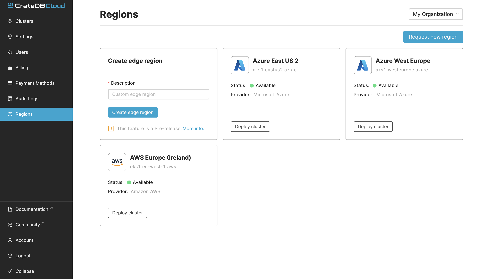

.. _edge:

============
CrateDB Edge
============

Crate.io is pleased to `announce CrateDB Edge`_, the hybrid cloud database
solution integrating CrateDB clusters and the CrateDB Cloud software stack with
on-premise or customer-controlled cloud infrastructure.

The process of getting CrateDB Edge running is far easier than it may seem,
thanks to the support for Edge deployment built into the CrateDB Cloud Console,
our own web UI. Even so, there are some steps involved, and some requirements
have to be met in order for it to work. This tutorial therefore serves as an
end-to-end walkthrough of the process and of these prerequisites.

.. rubric:: Table of contents

.. contents::
   :local:

.. _edge-prereqs:

Prerequisites
=============

Certain hardware and software specifications must be met in order to make use
of CrateDB Edge. The most important of these is that you must provide a working
Kubernetes cluster, one that meets the following requirements:

.. rst-class:: open

* It must contain at least three nodes (for high availability);

* Sufficient CPU per node to run the CrateDB Cloud software stack and the OS
  (we recommend at least 4 CPU cores for reliable performance);

* A Kubernetes version > 1.15;

* TCP/443 nginx, TCP/4200, TCP/5432 pointing to Kubernetes;

* An `ingress-nginx`_ controller for Kubernetes;

* A Kubernetes-external load balancer;

* A certificate manager;

* and storage classes named ``crate-premium`` and ``crate-local``.

Beyond this, using the CrateDB Cloud stack requires creating a CrateDB Cloud
account and an organization, which will become the owner of the Edge region in
which the cluster can be deployed. One must also access the CrateDB Cloud
Console in order to deploy the cluster itself, using the provided script. These
steps will be explained below.

.. _edge-signup:

Sign up
=======

To use the CrateDB Cloud software, you must first sign up. Follow the steps
outlined in :ref:`this tutorial <sign-up>` to do so.

.. _edge-create-org:

Create an organization
======================

When you first log in to the CrateDB Cloud Console after having created an
appropriate account, you will arrive at the organization overview page. Here
you will be prompted to create an organization.

.. image:: _assets/img/cloud-create-org.png
   :alt: CrateDB Console organization creation screen

Fill out the name of the organization and click the *Create organization*
button. After a short moment, the organization will be created and you can
proceed.

You will be taken to the Subscriptions tab of the overview page. You will be
prompted to create a new subscription. However, for the purposes of CrateDB
Edge deployment, you want to deploy directly into a given region, either one
hosted by a cloud provider or a custom region of your own. (Both routes will be
explained here.) To do so, go to the Regions tab in the same overview.

.. _edge-create-custom:

Create a custom region
======================

In the Regions tab, it is possible to create a custom region. You will want to
do this if you are hosting your cluster locally and are not relying on existing
cloud providers to host your database infrastructure.

The Regions tab shows an overview of regions hosted by cloud providers as well
as the option to create your own.

To create a custom region, simply fill out a name for the region and click on
the *Create edge region* button.

Once you have done so, it will show your custom region.

.. image:: _assets/img/cloud-custom-region.png
   :alt: CrateDB Console custom region screen

A preconfigured script will appear in the custom region field that you have
just created. To proceed, open your local CLI and follow the steps in the next
section of the tutorial. (You may want to keep the CrateDB Cloud Console open
in your browser in the meantime.)

.. _edge-script:

Apply the script
----------------

You can use the copy function provided in the custom region field to copy the
script into your own CLI. Simply paste it there and execute the script. The
script will check whether your local setup conforms to the prerequisites listed
above. If one or more prerequisites fail, the script will notify you of this,
and you will have to install them to proceed. (We recommend `Helm`_ for
tracking and installing dependencies on Kubernetes.)

Two prerequisites are not currently managed by the script directly, and may
require additional CLI commands: the nginx ingress and the certificate manager.
We provide here some tips for installing each of these prerequisites as needed.

Ingress nginx
'''''''''''''

For installing nginx, we recommend reading the `installation instructions`_ on
the nginx website. A sample command, depending on the Kubernetes provider you
are using, might be:

.. code-block:: console

    kubectl apply -f https://raw.githubusercontent.com/kubernetes/ingress-nginx/controller-v0.46.0/deploy/static/provider/cloud/deploy.yaml

Certificate manager
'''''''''''''''''''

The command for installing the certificate manager is as follows:

.. code-block:: console

    kubectl apply -f https://github.com/jetstack/cert-manager/releases/download/v1.3.1/cert-manager.yaml

Manifest and verification
'''''''''''''''''''''''''

Once you satisfy the prerequisites, the script will ask for your confirmation
to install CrateDB Edge. Type Y or y to continue. The script will then
download the manifest files for the CrateDB Edge service and apply them.

In the final stage, the script will loop over the services and check their
availability. It continues doing this until all required services have become
available. Note that this may take some time, depending also on the speed of
certificate issuance.

Once the services are up and running, the script will report: "Successfully
validated installation". At this point, you can return to the CrateDB Cloud
Console.

In the CrateDB Cloud Console, select an appropriate CrateDB Cloud
`subscription plan`_ to proceed. This will take you to the cluster
configuration wizard.

.. _edge-config:

Configure the cluster
---------------------

Now all that remains is to follow the steps in the configuration wizard to
finalize the setup of your custom CrateDB Edge cluster.

Wizard step 1
'''''''''''''

In the first step of the wizard, you are prompted for an organization, a
project name, and a project region. Fortunately, the organization and region
you have created earlier are already pre-selected for you. All that is needed
is to name the project within which your cluster will be deployed.

.. image:: _assets/img/stripe-wizard-step1.png
   :alt: CrateDB Cloud configuration wizard step 1

Click *Next* to proceed.

Wizard step 2
'''''''''''''

In the next step, we come to the cluster itself. Here the wizard will ask you
to name the cluster, as well as the username and the password that will
subsequently be used to access the cluster via the unique cluster URL. The
password must be at least 24 characters long; any characters are accepted,
including special characters. If you want, click the *Auto-generate password*
button to automatically generate a secure 24 character password (if it shows
a password already, clicking again will generate a new one).

.. image:: _assets/img/stripe-wizard-step2.png
   :alt: CrateDB Cloud configuration wizard step 2

Finally, you can also set the scale unit of the cluster to the desired level
here. As you move the slider horizontally, you will move up (or down) the scale
levels within the subscription plan you previously selected. As you will see,
the hardware capacities of the cluster will change correspondingly. Currently,
within each subscription plan clusters can be scaled between scale units 1-3.
The default scale unit is 1. Note that scaling the cluster changes its price.

When the names and password are generated, click *Next* to continue.

Wizard step 3
'''''''''''''

This step is even easier than the others: it merely summarizes the results
of your choices. First, it shows the settings for your organization and
project, with the names you have defined. Next, it shows the cluster
information, including the version of CrateDB the cluster will be running and
once again the scale unit capacities the cluster will have. Finally, the
pricing information shows you the relevant costs of running the cluster. Note
that Crate.io always bills for usage on an hourly basis, and only actual usage
is ever billed.

.. image:: _assets/img/stripe-wizard-step3.png
   :alt: CrateDB Cloud configuration wizard step 3

As always, click *Next* to proceed.

Wizard step 4
'''''''''''''

One final step remains, however. At this stage, the wizard will prompt you for
your credit card information to bill for the cluster. Fill out the number,
expiry date, and CVC (the three numbers on the back of the card) for the credit
card you intend to use to pay for the CrateDB Edge cluster. Additionally,
provide your billing address. Please do not forget to tick the box to authorize
Crate.io to take payments from your card.

.. image:: _assets/img/stripe-wizard-step4.png
   :alt: CrateDB Cloud configuration wizard step 4

When you are done, click *Deploy*. You will receive a final username and
password reminder. Subsequently, you will be taken to the Cluster overview
screen, where you will see the cluster deployment in process.

Once the cluster is fully deployed, it can be accessed through the `CrateDB
Admin UI`_ using the username and password you have defined and the URL of your
cluster.

.. _edge-cloud-region:

Use a cloud provider region
===========================

Besides creating your own custom region, it is also possible to use CrateDB
Edge in combination with an existing cloud provider. To deploy a cluster in
this way, follow the initial steps described above until you have :ref:`created
an organization <edge-create-org>`. Then, go to the Regions tab and instead of
creating a custom region, choose a cloud provider from the fields provided and
click *Deploy cluster*. You will be referred to the subscription plan screen.
Select your desired plan and proceed to the :ref:`configuration wizard
<edge-config>` as described above.

.. _edge-delete-region:

Delete a custom region
======================

In order to delete a custom region, click the trashcan icon at the bottom right
of the custom region panel. A confirmation screen will appear warning that
deletion of a custom region disables access to CrateDB Cloud for that region.
To confirm deletion of the custom region, enter the name of your region into
the form.

.. image:: _assets/img/cloud-edge-deletion
   :alt: CrateDB Edge deletion confirmation screen

Deleting a custom region does not delete the resources inside that region. To
also delete the resources inside the region, run the script provided in the
deletion confirmation screen in your local CLI. This will uninstall CrateDB
Cloud Edge from your local Kubernetes cluster.

.. _announce CrateDB Edge: https://crate.io/a/announcing-cratedb-edge/
.. _CrateDB Admin UI: https://crate.io/docs/crate/admin-ui/en/latest/
.. _Helm: https://helm.sh/docs/intro/quickstart/
.. _ingress-nginx: https://github.com/kubernetes/ingress-nginx
.. _installation instructions: https://kubernetes.github.io/ingress-nginx/deploy/
.. _subscription plan: https://crate.io/docs/cloud/reference/en/latest/subscription-plans.html