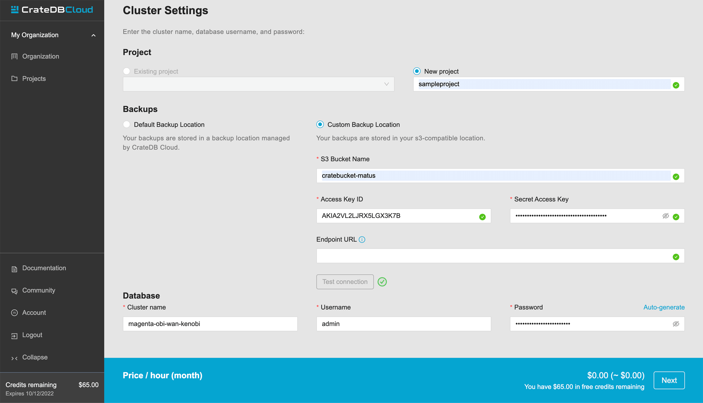

.. _edge-custom-backup:

Custom backup location
======================

This guide introduces a feature of CrateDB Edge that lets users specify their
backup location. This gives you full ownership and control of your data when
using CrateDB Edge.

.. rubric:: Table of contents

.. contents::
   :local:

.. _edge-custom-backup-prereqs:

Prerequisites
-------------

- This guide describes only the final deployment stage of the CrateDB Edge
  cluster. For the full instructions, see either the :ref:`Self-hosted Edge
  <edge-self-hosted>`, or the :ref:`Managed Edge <edge-providers>` tutorials.

- The custom backup location only supports `Amazon S3 bucket`_ or
  S3-compatible storage.

Configuration
-------------

If you're using an Amazon S3 bucket, you will need the Access Key ID and the
Secret Access Key of the user that has access to the bucket that you want to
backup your data to.

If you're using non-Amazon S3 storage, you will also need to specify an
endpoint URL of the storage.

After you have put in your details, click "Test connection" at the bottom of
the page. When the connection is verified, you can deploy the cluster.

Your cluster will now automatically backup to your storage every hour. You can
also make a manual backup with `COPY TO statement`_.

.. NOTE::
    
    If you plan to do manual backups of certain files often, we encourage you
    to enable the bucket versioning. That way, you can access older revisions
    of the saved files.

.. _Amazon S3 bucket: https://aws.amazon.com/s3/
.. _COPY TO statement: https://crate.io/docs/crate/reference/en/5.0/sql/statements/copy-to.html
