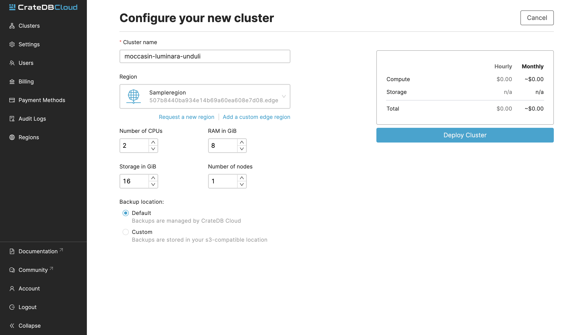
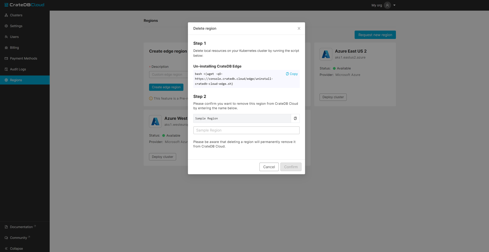

.. _edge-disclaimer:

Introduction
============

.. NOTE::

    You must have `wget`_ and `jq`_ installed for the script to function.
    CrateDB Edge is currently in Pre-Release. CrateDB Edge and related services
    are provided on an "as is" basis and may change at any time. Crate.io
    provides no guarantees or warrant regarding the usability or performance of
    CrateDB Edge. The CrateDB Cloud Service Level Agreement (SLA) is expressly
    disclaimed for the use of CrateDB Edge and related services until further
    notice. By using CrateDB Edge, you agree to these terms and conditions.

    Should you find any errors, bugs, or functionality problems while using the
    CrateDB Edge Pre-Release, please let us know via `our contact page`_ or our
    `support email`_.

.. rubric:: Table of contents

.. contents::
   :local:
   
.. _edge-prereqs:

Prerequisites
-------------

Certain hardware and software specifications must be met in order to make use
of CrateDB Edge. The most important of these is that you must provide a working
Kubernetes cluster, one that meets the following requirements:

.. rst-class:: open

* It must contain at least three nodes (for high availability).
  You can also run development workloads on a single-node cluster. Note,
  however, that you will only be able to provision single-node CrateDB
  clusters;

* Sufficient CPU per node to run the CrateDB Cloud software stack as well as
  sufficient compute to run the CrateDB instances desired. We recommend the use
  of a K8s autoscaler. For reference, the CrateDB Edge stack - without Grafana
  or Loki - requires about 2 CPUs and 2500 Mi of memory. We recommend at least
  4 CPUs per node for reliable performance.

* A Kubernetes version 1.20, 1.21, or 1.22;

* A storage class for persisting your data (SSD recommended). As outlined in
  the installation script, CrateDB Edge expects the storage classes
  ``crate-premium`` (SSD) and ``crate-standard`` (SSD or Spindle). Also ensure
  that you are able to set the field ``allowVolumeExpansion`` to ``true``.

* Unless you are experienced with operating Kubernetes clusters, we recommend
  to start with a dedicated Kubernetes cluster for CrateDB Edge. If you use an
  existing Kubernetes setup, be aware that the following components will be
  set up during installation of CrateDB Edge, which may interfere with your
  existing configuration:

  * cert-manager (version 1.6.1)
  * ingress-nginx (version 1.2.3)
  * Optionally, Grafana, Loki, or Promtail (via Helm).

Beyond this, using the CrateDB Cloud stack requires creating a CrateDB Cloud
account and an organization, which will become the owner of the Edge region in
which the cluster can be deployed. One must also access the CrateDB Cloud
Console in order to deploy the cluster itself, using the provided script. These
steps will be explained below.

Some Kubernetes knowledge, especially regarding networking and storage, is
recommended when using CrateDB Edge, especially when using it as-is. If you're
uncertain, you may benefit from using CrateDB Edge in combination with
:ref:`cloud providers or third-party tools <edge-providers>` as described
further down in this tutorial.

.. NOTE::
    A special note about bare metal Kubernetes clusters: CrateDB Edge should
    work on any bare metal cluster, but the CrateDB instances running within
    require a load balancer for outside access. If you do not have a load
    balancer (for example `MetalLB`_), you can still access the CrateDB
    clusters within, but you will need to figure out the node ports to use.

.. _edge-signup:

Sign up
-------

To use the CrateDB Cloud software, you must first sign up. Follow the steps
outlined in :ref:`this tutorial <sign-up>` to do so.

.. _edge-create-org:

Create an organization
----------------------

When you first log in to the CrateDB Cloud Console after having created an
appropriate account, you will arrive at the Organization overview page. Here
you will be prompted to create an organization.

.. image:: ../_assets/img/cloud-create-org.png
   :alt: CrateDB Console organization creation screen

Fill out the name of the organization and click the *Create organization*
button. After a short moment, the organization will be created and you can
proceed.

You will be taken to the Subscriptions tab of the Organization overview page.
You will be prompted to create a new subscription. However, for the purposes of
CrateDB Edge deployment, you want to deploy directly into a given region,
either one hosted by a cloud provider or a custom region of your own. (Both
routes will be explained here.) To do so, go to the Regions tab in the same
overview.

.. _edge-create-custom:

Create a custom region
----------------------

In the Regions tab, it is possible to create a custom region. You will want to
do this if you are hosting your cluster locally and are not relying on existing
cloud providers to host your database infrastructure.

The Regions tab shows an overview of regions hosted by cloud providers as well
as the option to create your own.

.. image:: ../_assets/img/cloud-regions.png
   :alt: CrateDB Console regions screen

To create a custom region, simply fill out a name for the region and click on
the *Create edge region* button.

Once you have done so, it will show your custom region.

.. image:: ../_assets/img/cloud-custom-region.png
   :alt: CrateDB Console custom region screen

A preconfigured script will appear in the custom region field that you have
just created. To proceed, open your local CLI and follow the steps in the next
section of the tutorial. (You may want to keep the CrateDB Cloud Console open
in your browser in the meantime.)

.. _edge-script:

Apply the script
----------------

You can use the copy function provided in the custom region field to copy the
script into your own CLI. Simply paste it there and execute the script. The
script will check whether your local setup conforms to the prerequisites listed
above. If one or more prerequisites fail, the script will notify you of this,
and you will have to install them to proceed. (We recommend `Helm`_ for
tracking and installing dependencies on Kubernetes.)

.. NOTE::
    You must have `wget`_ and `jq`_ installed for the script to function.

Manifest and verification
'''''''''''''''''''''''''

Once you satisfy the prerequisites, the script will ask for your confirmation
to install CrateDB Edge. Type Y or y to continue. The script will then
download the manifest files for the CrateDB Edge service and apply them.

In the final stage, the script will loop over the services and check their
availability. It continues doing this until all required services have become
available. Note that this may take some time, which depends among other things
on how fast a certificate can be issued.

Help and parameters
'''''''''''''''''''

Use the ``--help`` parameter to find an overview of the available parameters
for the script.

The parameters are defined as follows:

.. code-block:: console

    Usage:
    cratedb-cloud-edge.sh <token> [options]

    Here <token> represents the installation token provided on region creation,
    and the [options] are the optional parameters as shown below.

    Options:
      --base-url: The URL the manifest should be fetched from
      -d, --debug: Displays a lot of debug information
      --dry-run: Will not apply the downloaded manifest file. This can be used
      for checking the manifest file (edge-manifest.yaml) before applying it.
      -m, --max-execution-time (600): Maximum time in seconds the script should
      run
      --run-prerequisites: Will only run the prerequisites check
      --run-validation: Will only run the post-install validation

Once the services are up and running, the script will report: "Successfully
validated installation". At this point, you can return to the CrateDB Cloud
Console.

In the CrateDB Cloud Console you can now deploy a cluster from within your
custom Edge region. Go to the Regions tab of the Organization overview to find
your custom region and deploy your cluster from there. This will take you to
the cluster configuration screen.

.. _edge-config:

Configure the cluster
---------------------

Configuration
'''''''''''''

Next, go through the cluster configuration process. You will see your custom
Edge region is selected, so no region selection is necessary. You can move
directly to the cluster configuration. You can configure your desired hardware
values for CPU, RAM, and storage per node manually in the panel provided, as
well as the number of nodes you want in your cluster.

On the right the cluster scale overview shows the total hardware values for the
cluster. This is simply the number of nodes you have chosen, multiplied by the
values per node you have defined.

At the bottom of the deployment screen you can configure your account settings.
Since you have already created an organization, it does not need to be set
here. However, you can now define a project that the cluster can be deployed
in, as well as the cluster name. You also determine the database username and
password that you can use to access the cluster `Admin UI`_ later on.

.. image:: ../_assets/img/cloud-edge-settings.png
   :alt: Account settings menu

Note that the cluster name has certain validation requirements: it may contain
only numbers, letters, and the dash symbol -. It must begin with a letter and
end with a letter or a number, and must be at least three characters long.

You can also here define the backup location of your CrateDB Edge cluster. You
have the option of either using the default backup location for CrateDB Cloud,
which is managed by us, or use a custom backup location that is convenient to
you. This has to be an S3 bucket or a location with an equivalent
functionality. In the latter case, you can set the access key and secret here
as well. You can test the connection as well; keep in mind that you cannot
proceed with a custom backup location unless the connection to it is
functional.

Click *Next* at the bottom right to proceed.

Billing
'''''''

Finally, you will be taken to a new screen where you can fill out your billing
information. Our payment processing is supported by `Stripe`_. At the bottom
right you can find the cards accepted by Crate.io. When you have filled out the
necessary information, click *Deploy* below it to deploy your cluster. Do not
forget to accept financial authorization by ticking the box at the bottom.

.. image:: ../_assets/img/stripe-billing.png
   :alt: Billing information screen

The payment and billing information you have submitted will be saved in the
Billing tab of the Organization overview screen in the CrateDB Cloud Console
(i.e., the fifth tab from the left on the same screen you arrived at).

You can at any time check your current accumulated bill at the bottom left of
the CrateDB Cloud Console screen:

.. image:: ../_assets/img/cloud-billing-meter.png
   :alt: Cloud Console billing meter

Finish up
---------

You will now be returned to the CrateDB Cloud Console, but this time to the
Cluster overview page. A popup menu will remind you of the username and
password you selected for connecting to the cluster. Make sure you copy this
information to a safe place (e.g., a password manager), as it will not be
retrievable past this point.

You can use the Cluster overview page to access your cluster via the Admin UI
(see, however, the note below).

.. NOTE::
    If your Kubernetes cluster does not provide a load balancer with an
    external IP address, you will not be able to access your cluster from the
    CrateDB Cloud Console.

.. _edge-cloud-region:

Use a cloud provider region
---------------------------

Besides creating your own custom region, it is also possible to use CrateDB
Edge in combination with an existing cloud provider. To deploy a cluster in
this way, follow the initial steps described above until you have :ref:`created
an organization <edge-create-org>`. Then, go to the Regions tab and instead of
creating a custom region, choose a cloud provider from the fields provided and
click *Deploy cluster*. You will be referred to the subscription plan screen.
Select your desired plan and proceed to the :ref:`configuration wizard
<edge-config>` as described above.

.. _edge-delete-region:

Delete a custom region
----------------------

In order to delete a custom region, click the trashcan icon at the bottom right
of the custom region panel. A confirmation screen will appear warning that
deletion of a custom region disables access to CrateDB Cloud for that region.

Deleting a custom region does not delete the resources inside that region. To
also delete the resources inside the region, run the script provided in the
deletion confirmation screen in your local CLI before confirming the deletion
in the console. This will uninstall CrateDB Edge from your local Kubernetes
cluster.

To finalize the deletion of the custom region, enter the name of your region
into the form.

.. _Admin UI: https://crate.io/docs/crate/admin-ui/en/latest/console.html
.. _Helm: https://helm.sh/docs/intro/quickstart/
.. _jq: https://stedolan.github.io/jq/
.. _MetalLB: https://metallb.universe.tf/
.. _our contact page: https://crate.io/contact/
.. _Stripe: https://stripe.com
.. _support email: support@crate.io
.. _wget: https://www.gnu.org/software/wget/