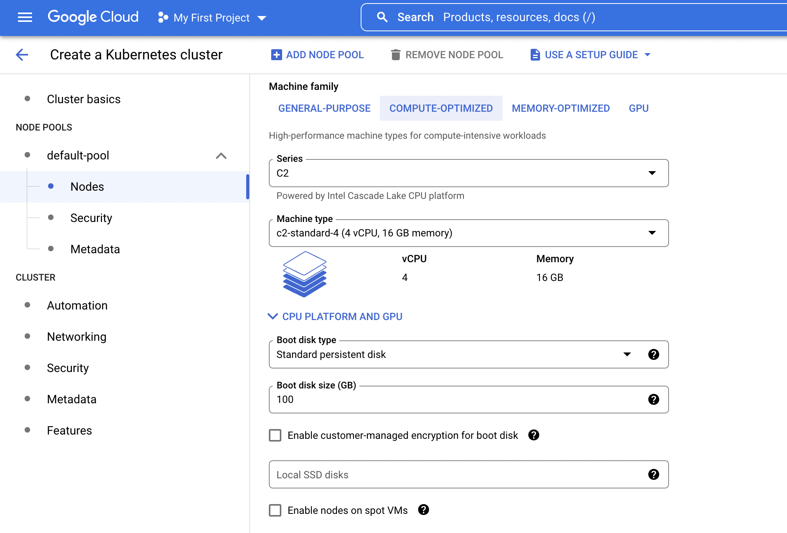

.. _edge-providers:

Managed Kubernetes options
==========================

In this section, we provide more specific installation instructions for some
managed Kubernetes providers, such as `Azure AKS`_, `Amazon EKS`_, `Digital
Ocean`_ and `Google Cloud Platform`_.

.. NOTE::
    These guides are provided as example scenarios only. Other managed
    Kubernetes providers or preconfigured Kubernetes distributions may also
    work with CrateDB Edge.

These are third-party tools and Crate.io is not responsible for those tools.
That said, we have tested the instructions provided below for functionality.
Users less familiar with customizing their Kubernetes stack on their own may
find any of these approaches a practical solution for easier CrateDB Edge
setup.

.. rubric:: Table of contents

.. contents::
   :local:

.. _edge-providers-aks:

Azure AKS
---------

Below is a step-by-step guide to using Azure AKS as a managed Kubernetes
provider in combination with CrateDB Edge. The steps are merely examples of a
process validated by us; other methods may work also. We provide this
information for ease of use and to illustrate how to work with CrateDB Edge.

Sign up
'''''''

First you must `sign up with Azure AKS`_. On the AKS page, click the *Start
Free* button or use the pay-as-you-go option. If you have an Azure account
already, you can use this account to sign up with. Once signed up, continue to
the Azure portal.

Create kubernetes cluster
'''''''''''''''''''''''''

In the Azure portal, find the "Kubernetes services" option. (You can use the
search bar at the top to do so.) You will see an overview of any Kubernetes
services you may already have running. Click on *Create*, then *Create
Kubernetes cluster*.

In the configuration menu, choose the desired subscription and resource group
or create a new one. Name your cluster as you wish and select the desired
region. We recommend using the default Kubernetes version. Finally, pick the
server availability you want, which affects your AKS pricing.

For the node size, it is important to conform to the :ref:`minimum requirements
set out above <edge-prereqs>`. For this reason, we strongly recommend choosing
a VM size that is at least 4 CPUs and 8GiB of RAM, for example the "D4s_v3"
combination. Additionally, we recommend using at least 3 nodes for a
production-grade high-availability setup. Other settings may be left on default
or adjusted as desired depending on your production requirements. (The default
settings should be fully functional for CrateDB Edge.) Then proceed with
creating the cluster. This process may take some time.

If you have `kubectl`_ installed, you can check on the node status once it is
finished by running in the `Azure CLI`_ the command

.. code-block:: console

    az aks get-credentials --resource-group <resource group name> --name <cluster name>

followed by

.. code-block:: console

    kubectl get nodes

which will show you all nodes. When all nodes are set to 'Ready', the cluster
is functioning properly. (Make sure you are in the right subscription before
running the commands, or this process will not work.)

After cluster deployment, you can click on *Go to resource* in the Azure Portal
to check that all configurations are as intended.

Set up Edge region
''''''''''''''''''

Sign up with, or log into, the `CrateDB Cloud Console`_. Go to the Regions tab
in the Subscription overview and create a custom Edge region by clicking on
*Create Edge region*. When the region has appeared in the regions list, it
will show a script that you can copy into your CLI. Do so and confirm
installation of CrateDB Edge on the correct cluster. The script will prompt you
for installation of the prerequisite tools as needed. To configure the
necessary storage classes, follow the instructions given in the script and then
rerun the script command.

The script, once run, will validate the installation of the CrateDB Edge stack.
You can also check that everything is operational by going to your Kubernetes
service in the Azure portal and checking the tab Workloads, under Kubernetes
Resources.

Deploy Edge cluster
'''''''''''''''''''

Finally, return to the CrateDB Cloud Console and click on *Deploy cluster* in
the custom region you have created. Follow the :ref:`steps described above
<edge-config>` to configure your CrateDB Cloud cluster. At the end of the
process, you should have a working CrateDB Edge install on Azure AKS managed
Kubernetes.

.. _edge-providers-eks:

Amazon EKS
----------

Below is a step-by-step guide to using Amazon EKS as a managed Kubernetes
provider in combination with CrateDB Edge. The steps are merely examples of a
process validated by us; other methods may work also. We provide this
information for ease of use and to illustrate how to work with CrateDB Edge.

.. NOTE::
    Amazon EKS cluster configuration has some complexity relating to the
    structure of AWS security management. The steps below try to provide a
    step-by-step guide, but may become outdated as AWS changes its interfaces
    or functionality. Since Crate.io is not responsible for EKS, we cannot
    guarantee this documentation remains fully in line with the latest AWS user
    flow. You can find current details on the `EKS cluster creation docs`_.

Sign up
'''''''

First you must `create an AWS account`_ and log in with it. If you have an AWS
account already, proceed directly to the `AWS Management Console`_. Find the
Elastic Kubernetes Service (you can search with the search bar at the top).

Create Kubernetes cluster
'''''''''''''''''''''''''

At the EKS portal, click the *Add cluster* button and hit *Create* to create a
new cluster. Having done that, you will arrive at the Kubernetes cluster
configuration. Give it a name and use the latest version of Kubernetes, as
long as it is < 1.22. Set the service role according to your requirements.
(Note: you can set the region at the top right, next to the user settings.)

Networking settings can be left to default or adjusted as desired. The same
applies to logging. Finish with *Create*. The EKS cluster will now be created.

Configuration
'''''''''''''

Once the cluster is set to *active* in the EKS cluster configuration panel, it
will be ready to be configured (you may still see a banner at the top stating
it is being created).

Make sure to add the necessary IAM role policies if you created a cluster with
Kubernetes 1.20 or earlier, or a cluster of 1.21 or later that uses the IPv4
family (this corresponds to the default settings.) Under Configuration, go to
*Cluster IAM Role ARN* and click the link below it. This will lead to the IAM
Management Console. In this console, click *Add permissions*, then *Add
policies*. Search for "Amazon_EKS_CNI_Policy". Tick the box and then click
*Attach policies*.

Under cluster Configuration, now go to *Add node group*. Configure the node
group by adding a name, assigning it a suitable `node IAM role`_ (you can
create one in the IAM Management Console if necessary). Click *Next*. In the
compute and scaling configuration, assure that the :ref:`minimum requirements
set out above <edge-prereqs>` are met. We recommend choosing at least 4 CPUs
and at least 8GiB of RAM, for example the "t3.xlarge" instance type. Your disk
size should be adequate to your needs - we recommend at least 8 GiB per node.
For production-grade clusters, always assure a minimum of 3 nodes. For the
network configuration, adjust to your preferences or leave it to the default
settings. Hit *Create* to create the node group.

In the `AWS CLI`_, enter the following command (make sure you are logged in
properly):

.. code-block:: console

    aws eks update-kubeconfig --region <region code> --name <cluster name>

You can check everything is working correctly with `kubectl`_:

.. code-block:: console

    kubectl get nodes

Set up Edge region
''''''''''''''''''

Sign up with, or log into, the `CrateDB Cloud Console`_. Go to the Regions tab
in the Subscription overview and create a custom Edge region by clicking on
*Create Edge region*. When the region has appeared in the regions list, it
will show a script that you can copy into your CLI. Do so and confirm
installation of CrateDB Edge on the correct cluster. The script will prompt you
for installation of the prerequisite tools as needed. To configure the
necessary storage classes, follow the instructions given in the script and then
rerun the script command.

Note that for EKS the default storage class is not called ``default`` but will
have a different name, e.g. ``gp2`` or ``gp3``. You have to adjust the script
accordingly. For more info, refer to the `documentation on AWS storage
classes`_. You can find the relevant storage class name with kubectl:

.. code-block:: console

    kubectl get sc

The script, once run, will validate the installation of the CrateDB Edge stack.
You can check everything is running correctly in the EKS cluster interface.

Deploy Edge cluster
'''''''''''''''''''

Finally, return to the CrateDB Cloud Console and click on *Deploy cluster* in
the custom region you have created. Follow the :ref:`steps described above
<edge-config>` to configure your CrateDB Cloud cluster. At the end of the
process, you should have a working CrateDB Edge install on AWS EKS managed
Kubernetes.

.. _edge-providers-digitalocean:

Digital Ocean
-------------

Below is a step-by-step guide to using Digital Ocean as a managed Kubernetes
provider in combination with CrateDB Edge. The steps are merely examples of a
process validated by us; other methods may work also. We provide this
information for ease of use and to illustrate how to work with CrateDB Edge.

Sign up
'''''''

First you must sign up with `Digital Ocean`_. On the Kubernetes page, click
*Sign up* and make an account. Verify your email address to proceed. (Digital
Ocean may also require a token pre-payment.)

Create Kubernetes cluster
'''''''''''''''''''''''''

Create a Kubernetes cluster using the Digital Ocean cloud interface, under
*Manage*, then *Kubernetes*. When configuring the cluster, make sure to choose
an option with sufficient hardware capacity. For example, when choosing the
Basic machine type, use the Max plan for that type to ensure sufficient power.
Then proceed to deploy the cluster.

Configuration
'''''''''''''

While the Kubernetes cluster is installing, use the link provided to locally
download the configuration YAML file and note the local address of the file.
Install `kubectl`_ if you have not done so already. Then point the Kubeconfig
configuration path to where you stored the YAML file:

.. code-block:: console

    export KUBECONFIG=~<file source>

Subsequently, wait for the install to finish and check that the nodes are
running as intended:

.. code-block:: console

    kubectl get nodes

Set up Edge region
''''''''''''''''''

Now, go to the CrateDB Cloud Console and create a custom CrateDB Edge region.
Follow the steps outlined :ref:`from the CrateDB sign up onwards <edge-signup>`
to proceed. Run the script the CrateDB Cloud Console shows in the panel for the
custom region you just created and install prerequisites as necessary.

Define storage class
''''''''''''''''''''

Eventually, the script will indicate that there is no ``crate-premium`` storage
class available. To define this storage class correctly, copy the default
storage class Digital Ocean provides, then change the the ``name`` to
``crate-premium`` in the copied file. For example, using kubectl and Vim:

.. code-block:: console

    kubectl get sc do-block-storage -o yaml | grep -vi is-default-class | sed -e 's/name: do-block-storage/name: crate-premium/' | kubectl create -f -

Then re-run the script until it is successful.

Deploy Edge cluster
'''''''''''''''''''

Finally, return to the CrateDB Cloud Console and click on *Deploy cluster* in
the custom region when it is available. Follow the :ref:`steps described above
<edge-config>` to proceed. At the end of the process, you should have a working
CrateDB Edge install on Digital Ocean managed Kubernetes.

Google Cloud Platform
---------------------

Below is a full walkthrough of how to get CrateDB Edge up and running on
Google Cloud. The steps are merely examples of a process validated by us; other
methods may work also. We provide this information for ease of use and to
illustrate how to work with CrateDB Edge. In this example, we use Google
Cloud's Kubernetes Engine with a standard setup. 

Sign up
'''''''

Signing up for Google Cloud is very straightforward. You can use your existing
Google account, and after you set up the Cloud billing you are eligible for
90-day, $300 trial period. For details, see 
`Google Cloud Free Program documentation`_.

Create Kubernetes cluster
'''''''''''''''''''''''''

The first step is to create a new Kubernetes cluster in the Google Cloud
console. We recommend using a GKE Standard cluster. When configuring the nodes,
it is important to remember that CrateDB Cloud Cluster needs at least 3 CPU
cores and at least 5 GiB of memory per node. For better performance, it is also
recommended to use compute-optimized nodes.

Configuration
'''''''''''''

Once your cluster is running, some configuration is needed. You will need to
install the `gcloud CLI`_ and `kubectl`_ to configure the cluster.

To connect to your cluster from your console, use the command that appears
after clicking the **CONNECT** button in the Google Cloud console. It will look
similar to this:

.. code-block:: console

    gcloud container clusters get-credentials cluster-1 --zone us-central1-c --project key-decorator-356217

After successfully connecting, a message similar to this should be displayed:

.. code-block:: console

    kubeconfig entry generated for cluster-1.

Now that you are connected, you can configure the cluster using *kubectl*.

One thing that the CrateDB Cloud Edge deployment script can't currently do is
create a storage class for Kubernetes, you need to create them yourself. A good
way is to start by displaying existing storage classes:

.. code-block:: console

    kubectl get sc

There should be one called ``standard (default)``. You can edit the storage
class by redirecting its yaml code to a new file. Do that with this command:

.. code-block:: console

    kubectl get sc standard -o yaml > sc.yaml

This will write create a new .yaml file called **sc.yaml**. Initially, it
should look something like this:

.. code-block:: yaml

    allowVolumeExpansion: true
    apiVersion: storage.k8s.io/v1
    kind: StorageClass
    metadata:
      annotations:
        storageclass.kubernetes.io/is-default-class: "true"
      creationTimestamp: "2022-07-21T03:26:32Z"
      labels:
        addonmanager.kubernetes.io/mode: EnsureExists
      name: standard
      resourceVersion: "897"
      uid: 5d6bc49a-c46b-4222-bf36-0b7dfbd872d2
    parameters:
      type: pd-standard
    provisioner: kubernetes.io/gce-pd
    reclaimPolicy: Delete
    volumeBindingMode: Immediate

From this default storage class, you need to create two new classes:
``crate-standard`` and ``crate-premium``

The yaml file for those should look like this:

.. code-block:: yaml
    :emphasize-lines: 5

    allowVolumeExpansion: true
    apiVersion: storage.k8s.io/v1
    kind: StorageClass
    metadata:
      name: crate-standard
    parameters:
      type: pd-standard
    provisioner: kubernetes.io/gce-pd
    reclaimPolicy: Delete
    volumeBindingMode: Immediate

Once you edit the ``sc.yaml`` file, save it and apply it with this command:

.. code-block:: console

    kubectl create -f sc.yaml

This will create the new ``crate-standard`` storage class. Repeat the steps for
the ``crate-premium`` class:

.. code-block:: yaml
    :emphasize-lines: 5

    allowVolumeExpansion: true
    apiVersion: storage.k8s.io/v1
    kind: StorageClass
    metadata:
      name: crate-premium
    parameters:
      type: pd-standard
    provisioner: kubernetes.io/gce-pd
    reclaimPolicy: Delete
    volumeBindingMode: Immediate

.. code-block:: console

    kubectl create -f sc.yaml

The only difference between them is the ``name`` parameter. After issuing 
``kubectl get sc`` you should now be able to see the new classes:

.. code-block:: console

    NAME                 PROVISIONER             RECLAIMPOLICY   VOLUMEBINDINGMODE      ALLOWVOLUMEEXPANSION   AGE
    crate-premium        kubernetes.io/gce-pd    Delete          Immediate              true                   44s
    crate-standard       kubernetes.io/gce-pd    Delete          Immediate              true                   7s

For a basic installation, this is all that is needed in terms of configuration.

Deploy a cluster
''''''''''''''''

All that remains now is to use the command that is generated after creating an
edge region in the CrateDB Cloud console. E.g.:

.. code-block:: console

    bash <(wget -qO- https://console.cratedb-dev.cloud/edge/cratedb-cloud-edge.sh) gAAAAABi2O81bYA8_qWQUU8svABjDdh0qNo1ZainUxDwx6MocxKJjBZ0X7Gw15QRj4LNIXZgoe7pig1fCJc_YC7UTnGacyi6Jn1-geiMBm1AGUOzXAjUIVUeCUV7jQCEtZjo4bWXaQzg7cr0bzkiLARK029M9PVTbtZbUJtO1HsFqUgnyP1-7exnylPkJ67NVwqD-ixKNdr_Ie6o5SxYlmhhjIge9fnAvQhtcURy-z4H0jBXhA7vURIL2CFXX4yWd30E-Wd1tnvP

Now you can :ref:`deploy the cluster <edge-config>`.

.. _AWS CLI: https://aws.amazon.com/cli/
.. _AWS Management Console: https://aws.amazon.com/console/
.. _Azure CLI: https://docs.microsoft.com/en-us/cli/azure/install-azure-cli
.. _create an AWS account: https://portal.aws.amazon.com/billing/signup
.. _CrateDB Cloud Console: https://console.cratedb.cloud
.. _documentation on AWS storage classes: https://kubernetes.io/docs/concepts/storage/storage-classes/#aws-ebs
.. _EKS cluster creation docs: https://docs.aws.amazon.com/eks/latest/userguide/create-cluster.html
.. _gcloud CLI: https://cloud.google.com/sdk/docs/install
.. _Google Cloud Free Program documentation: https://cloud.google.com/free/docs/gcp-free-tier
.. _kubectl: https://kubernetes.io/docs/tasks/tools/
.. _node IAM role: https://docs.aws.amazon.com/eks/latest/userguide/create-node-role.html
.. _sign up with Azure AKS: https://azure.microsoft.com/en-us/free/services/kubernetes-service/