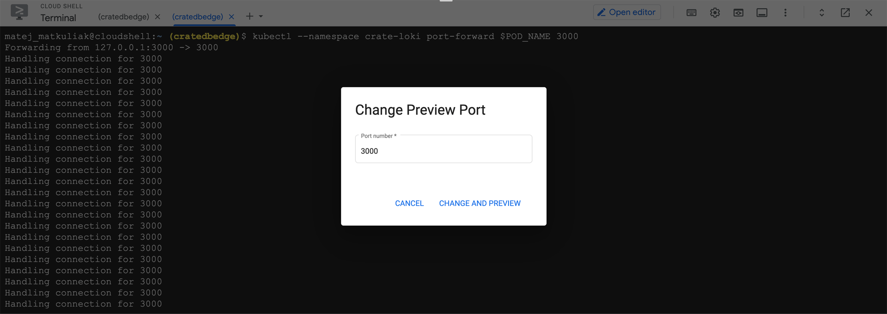
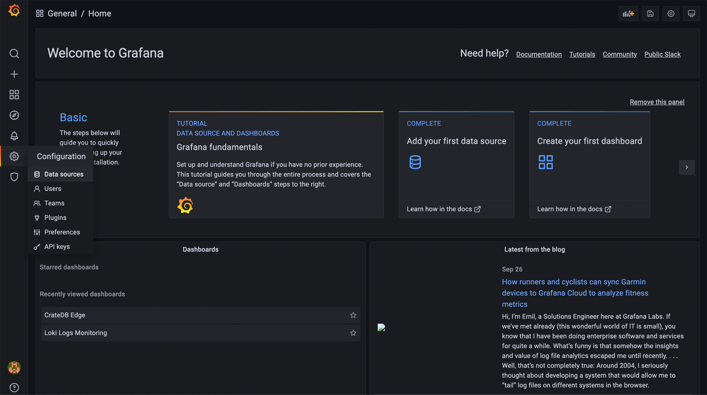
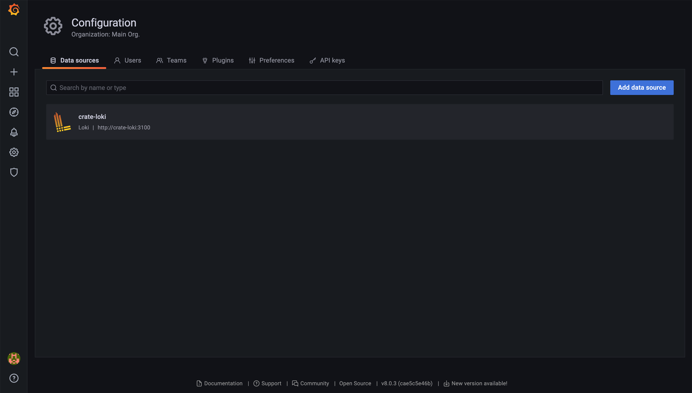
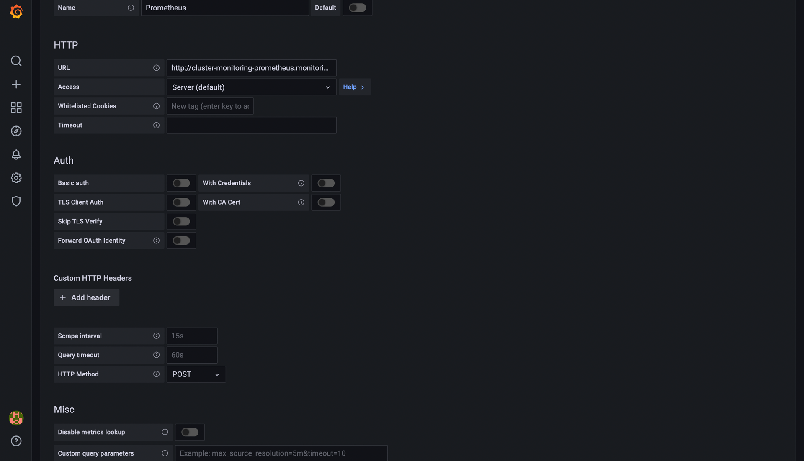
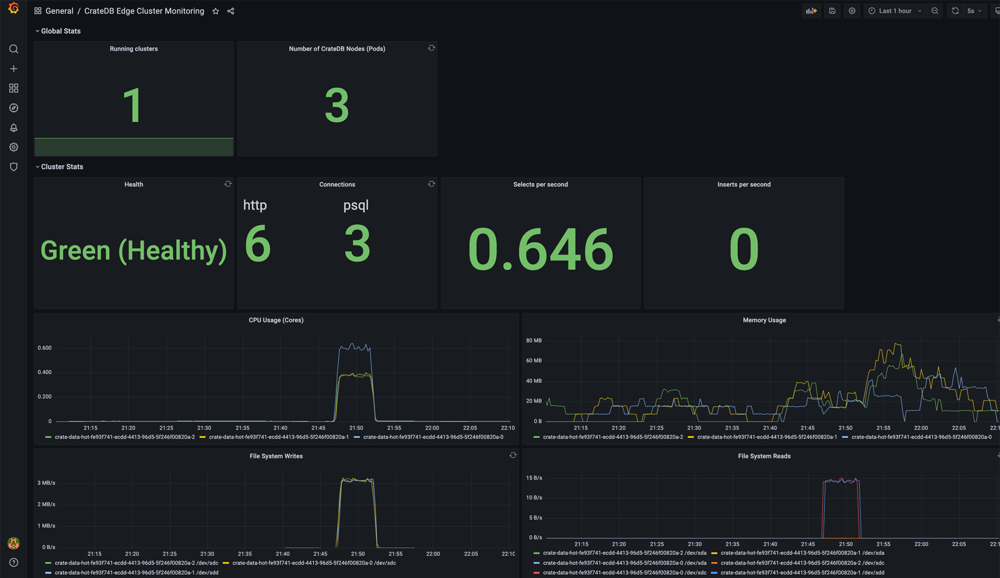

.. _edge-monitoring:

Monitor CrateDB Edge
====================

This tutorial introduces ways to set up monitoring of your CrateDB Edge cluster.
The visualization tool `Grafana`_ is used together with `Prometheus`_ and `Loki`_
to monitor the cluster performance and browse logs, respectively.

.. rubric:: Table of contents

.. contents::
   :local:

.. _edge-monitoring-prereqs:

Prerequisites
-------------

- The CrateDB Edge installation script requires Helm to be present in the system.
- For a deployment with Grafana, Loki, and Prometheus, we recommend at
  least 5 CPUs and 5 GiB of memory per node for acceptable performance.

.. _edge-monitoring-deployment:

Cluster Deployment
------------------

Deployment steps will depend on your :ref:`cloud provider <edge-providers>`,
or on your local environment, if you choose the :ref:`self-hosted
<edge-self-hosted>` variant of CrateDB Edge.

.. _edge-monitoring-grafana-install:

Grafana Install
---------------

The first important step comes after the successful installation of CrateDB into your
chosen system. Right after you get the following console prompt:

.. code-block:: console

  ✓ Region is connected to CrateDB Cloud.
  ✓ Successfully validated installation

This means that base installation is done. You will now be asked if you want to
have Grafana installed in the system. Press ``Y`` to opt-in:

.. code-block:: console

  Optional installation of Loki and Grafana
  -----------------------
  ! Loki and Grafana not detected.
 
  =============================================================================
  CrateDB Edge encourages the usage of Loki and Grafana to ease support.
  Would you like to install Loki and Grafana?
 
  =============================================================================
  Install? [Yy] y

After successful installation, you will get the following output:

.. code-block:: console

  ✓ Installed.
  Loki and Grafana successfully installed.

.. _edge-monitoring-accessing-grafana:

Accessing Grafana UI
--------------------

You will notice that during the installation of Grafana, you are provided with
a number of useful commands that will help you access the Grafana UI once its
installation is finished.

.. _edge-monitoring-grafana-password:

Grafana user password
'''''''''''''''''''''

As a part of the installation process, a user account is created for Grafana. The
username is ``admin`` and the password can be retrieved with the following
command:

.. code-block:: console
  
  kubectl get secret --namespace crate-loki crate-grafana -o jsonpath="{.data.admin-password}" | base64 --decode ; echo

You will get a response with a password:

.. code-block:: console

  rpz654Q2k8D5vgcvvrRgQMZAC2gKxZJH4oQf09fB

.. _edge-monitoring-port-forwarding:

Port-forwarding to get the Grafana URL
''''''''''''''''''''''''''''''''''''''

To get the URL of your Grafana UI, you need to issue the following commands:

.. code-block:: console

  export POD_NAME=$(kubectl get pods --namespace crate-loki -l "app.kubernetes.io/name=grafana,app.kubernetes.io/instance=crate-grafana" -o jsonpath="{.items[0].metadata.name}")
  
  kubectl --namespace crate-loki port-forward $POD_NAME 3000

This will forward your running Grafana instance to port ``3000``. You can then
view it on that port. For this tutorial, we used Google Cloud Engine. After 
issuing the command, we use the "Web preview" to see Grafana UI on port 3000.

.. NOTE::

    Depending on your cloud provider, it is possible that port 3000 will
    already be occupied in your system. If that's the case, you will see
    following response:

    .. code-block:: console

      Unable to listen on port 3000: Listeners failed to create with the following errors: 
      [unable to create listener: Error listen tcp4 127.0.0.1:3000: bind: address already in use unable to create listener: 
      Error listen tcp6 [::1]:3000: bind: cannot assign requested address]
      error: unable to listen on any of the requested ports: [{3000 3000}

    When that happens, inspect occupied ports by issuing:

    .. code-block:: console

      sudo netstat -tulpn | grep LISTEN

    You may get a response like:

    .. code-block:: console

      tcp  2  0  127.0.0.1:3000  0.0.0.0:*  LISTEN  667/kubectl

    If it's a service you don't currently need, kill the process with:

    .. code-block:: console

      kill -9 667

    After that, reissue the port-forwarding commands.

.. _edge-monitoring-prometheus-datasource:

Adding the Prometheus data source
---------------------------------

At this point, you should be able to access the Grafana UI. After logging in, it
is necessary to add a new data source Prometheus. To add a data source, choose
the ``Configuration -> Data sources`` in the left-hand menu:

You will see that out-of-the-box, the data source for Loki, is already present.

To monitor cluster performance, you need to add another data source -
Prometheus. Click the "Add data source" button in the
top right to add a new data source. Choose "Prometheus" when shown the list of options. You will be
brought to the data source configuration page.

The only field that you need to fill out is "URL". The URL for Prometheus is
always:

.. code-block:: console

  http://cluster-monitoring-prometheus.monitoring.svc.cluster.local:9090

After that, click "Save & test" at the bottom of the page. You should get a
response "Data source is working"

.. _edge-monitoring-importing-dashboards:

Importing the dashboards
------------------------

You can import our example dashboards now that you have the necessary data sources. To import the dashboards click on ``Dashboards -> Manage`` in the
menu on the left. Then click "Import" in the top right.

Both of these ``.json`` files need to be imported:

- `Cluster performance dashboard`_
- `Logs monitoring dashboard`_

.. _edge-monitoring-cluster-dashboard:

Cluster monitoring dashboard
----------------------------

This dashboard utilizes metrics provided by Prometheus. It monitors following
metrics:

- Number of running clusters
- Number of running nodes
- Cluster health
- Number and types of opened cluster connections
- Selects & Inserts per second
- CPU usage
- Memory usage
- File system writes & reads

.. _edge-monitoring-logs-dashboard:

Logs monitoring dashboard
-------------------------

This dashboard uses Loki to store the logs from available namespaces, with
ability to search for strings in the logs.

.. image:: ../_assets/img/edge-monitoring-loki-dashboard.png
   :alt: Grafana Loki dashboard

.. _edge-monitoring-conclusion:

Conclusion
----------

This tutorial should serve as an introduction to CrateDB Edge monitoring
using Loki & Prometheus in Grafana. When you complete it, you should
have two handy introductory dashboards to monitor your cluster's
performance and operations.

Of course, the best dashboards for you will vary based on your use case and
needs. Because of that, we encourage you to play around with these provided
dashboards and also visit documentation `for Loki`_ `and Prometheus`_ in
Grafana which will help you to build dashboards best suited for your needs.

.. _and Prometheus: https://grafana.com/docs/grafana/latest/datasources/prometheus/
.. _Cluster performance dashboard: https://raw.githubusercontent.com/crate/cloud-tutorials/master/docs/_extra/cratedb-edge-cluster-dashboard.json
.. _for Loki: https://grafana.com/docs/loki/latest/
.. _Grafana: https://grafana.com/
.. _Loki: https://grafana.com/oss/loki/
.. _Logs monitoring dashboard: https://raw.githubusercontent.com/crate/cloud-tutorials/master/docs/_extra/cratedb-edge-logs-dashboard.json
.. _Prometheus: https://grafana.com/oss/prometheus/
