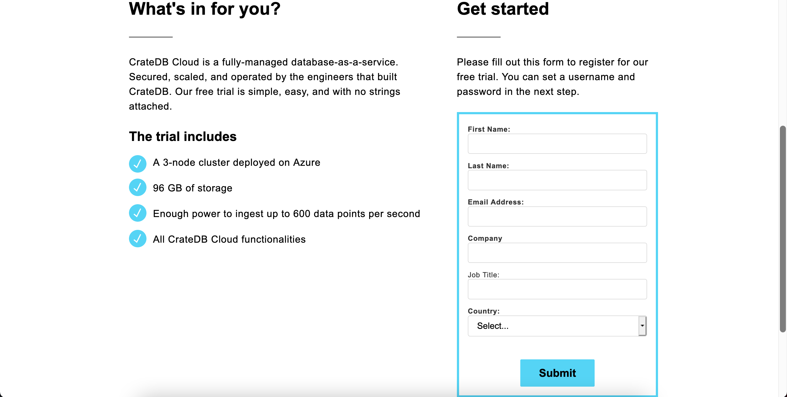
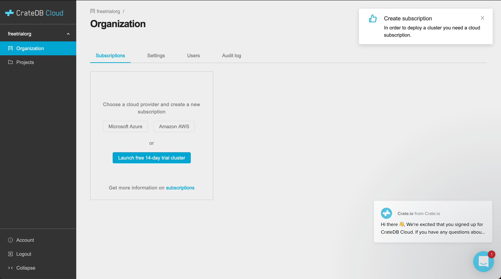
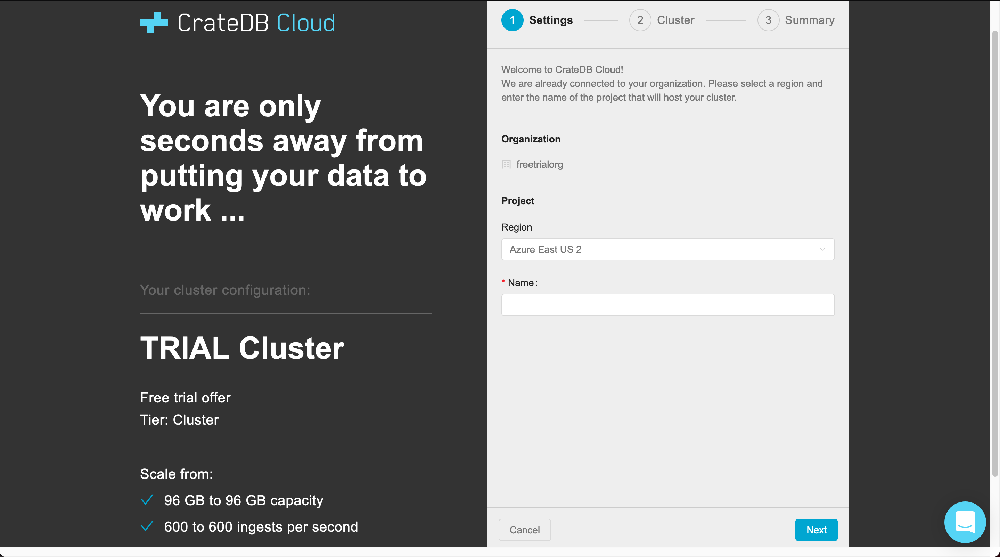
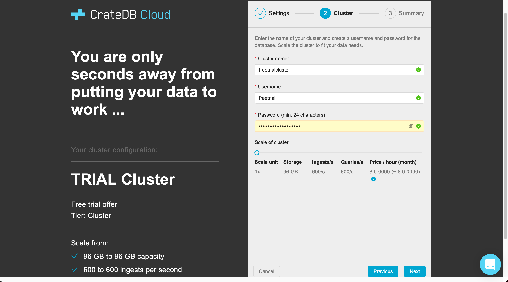
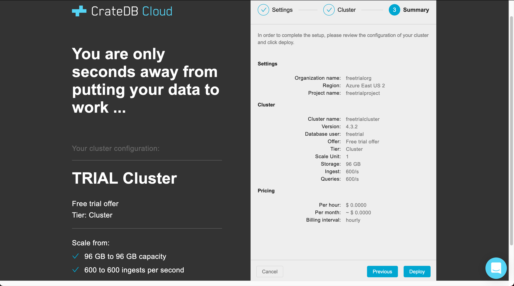

.. _free-trial:

==========
Free trial
==========

If you want to try out CrateDB Cloud's potential, there are multiple ways to do
this. One is to simply subscribe to CrateDB Cloud, by following our direct
subscription tutorial, and to choose the Development subscription plan. As a
secondary option, you can also refer to our SaaS marketplace offers on `Azure
Marketplace`_ and `AWS Marketplace`_ and choose the Development plan there.
(For more information on what that means, see our `reference on subscription
plans`_).

However, there is also an easy option to try CrateDB Cloud without any
commitment at all. You can avail yourself of our `free trial`_: a fully
functioning CrateDB Cloud cluster running for 14 days without cost, so you can
experience the benefits of CrateDB Cloud without worrying about any charges
just yet.

In this guide, we describe step by step how to activate the CrateDB Cloud free
trial offer. The CrateDB Cloud structure is based on organizations, and within
these organizations run projects that contain the deployed clusters. To deploy
your free trial cluster, you therefore need an organization and a project to
deploy it in as well. Fortunately, these are created quite easily as part of
the deployment process, as will be shown in the following steps.

.. _free-trial-signup:

Sign up
=======

In order to access the free trial, you must first sign up with an account.
The signup process starts at the `webpage form`_. Fill out the form and click
*Submit* to proceed.

You will see a forwarding screen confirming your information was received. This
takes you to the signup process, where you can create a username and password
for CrateDB Cloud (supported by Cognito). Follow the steps and log in (or if
you already have a username and password for CrateDB Cloud, use those
credentials). Once logged in, you will be forwarded to the CrateDB Cloud
Console subscription overview, where you will find the free trial option.

However, before you can launch the free trial cluster, it requires an
organization and a project as containers for the cluster to operate in.
Fortunately, the project will be created as part of cluster configuration. That
leaves only one preliminary step: creating an organization.

.. _free-trial-org:

Create an organization
======================

Before the free trial can be deployed, it is necessary to create an
organization within the CrateDB Cloud Console. The trial cluster is then
deployed within this organization. When you arrive for the first time at the
Console subscription overview, you should be prompted to create an
organization. (If you have already done so, you can skip this step and directly
use the *Launch free 14-day trial cluster* button on the Console subscription
overview page.)

.. image:: _assets/img/free-trial-organization.png
   :alt: Create an organization

Enter the desired name for the organization in the field and click *Create
organization*. Once you have done so, you will see in the subscription overview
screen a set of options for choosing a cloud provider: Microsoft Azure or
Amazon AWS. Below them is the free trial cluster option.

You can now deploy the free trial cluster by clicking the *Launch free 14-day
trial cluster* button. This will take you to the configuration wizard for the
cluster, which will complete the process.

.. _free-trial-configure:

Configure the free cluster
==========================

In the configuration wizard, the organization you have created will be
pre-selected. All that remains is to choose a region where the cluster will be
deployed and to name the project your free trial cluster will be a part of.
When you are done, click *Next*.

The next step requires you to name the cluster itself and to configure a
username and password to access the cluster directly through the CrateDB Cloud
admin UI. (Note that this username and password are distinct from the one used
to access the CrateDB Cloud Console.)

When this is complete, click *Next* again. This will show you a summary of the
cluster configuration and the subscription tier (free trial) you are deploying.
It also shows you the storage, query, and ingest capacity of the cluster. The
price, of course, is $0.

If you are happy with the results, click *Deploy*. Your free trial cluster will
now be deployed and you will be returned to the CrateDB Cloud Console.

.. _free-trial-expiry:

Free trial expiry
=================

After 14 days, the free trial cluster will automatically expire and no longer
be accessible. You do not have to do anything to cancel or remove it. To
continue using the CrateDB Cloud service after the 14 days, you can
:ref:`subscribe to one of our marketplace offers <cluster-deployment>`.

.. _AWS Marketplace: https://aws.amazon.com/marketplace/pp/B089M4B1ND
.. _Azure Marketplace: https://azuremarketplace.microsoft.com/en-us/marketplace/apps/crate.cratedbcloud?tab=PlansAndPrice
.. _free trial: https://go.cratedb.com/lp-free-trial.html
.. _reference on subscription plans: https://crate.io/docs/cloud/reference/en/latest/subscription-plans.html
.. _webpage form: https://go.cratedb.com/lp-free-trial.html