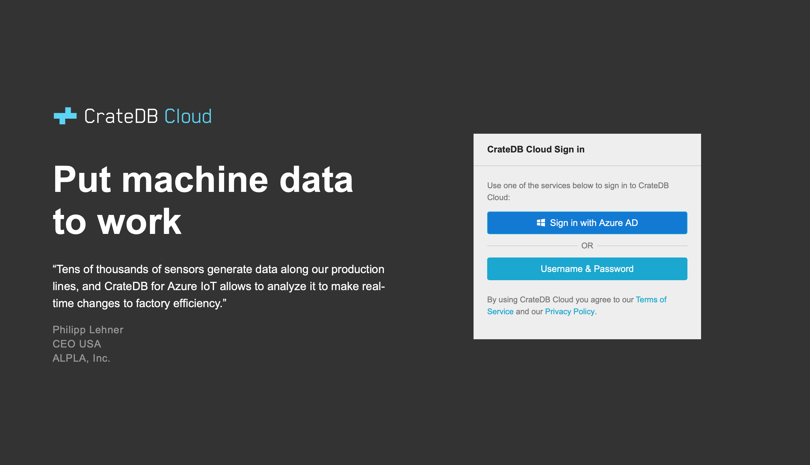
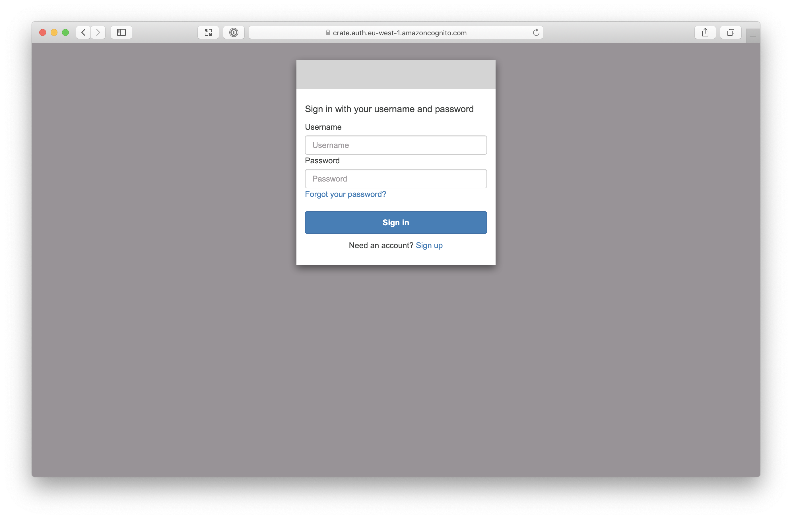
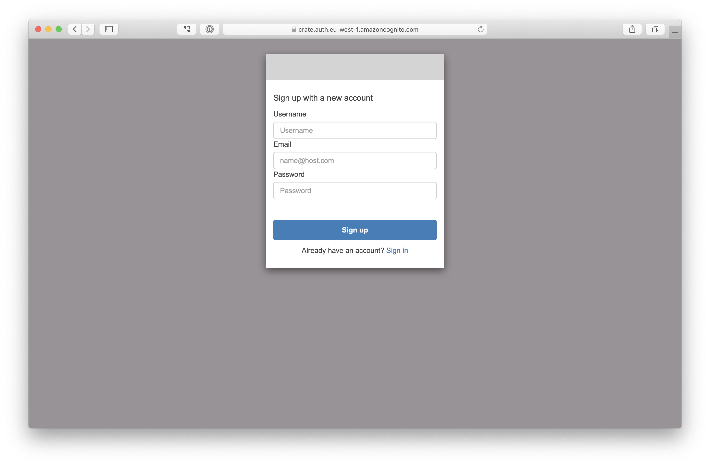
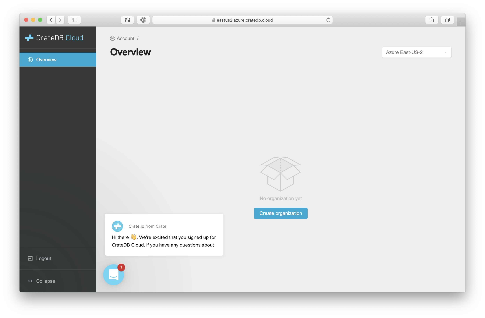

.. _sign-up:

=======
Sign up
=======

Before you can start using :ref:`CrateDB Cloud <index>`, you must first sign up
for a user account.

As a CrateDB Cloud user, you can create and manage organizations and projects.
As an organization administrator, you can also manage other CrateDB Cloud users
as well as launch CrateDB Cloud clusters and other CrateDB Cloud products.

We currently support two signup methods. However, only one authentication
method, AzureAD, allows you to deploy clusters on CrateDB Cloud. For a more
detailed tutorial guiding you through the Azure signup process through to
starting up a cluster, see the :ref:`tutorial on deploying a cluster from
scratch <deploy-azure-to-cluster>`.

.. rubric:: Table of contents

.. contents::
   :local:

.. _sign-up-azure:

Sign up via Azure AD
====================

Visit the `CrateDB Cloud Console`_. You should be presented with a
|Microsoft Azure| *Active Directory* (AD) sign in option:

You must have a Azure account to proceed.

.. _sign-up-username-password:

Sign up with username and password
==================================

If you select the *Username and password* sign-in method, you should be
presented with a username and password sign in page:

However, before you sign in, you must first sign up for an account.

Select *Sign up* from the bottom of the dialogue box. You will be redirected to
the sign-up page:

Fill in your details, then select *Sign up*.

Next, you should see this screen:

.. image:: ../_assets/img/cloud-verification.png

Check your email, fill in the code, and, finally, select *Confirm Account* to
finish the process.

.. _sign-up-sign-in:

Sign in
=======

Once you're signed in, you should be redirected to the `Cloud Console`_:

There's nothing here yet.

However, by the end of :ref:`this tutorial <deploy-azure-to-cluster>`, you will
have created your first CrateDB cluster and this page will display important
information such as average response times, queries, logs, and so on.

.. _sign-up-next:

Next steps
==========

Now that you have an account, you can start to interact with CrateDB Cloud.

.. _Cloud Console: https://crate.io/docs/cloud/console/
.. _CrateDB Cloud Console: https://eastus2.azure.cratedb.cloud/
.. _sign up: https://azure.microsoft.com/en-us/free/

.. |Microsoft Azure| raw:: html

    <a href="https://azure.microsoft.com/" target="_blank">Microsoft Azure</a>