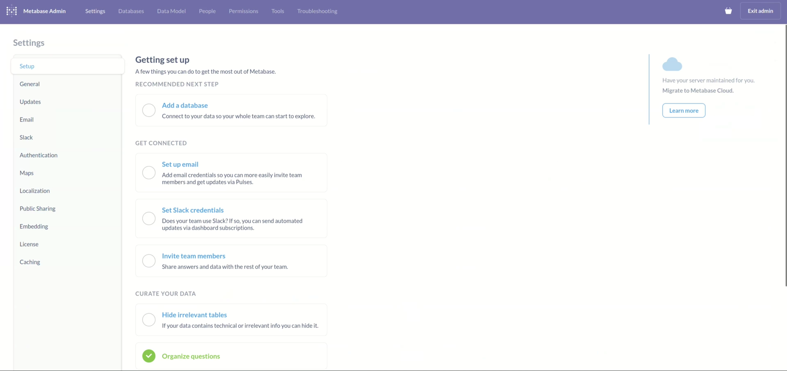
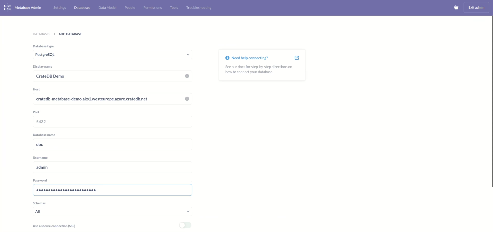
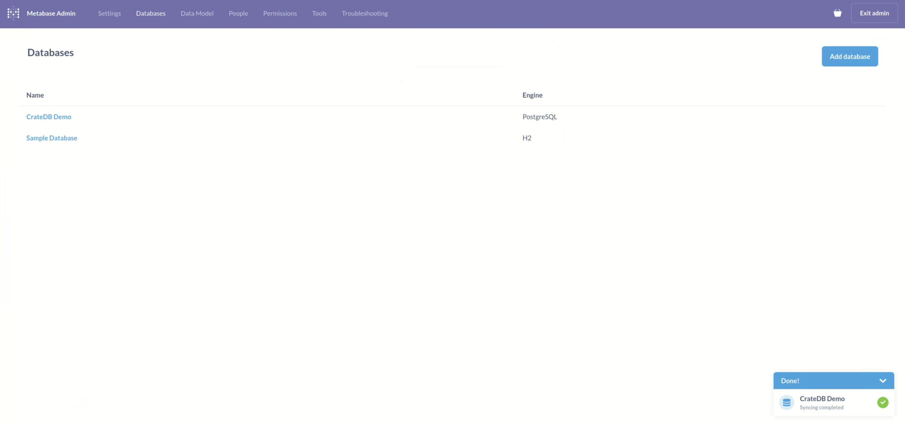
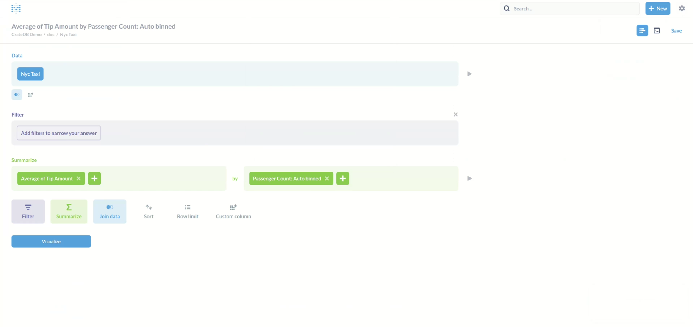
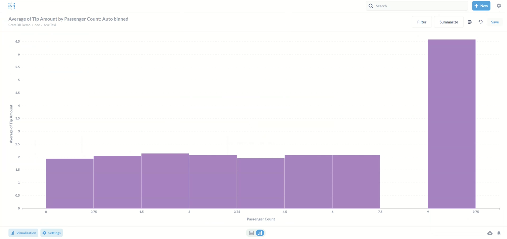
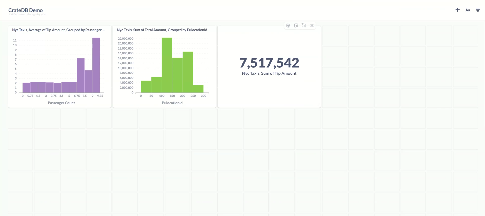

.. _integrations-metabase:

Visualize data with Metabase
============================

This tutorial introduces `Metabase`_, another visualization tool that can help
you analyze and use your data to its full potential.

.. rubric:: Table of contents

.. contents::
   :local:

.. _metabase-prereqs:

Prerequisites
-------------

First, you will need a running cluster. You can use Metabase with both
:ref:`Cloud clusters <cluster-deployment-stripe>` and :ref:`Edge clusters
<edge>`.

To use Metabase, you must have an existing data set in your CrateDB cluster.
Feel free to use the sample dataset available in the `Cloud Console`_ or
import your own data similarly to how it's done :ref:`in this how-to
<cloud-howtos:import-data>`.

.. _integration-metabase-config:

Initial configuration
---------------------

Metabase offers both cloud version and local installation. Whichever you
choose, the first step will be adding your CrateDB cluster as a new database.
To do that, go to the ``Admin Settings`` -> ``Setup``, and choose 
the ``Add a database`` option.

Database configuration is relatively simple, these are the necessary fields:

- Database type (PostgreSQL)
- Display name
- Host (the URI of your cluster)
- Database name
- Username
- Password

.. NOTE::

    Make sure you also select "Use a secure connection (SSL)" option, unless
    your cluster is not configured for SSL.

After submitting your details, Metabase will sync with your CrateDB cluster for
a few moments. When that completes, you will get a message saying, "Syncing
complete".

.. _integration-metabase-questions:

Questions
---------

Now you are ready to visualize your data. Metabase works by asking questions.
You ask a question, and Metabase answers it in a visual form. These questions
can then be saved to form dashboards. To ask a question, go to ``Home`` and
click on ``New`` -> ``Question`` in the upper right corner. Then select the
database and a table from it. 

As an example, we ask about the Average tip amount,
sorted by the passenger count. 

Metabase then provides a visualization of that question.

The answer that you get can be saved. When you save a question, you will also
be asked if you want to add it to a dashboard. Dashboards provide an easy way
to monitor your data.

.. _integration-metabase-conclusion:

Conclusion
----------

This was an introductory tutorial into the data visualization tool Metabase.
Metabase offers a quick and intuitive way to make sense of your data with
interactive dashboards, automated reporting, and more.

If you'd like to see how the other questions were configured, feel free to
check out our `video tutorial`_ on this topic.

If this integration could benefit you, feel free to head to `Cloud Console`_
and get started!

.. _Cloud Console: https://console.cratedb.cloud/?utm_campaign=2022-Q3-WS-Developer-Motion&utm_source=docs
.. _Metabase: https://www.metabase.com/
.. _video tutorial: https://www.youtube.com/watch?v=veuR_76njCo
