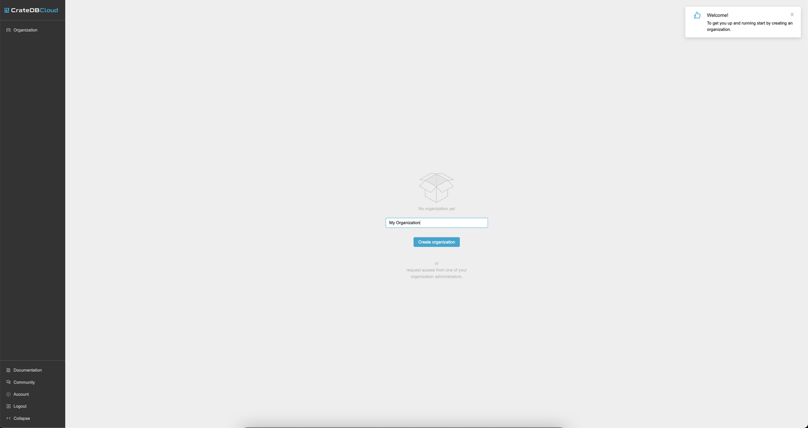
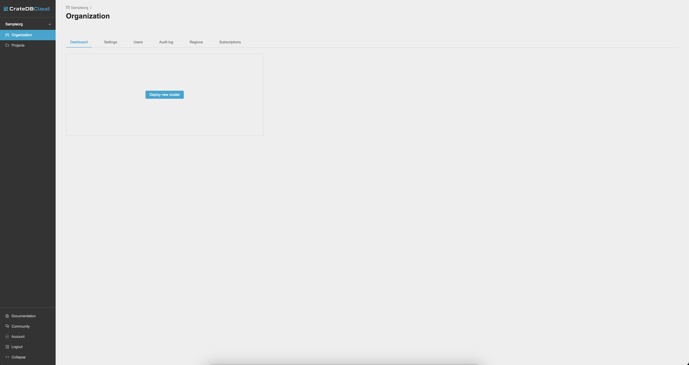
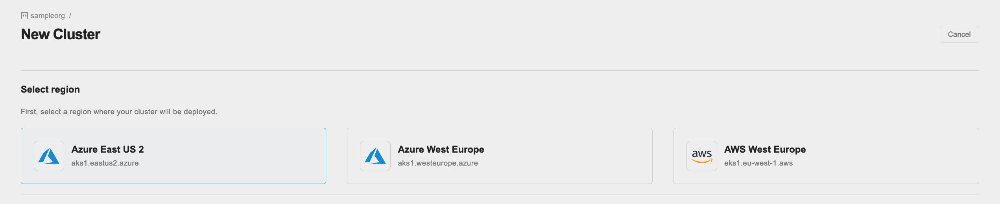
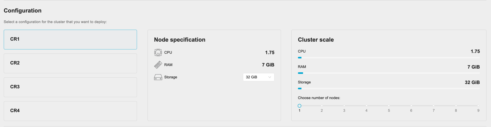
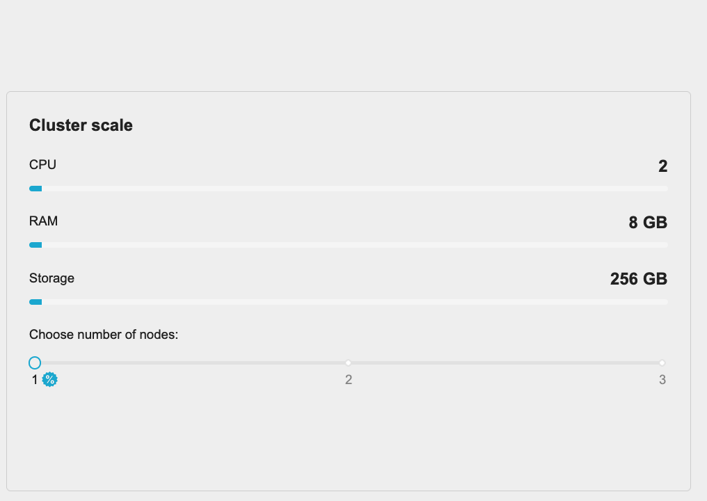
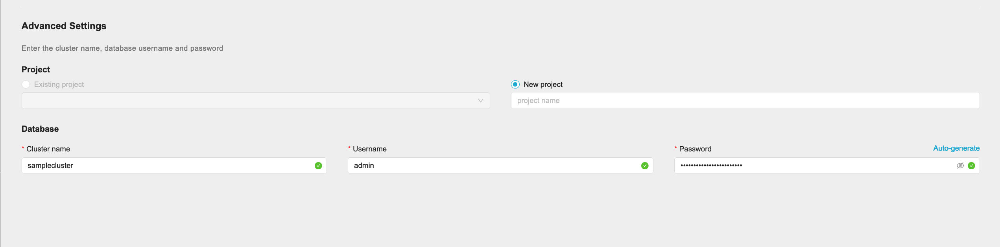
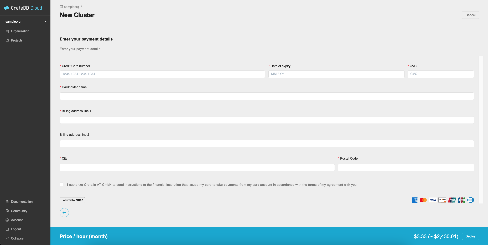

.. _promo:

==========================
Free trials and promotions
==========================

Crate.io regularly offers promotions, consisting of either free or discounted
offers on CrateDB Cloud database-as-a-service products. Promotions can involve
discounts of up to 100% on three dimensions of the product: on specific
`subscription plans`_, on tiers of the subscription plans (essentially
multipliers for the specified hardware per node), and/or on `scale units`_ (the
number of nodes selected). Promotions may last indefinitely or for limited
periods of time.

In this guide, we explain step by step how to make use of such promotions, as
well as when payment information will be required. While we hope the process is
self-explanatory, feel free to refer to this guide as an aide where required.

Keep in mind that you can also try out CrateDB Cloud at any time by following
the default :ref:`cluster deployment tutorial <cluster-deployment>` and
choosing the Development plan, which is designed for just this purpose.

.. NOTE::
    Free and discounted promos are currently not supported for subscription
    plans offered through the SaaS marketplaces (`AWS`_ and
    `Azure Marketplace`_).

.. rubric:: Table of contents

.. contents::
   :local:

.. _promo-signup:

Sign up
=======

In order to make use of a promotion, you must first sign up with an account.
You can follow the process described in the :ref:`signup tutorial <sign-up>` to
do so. Follow the steps and log in (or if you already have a username and
password for CrateDB Cloud, use those credentials). Once logged in, you will be
forwarded to the CrateDB Cloud Console Organization Overview screen.

Before you can launch your promo cluster, you need to have an organization and
a project (which are organizational containers that the cluster must operate
in). Fortunately, the project will be created as part of cluster deployment.
That means there is only one additional preliminary step to take: creating an
organization.

.. _promo-org:

Create an organization
======================

Before the promoted cluster can be deployed, it is necessary to create an
organization within the CrateDB Cloud Console. The trial cluster is then
deployed within this organization. When you arrive for the first time at the
CrateDB Console Organization Overview, you should be prompted to create an
organization.

Enter the desired name for the organization in the field and click *Create
organization*. Once this is done, you will be returned to the CrateDB Console
Organization Overview, where you can start deploying your free or discounted
cluster.

.. _promo-promotion-cluster:

Deploy a promotional cluster
============================

Crate.io offers two types of promotional offers from time to time: free (trial)
offers and discounted offers. You can find a step-by-step tutorial for how to
deploy either kind of cluster below.

Discounted promotional cluster
------------------------------

To deploy a discounted promotional cluster on CrateDB Cloud, follow the signup
process and create and organization as described above. Then, once arrived once
more at the Dashboard tab of the Organization overview screen, click on the
*Deploy cluster* button.

This will take you to the cluster deployment screen. All the steps required for
cluster deployment are contained within this screen (and, where relevant, the
billing information screen). The cluster deployment screen consists of three
steps: region selection, cluster configuration, and account settings.

Region selection
''''''''''''''''

First, select a `region`_. Your cluster will be deployed in this region.

.. NOTE::
    Currently, your choice of region does not affect the price of the cluster.
    This may change in future versions of CrateDB Cloud.

Configuration
'''''''''''''

Next, go through the cluster configuration process. On the left-hand side, you
can choose a subscription plan. As you select each subscription plan, you will
see that the values for CPU, RAM, and storage per node change accordingly in
the middle panel that shows the node specification.

For most subscription plans, the node specification also allows a further
choice of tier: Basic, Pro, or Premium. Each higher tier doubles the values per
node of the previous tier.

Finally, on the right the cluster scale overview shows the total values for the
cluster. This is simply the number of nodes multiplied by the values of the
subscription plan and tier. The cluster scale panel also allows you to increase
the number of nodes you want in your cluster.

To sum up: the configuration of the cluster depends on the hardware values per
node and the number of nodes in the cluster. The hardware values per node are
determined by the choice of subscription plan and the choice of tier within the
subscription plan. The number of nodes in the cluster is set in the cluster
scale panel.

Each of these choices will affect the price of the cluster, and it is possible
for a subscription plan, a tier, or a number of nodes to be subject to a free
or discounting promotion. You can always find the total price per hour and per
month in the blue bar at the bottom of the screen.

.. HINT::
    To identify a promotional offer where a discount is available, look for the
    % icon under the cluster scale panel.

Account settings
''''''''''''''''

At the bottom of the deployment screen you can configure your account settings.
Since you have already created an organization, it does not need to be set
here. However, you can now define a project that the cluster can be deployed
in, as well as the cluster name. You also determine the database username and
password that you can use to access the cluster `Admin UI`_ later on.

Note that the cluster name has certain validation requirements: it may contain
only numbers, letters, and the dash symbol -. It must begin with a letter and
end with a letter or a number, and must be at least three characters long.

Click *Next* at the bottom right to proceed.

Billing information
'''''''''''''''''''

For a discounted cluster, you will be taken to a new screen where you can fill
out your billing information. Our payment processing is supported by `Stripe`_.
At the bottom right you can find the cards accepted by Crate.io. When you have
filled out the necessary information, click *Deploy* below it.

The payment and billing information you have submitted will be saved in the
Billing tab of the Organization Overview page in the CrateDB Cloud Console.

Finish up
'''''''''

If all is well, you will be shown a popup confirming the deployment is in
progress and showing you once again your database username and password. Since
this is the last time you will be shown the cluster access credentials, you
may want to copy them into a safe location (e.g. a password manager). Beyond
the popup, you will see the Cluster Overview screen in the CrateDB Cloud
Console. The section *Status* on the left-hand side will show you that the
cluster is being set up. Once it is done, this will show *Available* and you
will be able to see cluster metrics.

Free promotional cluster
------------------------

Just as clusters may be discounted based on subscription plan, tier, or number
of nodes, so clusters may be offered free based on any of these dimensions. As
with discounts, the free offer may last indefinitely or for a limited amount
of time.

In the case of a free cluster, the process is essentially the same as described
above. Choose the promotional cluster in the cluster deployment screen when you
have signed up and created an organization. When the cluster is promotional, it
will have a % symbol under the node selector, as described above. Free
clusters, as opposed to discounted ones, the price indicator bar at the bottom
will show that it costs zero. If the cluster in question is free for a limited
period of time, the price indicator bar will show what it will cost when it is
no longer free, and after what period of time (in months) this will apply.

Naturally, for a free cluster, no billing information is required.

Use your cluster after the promotion
------------------------------------

When your free or discounted cluster period ends, you can of course continue
to use it. If you wish to continue using the cluster after a free period has
expired, you must fill out the billing information in the Billing tab of the
Organization Overview in the CrateDB Cloud Console. Otherwise, the cluster will
be deleted soon after expiry of the free period. For more information on using
the CrateDB Cloud Console, refer to the `Console overview in the reference
documentation`_.

.. _Admin UI: https://crate.io/docs/crate/admin-ui/en/latest/console.html
.. _AWS: https://aws.amazon.com/marketplace/pp/prodview-l7rqf2xpeaubk
.. _Azure Marketplace: https://azuremarketplace.microsoft.com/en-us/marketplace/apps/crate.cratedbcloud
.. _Console overview in the reference documentation: https://crate.io/docs/cloud/reference/en/latest/overview.html
.. _region: https://crate.io/docs/cloud/reference/en/latest/glossary.html#region
.. _scale units: https://crate.io/docs/cloud/reference/en/latest/glossary.html#scale-unit
.. _Stripe: https://stripe.com
.. _subscription plans: https://crate.io/docs/cloud/reference/en/latest/subscription-plans.html