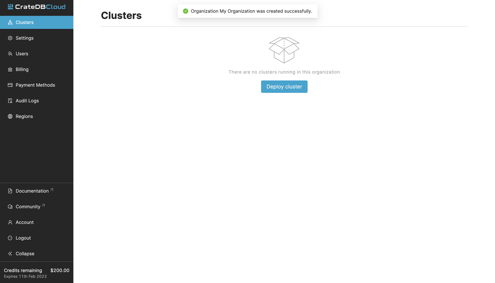

.. _promo:

==========================
Free trials and promotions
==========================

Crate.io regularly offers free trials and promotions on the CrateDB Cloud
database-as-a-service products. These may involve discounts of up to 100% on
specific `subscription plans`_, `scale units`_ within those plans, and for
particular periods of time. In this guide, we explain step by step how to make
use of such free trials or promotions, as well as when payment information will
be required during the process. Keep in mind that you can also try out CrateDB
Cloud at any time by following the default :ref:`cluster deployment tutorial
<cluster-deployment>` and choosing the Development plan, which is designed for
just this purpose.

This guide will first describe the process for making use of our 14-day free
trial offer. Subsequently, you can find out how to use free or discounted
promotional offers. These will be offered regularly by Crate.io and constitute
a separate category of promotion from the 14-day free trials.

.. NOTE::
    Free trials and other promos are currently not supported for subscription
    plans offered through the SaaS marketplaces (AWS and Azure Marketplace).

.. rubric:: Table of contents

.. contents::
   :local:

.. _promo-signup:

Sign up
=======

In order to access a free trial or promotion, you must first sign up with an
account. You can follow the process described in the :ref:`signup tutorial
<sign-up>` to do so. Follow the steps and log in (or if you already have a
username and password for CrateDB Cloud, use those credentials). Once logged
in, you will be forwarded to the CrateDB Cloud Console Organization overview.

However, before you can launch your promo cluster, you need to have an
organization and a project as containers that the cluster can operate in.
Fortunately, the project will already be created as part of cluster
configuration. That means there is only one preliminary step: creating an
organization.

.. _promo-org:

Create an organization
======================

Before the free trial can be deployed, it is necessary to create an
organization within the CrateDB Cloud Console. The trial cluster is then
deployed within this organization. When you arrive for the first time at the
CrateDB Console Organization overview, you should be prompted to create an
organization.

Enter the desired name for the organization in the field and click *Create
organization*. Once this is done, you will be returned to the CrateDB Console
Organization overview, where you can start deploying your free or discounted
cluster.

.. _promo-free-trial:

Deploy a 14 day free trial cluster
==================================

Once you have created your organization, you will arrive at the Dashboard tab
of the Organization overview screen. From here, move to the rightmost tab
labeled Subscriptions. Click the big blue *Launch free 14-day trial cluster*
button.

.. image:: _assets/img/cloud-subscriptions.png
   :alt: Create a new subscription

This will take you to the cluster configuration wizard. In the first step of
the wizard, you will be asked to choose a region in which to deploy the cluster
in a dropdown menu. You will also need to create a new project if you do not
have one already. (If you do, it will be automatically pre-selected for you.)
Click *Next* to proceed.

.. image:: _assets/img/free-trial-wizard-step1.png
   :alt: Promo cluster configuration wizard step 1

In the second step of the configuration wizard, you will be asked to define a
name for your promo cluster. You will also be asked to define a separate name
and password to access the cluster directly through the cluster UI, once it is
deployed. The password must be at least 24 characters. However, do not worry:
a suitable password will automatically be generated for you.

When you have filled out the form, click *Next* to proceed.

.. image:: _assets/img/free-trial-wizard-step2.png
   :alt: Promo cluster configuration wizard step 2

The final step of the configuration wizard restates all the information about
the promo cluster you are about to deploy. You can confirm the desired discount
here by looking at the Pricing section. When you are satisfied, click *Deploy*.

.. image:: _assets/img/free-trial-wizard-step3.png
   :alt: Promo cluster configuration wizard step 3

If all is well, you will be shown a popup confirming the deployment is in
progress and showing you once again your cluster username and password. Since
this is the last time you will be shown the cluster access credentials, you
may want to copy them into a safe location (e.g., a password manager). Beyond
the popup, you will see the Cluster Overview screen in the CrateDB Cloud
Console. The section *Status* on the left-hand side will show you that the
cluster is being set up. Once it is done, this will show *Available* and you
will be able to see cluster metrics.

After 14 days, the free trial cluster will automatically expire and no longer
be accessible. You do not have to do anything to cancel or remove it. To
continue using CrateDB Cloud after the 14 day period, follow the
:ref:`deployment tutorial <cluster-deployment-stripe>` to deploy a regular
CrateDB Cloud cluster.

.. _promo-promotion-cluster:

Deploy a promotional cluster
============================

Free promotional cluster
------------------------

The process for using a free or discounted promotional cluster on CrateDB Cloud
is fundamentally quite similar. Follow the same signup process and create an
organization as described above. Then, once arrived once more at the Dashboard
tab of the Organization overview screen, click on the *Deploy cluster* button
(instead of going to the Subscriptions tab).

You will be shown all the subscription plans CrateDB Cloud currently offers.
Whenever any of the plans are free or discounted, this will be shown in the
subscription plan UI. Choose the promo plan you want. In the case shown in the
screenshot below, you could for example choose a free trial of the Development
plan.

.. image:: _assets/img/free-trial-plans.png
   :alt: Choose a promoted subscription plan

You can also scale your cluster here between the three available scale units
of each subscription plan. Note that discounts and free trial offers may apply
to a particular scale unit only, and may apply for a limited time. The UI will
show that the relevant scale unit is discounted, by how much, and for how long.
For example, in the example below, the first scale unit of the Development plan
is free for one month. Click *Choose* to proceed.

From this point, follow the configuration wizard as described previously.

Discounted promotional cluster
------------------------------

In the case of a discounted - rather than free - cluster, the process is
essentially the same as described above. Choose your discounted cluster in the
subscription plan UI when you have clicked on *Create new subscription*, just
as before. In the example used here, you could choose the discounted GP plan.

.. image:: _assets/img/free-trial-plans.png
   :alt: Choose a promoted subscription plan

The only difference is that if you do not already have a means of payment
associated with your organization, you will see an extra screen at the end of
the cluster configuration wizard asking you to fill out your payment and
billing information. (I.e., this appears as the fourth wizard screen, following
step 3 described in the section above.) On this screen, you can fill out your
credit card details and your billing address. We also ask you here to authorize
payment to Crate.io AT GmbH for the costs of the (discounted) cluster.

.. image:: _assets/img/free-trial-wizard-step4.png
   :alt: Promo cluster configuration wizard step 4

After you have submitted this information, click *Next* to create the cluster
as normal. The payment and billing information you have submitted will be saved
in the Billing tab of the Organization overview page in the CrateDB Cloud
Console.

Use your cluster after the promotion
------------------------------------

Naturally, when your free trial or discounted cluster period ends, you can
continue using it. When required, you can simply add your billing information
in the Billing tab of the Organization overview of the CrateDB Cloud Console.
(This tab will appear in the overview when payment is required for any
cluster.) For more information on using the CrateDB Cloud Console, refer to the
`Console overview in the reference documentation`_.

.. _Console overview in the reference documentation: https://crate.io/docs/cloud/reference/en/latest/overview.html
.. _scale units: https://crate.io/docs/cloud/reference/en/latest/glossary.html#scale-unit
.. _subscription plans: https://crate.io/docs/cloud/reference/en/latest/subscription-plans.html