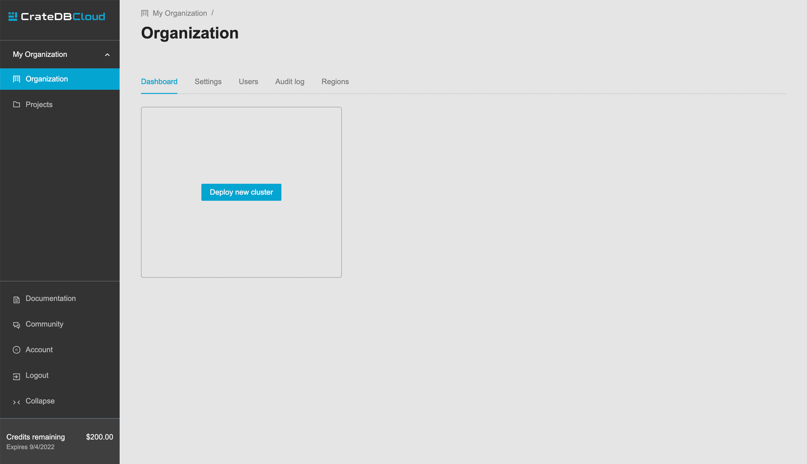

.. _free-trial-budget:

=================
Free trial budget
=================

This section explains our Free trial budget mechanism. This feature gives the
user $200 in free credit that can be used for any cluster configuration.

.. rubric:: Table of contents

.. contents::
   :local:

.. _free-trial-budget-signup:

Sign up
=======

To be eligible for free credit, the first step is to
sign up.  You can follow the process described in the 
:ref:`signup tutorial <sign-up>` to do so.

.. _free-trial-budget-org:

Create an organization
======================

To get the credit, simply create a new organization. For the detailed
instructions, see 
:ref:`Create a new organization how-to <cloud-howtos:create-org>`.

.. image:: ../_assets/img/free-trial-organization.png
   :alt: Create an organization

Enter the desired name for the organization in the field and click *Create
organization*. Once this is done, you will be returned to the Organization
overview, where you will see that you have $200 of available credit. You can
also see when the credit expires. Free credit is valid for 30 days after
organization creation.

Now you can follow the 
:ref:`Cluster deployment tutorial <cluster-deployment-stripe>` and get you
first cluster running.

.. NOTE::
    Notes on the free credit:
     
     - Credit can be spent on any cluster configuration
     - Credit expires 30 days after organization is created
     - Billing starts when the free credit is consumed or expired
     - It is possible to deploy multiple clusters with the free credit
     - It is possible to scale clusters with the free credit
