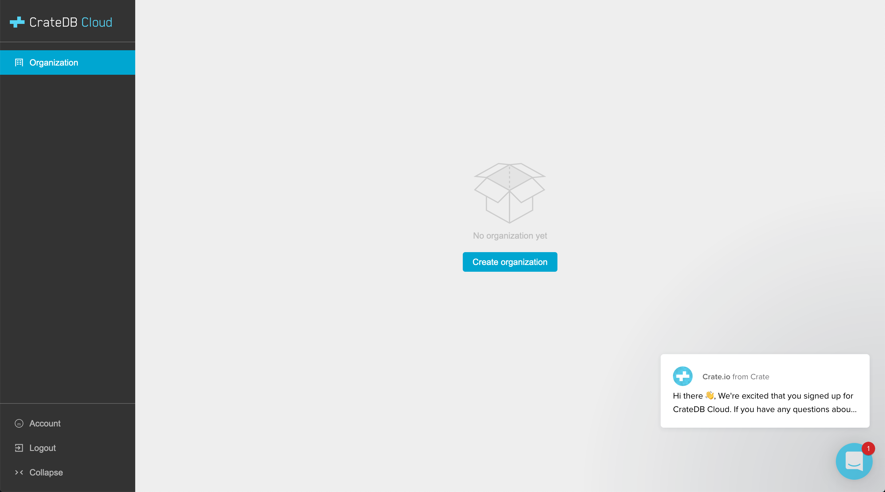

.. _sign-up:

=======
Sign up
=======

Before you can start using :ref:`CrateDB Cloud <index>`, you must first sign up
for a user account.

As a CrateDB Cloud user, you can create and manage organizations and projects.
As an organization administrator, you can also manage other CrateDB Cloud users
as well as launch CrateDB Cloud clusters and other CrateDB Cloud products.

We currently support two signup methods: AzureAD and Amazon Cognito. Only
AzureAD allows you to deploy clusters on CrateDB Cloud through Microsoft Azure
Marketplace. Similarly, for cluster deployment through our other cloud
provider, AWS, you should use the Amazon Cognito signup service. The Cognito
authentication service is indicated in the UI as *Username & Password*. Both
signup processes are described below.

.. NOTE::
    Due to these restrictions, it is possible that you will only see one of
    these signup options in the signup UI at a given moment.

Although you can also sign up for a CrateDB Cloud user account after completing
the first set of steps in the cluster deployment tutorial, for clarity we
recommend you do the CrateDB Cloud signup first, then follow the steps in the
deployment tutorial.

To go directly to the latter tutorial, see the :ref:`tutorial on deploying a
cluster from scratch via Azure <deploy-to-cluster-azure>` or the
:ref:`tutorial on deploying a cluster from scratch via AWS
<deploy-to-cluster-aws>` respectively.

.. rubric:: Table of contents

.. contents::
   :local:

.. _sign-up-azure:

Sign up via Azure AD
====================

Visit the `CrateDB Cloud Console`_. You should be presented with a Microsoft
Azure *Active Directory* (AD) sign in option:

.. image:: _assets/img/cloud-sign-in-azure-new.png

You must have an Azure account to proceed.

.. _sign-up-username-password:

Sign up with Username & Password (Cognito)
==========================================

If you select the *Username & Password* sign-in method (supported by Amazon
Cognito), you should be presented with a username and password sign in page:

.. image:: _assets/img/cloud-sign-in-user-pass.png

However, before you sign in, you must first sign up for an account.

Select *Sign up* from the bottom of the dialogue box. You will be redirected to
the sign-up page:

.. image:: _assets/img/cloud-sign-up.png

Fill in your details, then select *Sign up*.

Next, you should see this screen:

.. image:: _assets/img/cloud-verification.png

Check your email, fill in the code, and, finally, select *Confirm Account* to
finish the process.

.. _sign-up-sign-in:

Sign in
=======

Once you're signed in, you should be redirected to the `Cloud Console`_:

There's nothing here yet.

However, by the end of our tutorials for :ref:`deploying a cluster via Azure
<deploy-to-cluster-azure>` or :ref:`deploying a cluster via AWS
<deploy-to-cluster-aws>`, you will have created your first CrateDB cluster and
this page will display important information such as average response times,
queries, logs, and so on.

.. _sign-up-next:

Next steps
==========

Now that you have an account, you can choose a cloud provider. Follow the
:ref:`relevant tutorial steps <cluster-deployment>` to subscribe and deploy your
first cluster.

.. _Cloud Console: https://crate.io/docs/cloud/reference/en/latest/overview.html
.. _CrateDB Cloud Console: https://console.cratedb.cloud/