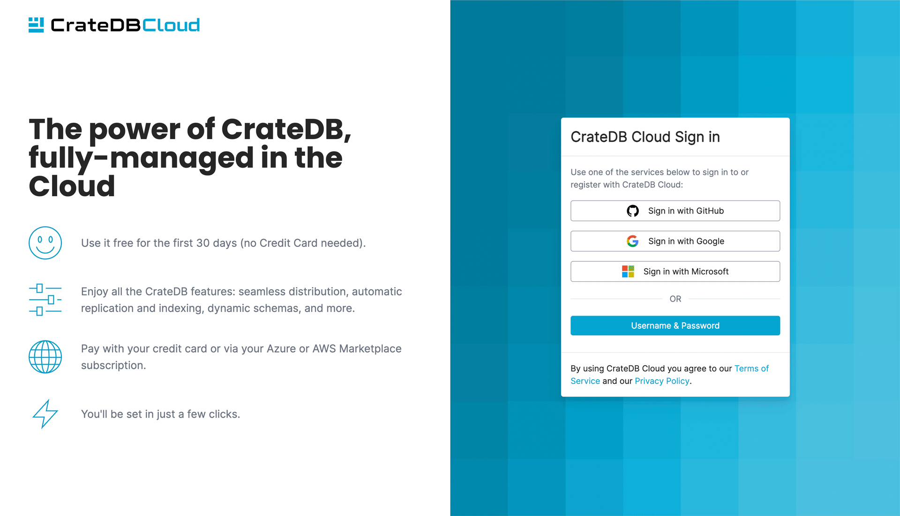
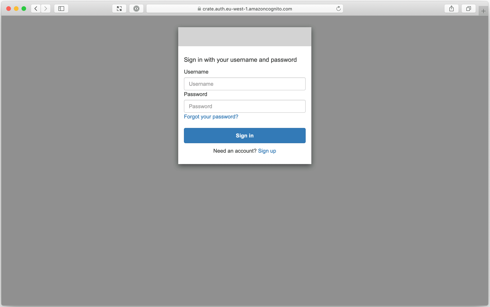
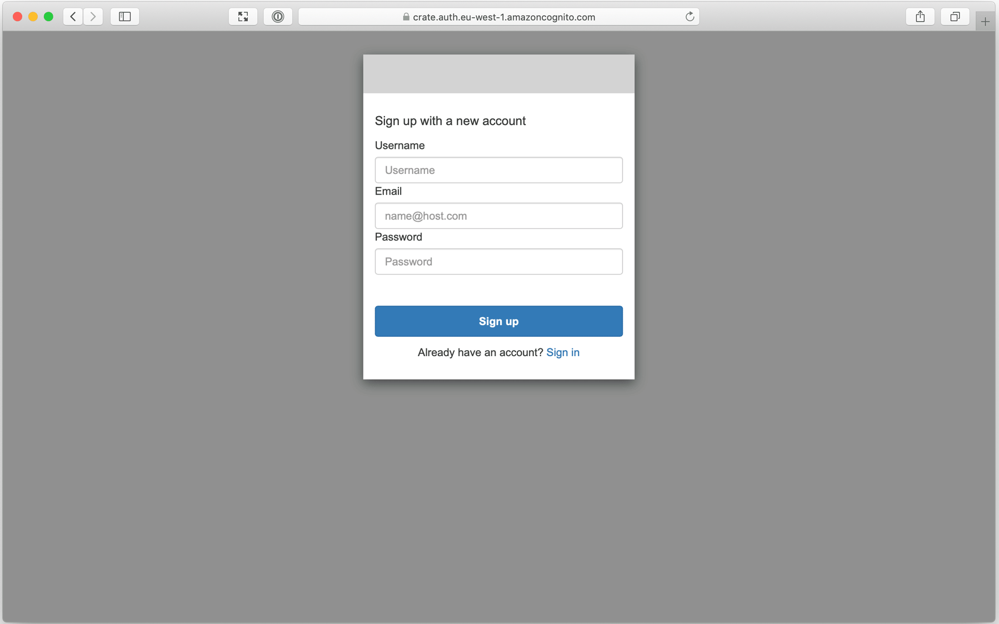

.. _sign-up:

=======
Sign up
=======

Before you can start using :ref:`CrateDB Cloud <index>`, you must first sign up
for a user account.

As a CrateDB Cloud user, you can create and manage organizations.
As an organization administrator, you can also manage other CrateDB Cloud
users as well as launch CrateDB Cloud clusters and other CrateDB Cloud
products.

We currently support four signup methods: using an account at Github, Google
or Microsoft, and making a separate username and password supported by Amazon
Cognito.

Consequently, the signup screen will look as follows:

If you intend to subscribe and deploy a cluster using a credit card - our
recommended procedure - any of these signup methods will work. When coming
from the Software as a Service (SaaS) marketplaces, however, restrictions
apply. Only the *Microsoft* option allows you to deploy clusters on CrateDB
Cloud when coming from the Microsoft Azure Marketplace. Similarly, for cluster
deployment through our other cloud provider, AWS, you should use the Amazon
Cognito signup service. The Cognito authentication service is indicated in the
UI as *Username & Password*. Both signup processes are described below.

To go directly to the cluster deployment tutorials, see the
:ref:`tutorial on deploying a cluster using a credit card
<cluster-deployment-stripe>` or the
:ref:`tutorials on deploying a cluster via the SaaS Marketplaces
<cluster-deployment-marketplace>` respectively.

.. rubric:: Table of contents

.. contents::
   :local:

.. _sign-up-github:

Sign up via Github
==================

Visit the `CrateDB Cloud Console`_. You will be presented with a Github
*Github* sign up option. You must have a Github account to proceed.

.. _sign-up-google:

Sign up via Google
==================

Visit the `CrateDB Cloud Console`_. You will be presented with a Google
*Google* sign up option. You must have a Google account to proceed.

.. _sign-up-azure:

Sign up via Microsoft
=====================

Visit the `CrateDB Cloud Console`_. You will be presented with a Microsoft
Azure *Microsoft* sign up option. You must have a Microsoft Azure account to
proceed.

.. _sign-up-username-password:

Sign up with Username & Password (Cognito)
==========================================

If you select the *Username & Password* sign-in method (supported by Amazon
Cognito), you should be presented with a username and password sign-in page:

However, before you sign *in*, you must first sign *up* for an account.

Select *Sign up* from the bottom of the dialogue box. You will be redirected to
the sign-up page:

Fill in your details, then select *Sign up*.

Next, you should see this screen:

.. image:: _assets/img/cloud-verification-cognito.png
   :alt: Cognito verification screen

Check your email, fill in the code, and, finally, select *Confirm Account* to
finish the process.

.. _sign-up-sign-in:

Sign in
=======

Once you're signed in, you should be redirected to the CrateDB Cloud Console.
Since you somehow do not have an organization defined yet in the signup
process, it will look like this:

.. image:: _assets/img/cloud-signup-landing.png
   :alt: CrateDB Cloud Console landing page

There's nothing much here yet. We suggest you turn to our `cluster direct
deployment tutorial`_ for next steps. By the end of that tutorial, you will
have created your first CrateDB Cloud cluster and this CrateDB Cloud Console
landing page will display an overview of your organization and its assets and
attributes.

For more information on how the CrateDB Cloud Console works, refer to `our
Console documentation`_.

.. _sign-up-next:

Next steps
==========

Now that you have an account, you can choose a cloud provider. Follow the
:ref:`relevant tutorial steps <cluster-deployment>` to subscribe and deploy
your first cluster.

.. _cluster direct deployment tutorial: https://crate.io/docs/cloud/tutorials/en/latest/cluster-deployment/stripe.html
.. _CrateDB Cloud Console: https://console.cratedb.cloud/
.. _our Console documentation: https://crate.io/docs/cloud/reference/en/latest/overview.html